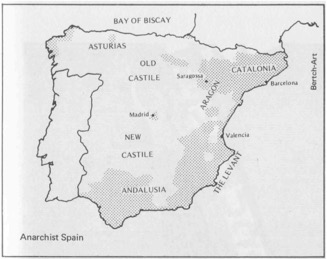
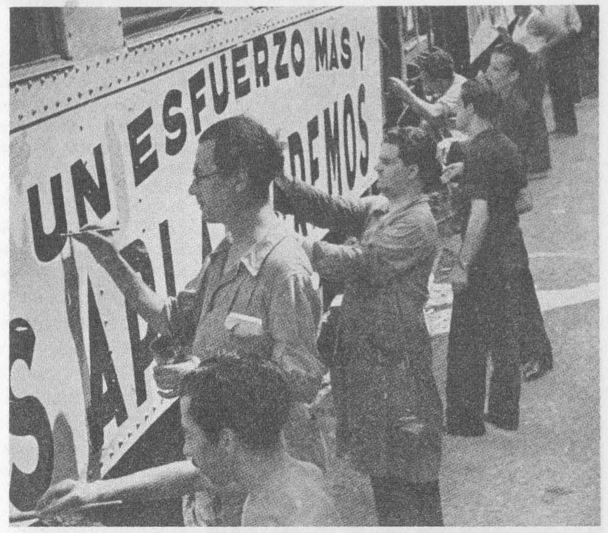

# **1936-1939西班牙革命中的工人自主管理**

编者：Sam Dolgoff

## **目录**

[toc]

向英雄的西班牙工农致敬！

向为自由而牺牲的西班牙无政府主义同志致敬！

向继续奋战的斗士们致敬！

## **前言**

西班牙社会革命的重要意义在英文作品中被长期忽视。它作为一次革命事件、一种革命模式、以及一个工人群众自我管理的具体案例的重要性，没有得到广泛的承认。我编辑这本集子的目的是介绍这次独特的历史经验。在我所写的第一章和友人布克钦的介绍性文章中，给出了一个总的概述。当然，最重要的是，这对参与者来说是一次真实的经历。通过他们的言行和作者的观察，希望读者对无政府主义集体的目的和组织有更多有价值的理解与思考。

材料被分为两个主要部分。第一部分提供了基本的背景信息：西班牙革命的性质、集体主义传统、西班牙自由劳工运动的发展，以及最终导致集体毁灭的历史事件。

第二部分，也是主要部分，描述实践中的社会革命——农业集体化和工业集体化的总体特征。首先讨论如何协调经济，货币在集体中的地位和性质，集体如何进行数据收集统计。接着描述了集体生活的实际情况，首先是工业集体化下的集体生活，然后是农村集体生活：新制度是怎样建立的，它们是怎样运作的，生产和分配是怎样进行的；关于协调、交流、集体关系、集团化地区和非集团化地区的关系。这本书在结尾处对无政府主义集体进行了一个简短评价，并对其影响和得到的教训提出了一些看法建议。

术语表、参考书目和附录增加了本卷的整体实用性。在开头处使用的历史照片直观地纠正了常见的误解，这些照片以往总是展示了过多的残酷战争场景，但很少反映西班牙社会革命的建设性方面。大多数照片来自编辑所持有的当代资料。我要感谢维克多·伯奇，布兰迪斯大学（Brandeis University）的图书管理员，他允许我使用104页、141页和142页上的图片。

这些辑录文章中的不同观察者在大约短短两年内的不同时期，拜访了同样的地区和同样的组织。由于每个观察员都强调了对他来说最重要的事情，所以他们的叙述能够相互补充，从而在对新的生活方式的看法上，提供了一种比任一一个观察员的视角更为全面的观点。然而，在这种情况下一些重复是不可避免的。我所作的翻译尽量忠于原作者，但不是字面上的，因为我也考虑过如何让读者阅读更顺利，所以会减少一些重复。

最后，我要感谢那些有远见和勇敢的人。有他们辛劳的记录，我才能辑录这些宝贵的文章。(他们每个人的简短传记也被囊括在了这本集子里)他们的努力使一则具有重大意义的社会经验得以流传。而我的目标则一直是在一个有用的辑录中把它们呈现给英语读者。

## **致谢**

我怀着最深切的赞赏感谢下列各位对这项工作所作的贡献:

我的朋友查克·汉密尔顿(Chuck Hamilton)，感谢他孜孜不倦的技术支持和编辑工作，将一份拙劣的手稿变成了一本完整的书。

感谢我的朋友保罗·阿夫里希（Dr. Paul Avrich）博士，他阅读了手稿并提出了宝贵的建议。

感谢我的同志默里·布克钦(Murray Bookchin)，是他最先鼓励我从事这个项目。

最后，感谢我的妻子埃丝特（Esther）在手稿终稿后，一丝不苟地检查了手稿，发现了许多错误。

Sam Dolgoff

纽约

1974年1月

 

## **本书简介**

作者：默里·布克钦（Murray Bookchin）

1936年7月18日上午，弗朗西斯科·佛朗哥将军在西属北非的拉斯帕尔马斯发表宣言，公开发动了西班牙反动军官对抗马德里合法选举产生的人民阵线政府的内战。

佛朗哥的宣言毫无疑问地揭示了一个可怕的历史走向：如果西班牙的右翼将军们获胜，共和国将被一个权威国家取代，而且这个国家将在制度上效仿德国和意大利的法西斯政权。佛朗哥的军队，或者是他们自称的“国民军”，展现了当时法西斯运动的所有特征和意识形态：抬起手臂，伸出手掌敬礼；宣扬一种所谓“民粹主义”哲学，鼓吹“秩序、尽责和服从”；公开承诺粉碎劳工运动；终结所有政治异见。放在整个世界局势的大环境下来看，西班牙的将军们发起的冲突似乎是另一场典型的“民主力量”与“法西斯势力”之间的激烈斗争，在二十世纪三十年代，这种矛盾愈发尖锐。与意大利、德国和奥地利的类似斗争的不同之处在于，“民主力量”的所受到的阻力并非来自敌对政党，而是西班牙军队。佛朗哥和他的军事同僚得到了军官干部的广泛支持，却没有料到他们将遭遇民众的集体反对。接下来的这场的“西班牙内战”持续了近三年——从1936年7月到1939年3月——大约有100万人丧生。

在我们很多人看来，二十世纪三十年代的危急关头，第一次有一群勇敢的人站出来进行抵抗，并在中欧和南欧的法西斯运动高歌猛进的背景下取得了难以置信的进步。就在三年前，希特勒不费吹灰之力就拿下了整个德国，马克思主义主导的德国劳工政党束手无策。两年前，在维也纳的工人们进行了一周徒劳无功的巷战之后，奥地利屈服于一个本质上独裁的政府。在世界各地，法西斯主义似乎都在“前进”，而“民主”在节节败退。但是西班牙却在英勇抵抗，尽管佛朗哥从意大利和德国购买了先进武器、飞机，得到实际的外国军事力量协助，但西班牙人民还是坚持抵抗了很久。在激进分子和自由主义者看来，“西班牙内战”不仅仅是发生在伊比利亚半岛的斗争，而是应该在每一个“民主”受到国内和国际法西斯运动浪潮威胁的国家开展斗争与抵抗。我们相信，“西班牙内战”是为了一个自由的共和国，并在人民的支持下勇敢地捍卫一个民主的议会国家，以对抗独裁统治的斗争。时至今日，大多数关于这个问题的书籍和那部蹩脚的电影纪录片都在传达这样一种意象：牺牲在马德里（*To Die in Madrid*）。

然而，在西班牙以外，我们很少有人知道的是，“西班牙内战”实际上是一场由数百万工人和农民发起的大规模社会革命，他们的目的不是拯救一个背信弃义的共和国政权，而是按照革命路线重建西班牙社会。主流媒体上看不到的是，这些工人和农民对共和国政权的敌意几乎和对法西斯主义者的敌意一样多。确实，他们的行动主要是针对”共和国“的那些想要背叛他们并投靠将军的部长们，他们突袭了军械库和军火商店，以惊人的勇气挫败了西班牙大多数城镇的军事阴谋。我们很少注意到的是，这些工人和农民占领了共和国控制地区的大部分工厂和土地，并进行了集体化，建立了以工人委员会和农民大会直接控制国家生产资料为基础的新社会秩序。当共和国的各式机构被它的大多数军队和警察部队遗弃在废墟中时，工人和农民已经建立了他们自己的机构来管理西班牙的城市，组建了他们自己的武装工人小队来巡逻街道，并建立了一支卓越的革命民兵力量，与法西斯的军队作战——这是一支自愿的民兵组织，在这一组织中，男性和女性选举自己的指挥官，不授予任何军衔，社会地位、物质性或象征性的优待。当时的西班牙工农进行了一场大规模的社会革命，但我们对此知之甚少。他们自己摸索创造了一种革命社会形态来管理国家，并对法西斯训练有素、装备精良的军队发动进攻。“西班牙内战”不是一个自由民主国家和一个法西斯军队之间的政治冲突，而是西班牙工人和农民与其历史上的阶级敌人之间深刻的社会冲突，这些阶级敌人包括世袭土地的贵族和牧师领主、新兴的工业资产阶级和银行家。

我们对这场冲突更广泛的革命视野被刻意隐藏了——“我们”——我指的是成千上万的三十年代的激进分子，他们对西班牙的斗争有着和六十年代的年轻人对印度支那的斗争一样的狂热和痛苦。我们不需要在乔治·奥威尔或弗兰茨·柏克瑙这种坚定的反斯大林主义激进分子那寻求一个解释。伯内特·博洛滕(Burnett Bolloten)是一名政治清白的合众通讯社记者，当时他恰好驻扎在马德里。他在自己那篇出色的研究报告《精心的伪装》的开头部分中，对西班牙冲突的歪曲表达了自己的道德愤慨:

>   尽管1936年7月西班牙内战爆发后，反佛朗哥阵营爆发了一场影响深远的社会革命——在某些方面比早期的布尔什维克革命更为深刻——但在西班牙以外，数以百万计的的人，不仅对其深度和广度一无所知，甚至对其存在也一无所知，因为他们受到的欺骗和有关政党的掩饰政策在历史上是无可比拟的。
>
>    在对世界实行欺骗和在歪曲西班牙革命性质方面，那些所谓的“共产党人”是罪魁祸首，他们在内战开始时虽然只是少数派，但却有效地利用了这场社会剧变所带来的各种机会，在1939年冲突结束之前，他们站在了民主力量的前沿，成为左翼阵营的统治力量。

这场骗局的细节罄竹难书。笼罩在西班牙周围的集体沉默，如同一个不良的居心，证明了这样一个事实：这些革命行动在很大程度上是真实存在的——同时试图歪曲事实的努力也是真实存在的。近四十年过去了，伤口仍未愈合。事实上，近来斯大林主义的遗毒正慢慢回潮，同时西班牙的反革命的影响也仍然影响着美国左派。但是，在此清算西班牙的斯大林派反革命的罪状，就超出了这一篇介绍性文章的叙述范围。幸运的是，山姆·道各夫（Sam Dolgoff）提供的参考书目为英语读者提供了许多关于这个议题更重要的参考文献。考察1936年7月以前发生的革命倾向，探讨革命倾向对西班牙工人阶级和农民的影响，也许是更有益处的。这本书中描述的集体并不是单纯的大众自发性的结果，虽然大众自发性很重要，但也不是完全由西班牙传统乡村社会的集体主义遗产所滋养的。革命思想和革命运动发挥了自己的关键作用，其影响值得仔细研究。

1936年7月，西班牙将军发动了一场军事叛乱；而西班牙工人和农民以社会革命来回应他们——这场革命很大程度上是无政府主义性质的。尽管社会主义的组织UGT和无政府工团主义组织CNT人数相当[^0-1]，但我还是会下这么一个煽动性的结论。（到1936年夏天，UGT和CNT的会员人数都可能超过100万。爱管闲事、官僚作风严重的UGT往往夸大其成员人数。在两个劳工联合会中，分散各地的CNT是受压迫最严重的，但对西班牙工人阶级的影响并不是会员人数这种干巴巴的数据就能说明的。）在军事叛乱开始的那几个月里，马德里的社会主义工人们的行为和巴塞罗那的无政府工团主义工人一样激进。他们建立了自己的民兵组织，组成街头巡逻队，没收了一些重要的，具有战略意义的工厂，将其置于工人委员会的控制之下。同样，卡斯提尔和埃斯特拉马杜拉的社会主义农民组成了集体组织，其中许多人和阿拉贡和莱万特的无政府主义农民一样是自由意志主义者。在革命的“无政府”阶段，与其他革命早期的开放阶段类似，“群众”试图对社会进行直接控制，并对建立临时的自由意志式社会管理制度展现出了极高的热情。

[^0-1]: 直至1936年的夏天，UGT和CNT的数量都可能超过了一百万。官方化、高度官僚化的UGT倾向于高估其成员数量。而无固定组织、去中心化的CNT——在两个劳工联盟中受迫害最严重的——比起其成员数量来说，常常对西班牙的工人阶级有着更大的影响。

然而，回顾这个开放阶段之后，公平地说，西班牙集体主义的持久性、社会影响力以及他们对斯大林主义反革命的抵抗，在很大程度上取决于他们受到无政府主义影响的程度。西班牙革命与之前的各种革命的不同之处在于，它不仅将西班牙的大部分经济部门置于工人委员会和农民大会的管理下，还建立了民主选举的民兵制度。这些革命措施都不同程度上在巴黎公社和俄国革命初期出现过。西班牙革命的独特之处在于，最近三代以来，工人掌控工厂和集体主义（以及民兵组织的命运）却一直被一场大规模的自由主义运动所倡导，并被指控为分裂所谓“共和”阵营的最严重问题。从其自由意志社会形态的范围来看，西班牙革命不仅比布尔什维克革命“更深远”，而且在西班牙植根已久的无政府主义思想和无政府主义激进分子的无畏精神的，实际上在西班牙内战中引发了一场左翼内战。

事实上，在许多方面，1936年的革命标志着西班牙60多年无政府主义运动的高潮。要了解这种情况，我们必须回溯到19世纪70年代初，当时意大利无政府主义者朱塞皮·法内利(Giuseppi Fanelli)将巴枯宁的思想介绍给马德里和巴塞罗那的工人和知识分子群体。法内利在马德里和*Fomento de las Artes*组织中的一群年轻的工人会面，布莱雷( Brenan)满怀欣喜地记录下了这场传奇性的会面：这位胡须浓密、身材高大、一个西班牙语单词都不会说的意大利无政府主义演讲者，在台上滔滔不绝地对着这一小群满怀热忱的听众大谈无政府主义，可是他混杂着法语和意大利语的、毫无章法的演说让人很是困惑。不过凭借激烈的肢体动作、音调的变化和大量使用同源词，法内利成功地传达了巴枯宁的思想，获得了该工人组织的支持，并建立了国际工人协会（或所谓的“第一国际”）的西班牙分会。此后，早期的西班牙无政府主义者和“国际主义者”们迅速从他们在马德里和巴塞罗那的圈子扩展到整个西班牙，其中在加泰罗尼亚和安达卢西亚他们的根基尤为坚固。1872年9月，在第一国际的海牙会议上，马克思主义者和无政府主义者最终分道扬镳。此后，西班牙分会在总体观点上仍以无政府主义为主。马克思主义在西班牙都没有成为一支重要的运动力量，直到世纪之交后才慢慢成为了劳工运动的一股强大的力量，但直到30年代，马克思主义者仍然很大程度上是持改良态度的。在其早期历史的大部分时间里，西班牙社会主义党(Spanish Socialist Party)和UGT的势力主要集中在马德里等传统政治中心，而非巴塞罗那等工人阶级占主导地位的城市。[^0-2]马克思主义倾向于吸引高技能，务实，威权的卡斯蒂利亚人；而无政府主义则影响着那些“非熟练工”，心怀理想主义的加泰罗尼亚人和安达卢西亚和黎凡特那些独立的，热爱自由的山区村民。安达卢西亚大量的打零工为生的人或贫困农民，至今仍是欧洲社会中最受压迫和最贫困的阶层，他们倾向于追随无政府主义。不过他们的信念也随着局势的变迁而变化。在动荡时期，他们扩大了巴枯宁主义影响的国际工人协会，以及其在西班牙后继者组织的队伍规模，不过也有大量的人随着革命局势的变化离开了队伍。

[^0-2]:马德里虽然是一个以社会主义为主的劳工运动中心，但也是一个极其活跃的无政府主义运动的发源地。不仅马德里的建筑工人有强烈的无政府工团主义倾向，而且在世纪之交，许多马德里知识分子也致力于无政府主义的理论发展，并为这场运动建立了一个影响颇深的理论传统，在无政府主义工人与西班牙知识分子断绝关系后，这场运动的影响也是深远的。

然而，尽管西班牙无政府主义的命运因地区和时期而异，在这六十年间存在于西班牙的革命运动实质上都是无政府主义的。甚至在第一次世界大战后，无政府主义在马克思社民组织和后来的布尔什维克组织之前就开始衰落了，西班牙无政府主义者依然保留了它们巨大的影响力和革命的热情。从激进的视角去看，西班牙工人运动的历史残存着自由意志主义的传统，并且经常用来与西班牙的马克思主义运动相区别。“总的来说，一小群组织良好的无政府主义者在社会主义区域驱使着社会主义者走向左翼，”Brenan观察到，“与此同时在主要是无政府主义者的区域，社会主义者只是杰出的改革者。”是无政府主义，而非社会主义决定着西班牙工人运动的发展变化——在西班牙反复进行的大罢工，在巴塞罗那和安达卢西亚的城镇和乡村里反复发生的暴动和发生在地中海沿岸城市的工人武装和雇佣的暴徒之间的枪战。

必须强调的是，西班牙的无政府主义不仅仅是一个嵌入了繁杂理论的模型。它是一种生活的方式：一方面，是西班牙人民紧密结合的村庄和工人阶级社区内激烈的邻里生活；另一方面，同样的，是对巴枯宁提出的地方分权的生活理论的阐释，互助和自我管理的民间组织。本书讨论了西班牙拥有的长久的农业集体主义传统，并对Joaquin Costa的《*Colectivismo Agrario en Espagna*》进行了仔细研究。因为这种传统明显是前资本主义的，所以西班牙的马克思主义者认为它是不合时宜的。事实上，作为“历史上的反动派”，西班牙社会主义者围绕马克思主义的宗旨建立了他们的农业理论，即在农民被“无产阶级化”和“工业化”之前，他们及其社会形式都不具有长久的革命价值。确实，村庄越早衰败，村民们也就越快地成为世袭的无产阶级。由资本主义生产过程本身的机制所训练、联合和组织起来的工人阶级的反抗也不断增长（马克思《资本论》）——一个明显的等级制和威权的“机制”——西班牙将能更快的推进社会主义的任务。

相比之下，西班牙无政府主义者选择了一种决定性的不同的方式。他们寻求村庄的前资本主义和集体主义传统，滋养他们并使其有活力，唤起他们的革命潜力作为互助和自我管理的解放模型，并推广它们以消除由工厂系统培育的服从，等级观念和独裁观点。在注意到无产阶级中的“资产阶级”（一个被巴枯宁晚年常常提起的词语）后，西班牙无政府主义者尝试利用在农民和工人阶级中的前资本主义传统来反对同化工人观点的专制工业理性。在这方面，他们的努力受到那些复兴这些传统日常的移居城市的乡村工人组成的无产阶级的喜爱。在巴塞罗那的无产阶级的革命热情——就如同彼得格勒和巴黎的无产阶级一样——在很大程度上归功于这些工人们从未始终沉溺于一个世袭的工人阶级，完全脱离了前资本主义传统，农民和工匠也是如此。在地中海沿岸的西班牙城市里，许多工人都保留着在非资本主义文化——一个在生命的每个时刻都没有受到打卡钟，工厂汽笛声，工头，机器，高度管制的工作日以及大城市里雾蒙蒙的世界来严格限制的生活记忆。西班牙无政府主义在这些敌对传统和情感造成的紧张环境中蓬勃发展。实际上，在西班牙出现了一个“日耳曼无产阶级”（巴枯宁所用的另一个短语），它在劳动者总联盟（UGT）和天主教联盟间游荡，它的政治观点，在不明显的保守下改革常常与加泰罗尼亚和地中海沿岸的大多数阶级跌落（déclassé）的工人阶级相冲突，导致了整个西班牙无产阶级内部的冲突局势。

归根结底，在我看来，西班牙无政府主义的命运取决于他们创造自由意志主义组织的能力，这种组织可以将村庄的前资本主义集体主义传统与工业化经济和高度城市化的社会结合起来。我说的不仅仅是在西班牙农民和无产阶级之间的机械性的“联盟”，而是更加有机的、全新的组织形式以及对将革命的自由特征引入生活在冲突的文化背景下的两个社会阶级之间的感性认知。大多数西班牙无政府主义者对西班牙所需要的一场组织良好的自由意志主义运动不包有怀疑，但是这种运动能否反映出乡村社会或者工厂社会？如果有冲突，这两者可否在同一运动中融合而不违反自由意志主义和地方分权，互助及自我管理的原则？在1848至1939年间的“无产阶级社会主义”古典时代，一个强调工业无产阶级在所有社会结构下的“领导权“的时代，西班牙无政府主义者遵循历史的轨迹揭示了这种时代自身的局限性。并且创造了无政府主义组织形式的可能性。

与城市相比，那些致力于无政府主义的西班牙乡村产生的组织问题很少。虽然布伦南（Brenan）着重于短工，但南部和黎凡特的农业无政府主义的力量主要存在于山间的村庄里，而非工作于安达卢西亚种植园中的农民无产阶级。在这些相对孤立的村庄中，强烈的独立意愿和人格尊严激发了由贫困带来的惨痛的社会仇恨，创造了无政府主义农村“家长”，他们的整个家庭都像使徒一样忠诚于“信念”，对于这些十分刻苦和严格禁欲的人，蔑视国家、教会和传统权威大体上是他们日常生活的一部分。由当地媒体编织在一起——并且在不同时期，在西班牙有数百个无政府主义刊物——他们从1870年代开始为农业无政府主义赋予了力量，并且在很大程度上形成了西班牙无政府主义在整个历史中的道德良知。

Dolgoff 翻译的Peirats，Leval和Souchy所著的农业集体一书的后半部分叙述很大程度上反映了无政府主义者通过他们的影响力于1936年革命前在所有村庄中创造的组织形式。农村地区的革命实质上扩大了旧的国际工人协会和后来的CNT核心，成员组织，或者简单地说紧密的团体将无政府主义者家庭组织为公民大会。大会每周举行一次并制定整个社区的政策。集会的形式囊括了国际工人协会西班牙分部于1872年在科尔多瓦所举行的、第一个真正的巴枯宁式的大会中所形成的农村无政府主义组织理念，强调西班牙乡村生活中的自由传统[^0-3]。这样的公民大会是可行的，他们的决议由在大会上选举出的委员会所执行。显然，罢免委员会成员的权力是被视为理所当然的，当然他们也并没有享受任何特权，薪酬或制度性的权利。他们的影响取决于他们显著的贡献和能力。它保留着西班牙无政府主义者永远不向代表们支付费用的基本原则，即使CNT拥有着数百万的成员[^0-4]。通常，代表们的权力必须在工作时间之后解除，激进的无政府主义者几乎所有的夜晚都在参加各种类型的会议。无论是在大会上还是在委员会中，他们都在争吵，辩论，投票和管理，如果时间允许——不仅仅是在闲暇时间，而且在他们的整个生活中——他们还会阅读并且热情的讨论他们所奉献的“理念”。在一天中大部分时间里，他们都是工作的男性或女性，有意识的工人，放弃了吸烟和酗酒，远离妓院和血腥的斗牛场，清除他们语言中的“肮脏”词汇，然后通过他们的诚实，尊严，对知识的尊重和斗争性，尝试为他们的整个阶级树立一个道德榜样。他们从来不在日常对话中使用“神”这个词（健康（*salud*）要比再见（*adios*）更受欢迎），并避免一切与牧师和国家当局的正式接触，实际上，重点是他们拒绝法律通过婚姻文件来证明他们终身的“自由结合”并且绝不对他们的孩子进行洗礼或者行坚信礼。人们必须要了解天主教西班牙才能意识到这些自愿承担的风俗有多么影响深远——以及它们中的一些与该国的清教徒传统保持一致是多么讽刺的事[^0-5]。

[^0-3]:在这里，我不想争论西班牙乡村是否是一个自由意志主义社会的范例。乡村社会在西班牙的不同地区之间差别很大——一些地方保留着他们不受干扰的民主传统，而其他地方则任由教会，贵族，领主和习俗在他们头上作威作福。很多时候，这两种势力在一种非常令人担忧的平衡下共存，民主虽然仍然存在但被威权主义所吞噬。
[^0-4]:就CNT而言这条规则有例外，总书记（The National Secretary）被给予了工人的平均工资，国家委员会的文职人员和日报编辑及员工也是如此。但是CNT的国家，地区和地方委员会的代表没有得到报酬，并且有义务专注于自身的工作，除非他们花费了过多时间用于处理工会事务。这并不是说没有人将自己的大部分时间用于传播无政府主义思想。“从一个地方到另一个地方，无论是步行还是骑骡子，抑或是在三等火车车厢的硬座上，他们甚至像在货车的防水油布下的流浪汉和流动斗牛士一样，”布伦南（Brenan）观察到，“当他们组织新团体或者进行宣传活动的时候‘这些理念的先驱’正如同他们的名字一样，生活得像一个受到更加富裕的工人们热情款待的贫穷修道士一样”。并且，我想补充说“村民”这种传统的组织，相比1870年代，在之后的几十年里并没有消失；相反，随着CNT与UGT对西班牙工农联盟展现自身忠诚度的竞争，组织变得更加系统化，并似乎有了更加稳定的资金支持。
[^0-5]:在这里我必须补充一点，戒烟，以高道德标准生活，尤其是戒酒在当时来说是非常重要的。在无政府主义占优的时期，在低迷的社会环境下，西班牙经历了自己姗姗来迟的工业革命。无产阶级低迷的士气，以及随处可见酗酒、性病和崩溃的卫生系统是西班牙革命者需要处理的首要问题，正如今天的黑人激进分子需要处理贫民窟中的类似问题一样。在这一点上，西班牙无政府主义者非常成功。很少有CNT的成员，敢于在会议上喝醉，或者在他们的同志面前行为不端，而坚定的无政府主义者中这种行为更为稀少。如果考虑到这个时期西班牙糟糕的工作和生活条件，在工业革命期间西班牙的酗酒问题并不像英格兰那样严重。

我们应当注意到如今的社会学文献在关于这一话题上广泛传播的谎言，即西班牙农业无政府主义在精神上是反技术的，并且渴望返回到新石器时代的“黄金时代”，这一点可以通过对无政府主义者在教育上发挥的独特作用进行仔细研究而得到有效反驳。事实上，正是无政府主义者通过廉价的，通俗的小册子将法国的启蒙精神和现代的科学理论带给了农民们，而不是傲慢的自由主义者或者倨傲的社会主义者。无政府主义者们的出版社将关于自然和社会进化理论的简单描述、对欧洲的世俗文化的初步介绍以及巴枯宁和克鲁泡特金的小册子一同发表。他们试图通过先进的土地管理技术来指导农民，并热衷于利用农业机械来减轻劳作的负担以为自身发展提供更多的闲暇。正如霍布斯鲍姆（在他《原始的叛乱》一书中）以及布伦南让我们所相信的那样，西班牙社会毫无倒退的趋势，而通过对无政府主义者表现出的更近似于激进的大众启蒙运动的仔细回顾，我可以肯定这一观点。

在个人特点上，那些专注于城市的无政府主义者与他们在乡村的同志没有本质上的不同。但是在西班牙的城镇，这些城市无政府主义者面临着更多也更困难的组织问题。当然，他们创建自由意志主义组织的努力是受欢迎的，因为许多西班牙工人在之前也是村民或者仅仅离开乡村一代人左右。[^0-6]然而，在城镇和工厂里的自由意志主义组织的前景不能由在农村无政府主义地区里存在的强烈的社区意识和长久的农村集体主义传统来决定。因为工厂本身就是劳作，等级制度，工厂规则和粗暴的物质需求的国度——比起人性化的合作，有趣的创造性工作和互助来说，“社区”更像是行使资本主义具有剥削甚至竞争性意义的分工的存在。工人阶级的团结更多取决于他们共同的敌人——那些推翻了在资本主义下工人们不只是工业资源和被冷酷使唤与无情剥削的对象等一切幻想的老板，而非由自我实现的工作所滋养的共同的有意义的生活。如果无政府主义可以在某种程度上被视为个人对工业体系的反抗，那么反抗所反映的深刻事实就是工厂事务不仅仅削弱了工人们对生活中美好事物的敏感性，它还降低了工人们对于人类潜能的想象，即他们直接控制管理社会生活的手段的能力。

[^0-6]:在“黑色的”（完全的无政府主义）萨拉戈萨，那里的工人阶级比巴塞罗那的无产阶级更加坚定的致力于无政府主义原则，雷蒙德卡尔（Raymond Carr）的描述相当准确，“罢工有着对经济诉求的不重视，以及像革命团结那样坚定的特点：为监狱中的同志而罢工比为了更好的生活环境而罢工更为流行

将西班牙无政府主义者与社会主义者区分开来的显著优点在于他们尝试改变工厂领域本身——这种改变长期受到工人们对于自我管理生产的诉求的影响，而更为直接的影响是，他们尝试建立自由意志主义组织并最终形成了工团主义CNT。然而，在我看来，工人自我管理能在多大程度上切实消除异化劳动并改变工厂对工人敏感性的影响需要比过去更多的讨论和分析。随着CNT中无产阶级成分的增加，工厂系统对工人的影响问题变得至关紧要，而无政府主义者则试图发展能够直接与由工厂系统所灌输的理念进行对抗的自主性和自我管理理念。

如今没有一个大规模的激进运动认真考虑过自身的组织形式是否需要进化——即会促使其成员最基本的行为模式发生变化的进化。自由意志主义运动如何才能破坏由资本主义工厂所灌输的服从、等级制度、领导与被领导的关系以及权威和命令的精神？提出这个问题是因为它关乎西班牙无政府主义——乃至整个无政府主义的信誉能否维持。[^0-7]“完整的人格”这一词汇反复地出现在西班牙无政府主义者的文章中，并且孜孜不倦的培养那些不仅在思想上接受了自由意志主义原则而且尝试在现实中实践这些原则的人。因此，这个运动的组织框架（如同在国际工人协会、CNT和FAI中所表现出来的那样）旨在将权力下放，以便允许基层能够表现出最大程度的自主性并做出决定，同时提供一个结构以保证不会形成官僚机构。另一方面，这些需求必须在协作，动员行动以及有效计划的需求之间保持平衡。西班牙城镇无政府主义组织的历史——他们所创造的以及他们所抛弃的形式——很大程度上是这两种需求之间的冲突以及其中一种胜过另一种的体现。这种张力不仅仅是经验和结构改进的问题。长远看来，权力下放与协作之间的冲突的结果取决于那些最专注的无政府主义者影响那些加入了受到无政府主义影响的工会——尤其是工团主义工会的工人们不只是专注于眼前的物质利益，而是为了提供自由意志主义社会结构的意识的能力。

[^0-7]: 对于马克思和恩格斯来说，改变无产阶级行为模式的组织形式不是问题。这可以推迟到“革命之后”。事实上，马克思认为工厂的专制影响（“资本主义生产过程本身的机制”）是产生“纪律，团结”无产阶级的积极因素。恩格斯在其骇人听闻的《论权威》一文对无政府主义的抨击中，明确的使用了工厂结构——它的等级形式和它所要求的服从——来合理化他对工人阶级组织权威化和集权化的观点。在这里，有趣的不是马克思和恩格斯是否是“威权主义者”，而是他们思考无产阶级组织问题的方式——他们的组织概念的模型在多大程度上是倾向于经济制度的，而又在多大程度上是为了彻底的社会革命。

工团主义早在1890年代在法国劳工运动中成为一个流行的词汇之前，就已经存在于早期的西班牙劳工运动中了。在我看来，受到无政府主义者影响的旧国际工人协会西班牙支部是明显的工团主义式的。在1870年6月于巴塞罗那举行的西班牙支部创始大会上，“工人社会组织委员会”提出了一个将会成为包括后来的CNT在内之后所有的西班牙无政府工团主义劳工联合的样板的结构。委员会提出了两种典型的工团主义结构：按行业组织和按地点组织。地方行业组织（*Secciones de oficio*）将来自同一企业和同一职业的工人们组织成了大型的职业联合会（*Uniones de oficio*），其主要职能是对经济上的不满和工作环境进行抗争。当地的一个综合行业组织召集了那些来自不同行业的工人，他们的人数太少以至于不能形成有影响力的组织。在每个国际工人协会所代表的社区和地区，与那些职业组织一并进行的，是当地不同的部门被组织起来，不论什么行业都被纳入了一个地理上的本地机构（*Federaciones locales*），其功能被公认为是革命性的——以权力分散的自由意志主义为基础来管理社会和经济生活。

这两种结构构成了工团主义所有组织形式的基石。在西班牙，与其他地方一样，这个结构由工人委员会组织在一起，工人委员会起源于个体商店、工厂和农业社区。工人们在集会中从他们之中选举出主持管理职业事务（*Secciones de oficio* ）和地区事务（*Federaciones locales*）的委员会。它们被联合成为西班牙几乎每个大区的区域委员会。在可能的情况下，工人们每年都会选举出代表参加国际工人协会西班牙支部的年度大会，后者又选举出全国的联盟政务委员会。

随着国际工人协会的衰落，工团主义联合会在西班牙不同的区域出现，尤其是加泰罗尼亚和安达卢西亚。第一个值得注意的是1880年的工人联合会。在镇压过后，西班牙无政府主义者与那些非工会意识形态的团体或者本质上是地方联盟的联合会结盟——前者如西班牙地区无政府主义组织（the Anarchist Organization of the Spanish Region），后者如加泰罗尼亚公约联合会（the Catalan-based Pact of Union）以及1890年代的团结会与1900年代早期的工人团结会。除了于1900年在马德里砖匠工会倡导下成立的短暂存在的西班牙工人社区联合会，没有任何重要的全国性的工团主义联合会在西班牙出现，直到1911年CNT成立。随着CNT的成立。西班牙工团主义进入了最成熟和最具决定性的时期。CNT比它的竞争对手UGT庞大得多，并成为了无政府主义者在西班牙进行煽动的必不可少的舞台。

CNT不仅仅是“成立”，它是在加泰罗尼亚工人团结会（Catalan Workers' Solidarity）和最团结的区域性联合会——加泰罗尼亚联合会（C*onfederación Regional del Trabajo de Cataluña*）的基础上有机发展起来的。之后，其它地区联合会由各个地方工会建立——它们中的许多徘徊在西班牙工人社区联合会之间——到1930年早期，这样的组织有8个。实际上，全国性的组织是区域性联盟松散的集合体，这些区域性联盟又能被分解为地方和地区的联合会，并最终被分解为劳工工会和独立的工会。这些劳工工会（早期，它们以*sociedades de resistancia al capital* ——资本反抗社这一戏剧性的名字而闻名）是建立在职业的基础上的，并且以典型的工团主义方式，被分为地区和行业联合会（*federaciones locales and sindicatos de oficio*）。为了协调这一结构，CNT在其年度大会上选举出一个全国性的委员会，主要用于进行通讯，收集数据和援助囚犯等工作。

加泰罗尼亚地区联合会的章程为我们提供了将遍布全国的运动整合起来的指导。根据这些章程，组织将践行“直接行动”的原则，并且拒绝所有的“政治和宗教的干扰”。附属地区和地方的联合会将拥有“最大程度上的自治权，可以理解为它们在所有关于统合独立行业的专业问题上拥有完全的自主权”。每位成员预计每月要支付十生丁（一小笔费用）用于在地方组织，地区联合会，国家联合会与工会报纸（工人团结报（*Solidaridad Obrera*）），以及用于援助“社会囚徒”的专项基金之间平均分配。

根据规定，地区的委员会——在当地相当于CNT的全国委员会，仅仅被视为一个行政机构。尽管它们在协调行动中扮演着明显的指导者的角色，但它们的行动受到在年度地区代表大会中设立的政策的约束。在特殊情况下，委员会可以通过全民投票或者书面询问的方式与本地机构商议。除了选举出地区委员会的地区年度代表大会之外，委员会还要按照地区联合会的要求举行特别代表大会。反过来，地区联盟会在常规代表大会之前三个月进行通知，以便它们能够“准备讨论的主题”。在大会召开前一个月，地区委员会被要求在工会报纸上公开提交的“主题”，以便给工人们留出足够的时间来决定他们对将要讨论的话题的态度，并以此告知他们的代表。参加大会的代表团的表决权力由其所代表的人数决定，他们由在地方和地区联盟召开的全体工人集会中被选举出来。

这些规定成为了CNT在1936年革命之前实践的基础。尽管它们显然缺少任何有关罢免委员会成员的规定，但是组织在它们最为兴盛的时期依然比规定中所期望的表现得更为民主。在这个庞大的组织的基础上，存在着一种如心跳般强盛的生命力，表现在对CNT问题的积极关注和强大的个人能动性上面。无政府主义者在国际工人协会时代建立的工人中心（*centros obreros*）不仅仅作为工会在当地的办事处，它们还是成员们交换想法和参加演说的会面地点和文化中心。当地CNT的所有事务都由普通工人组成的无偿的委员会管理。尽管官方的工会会议每三个月才举行一次，但每周六晚和周日的下午都有“有启发性的会议”举行。工团之间的团结是如此的紧密，以至于它们不可能总是保持孤立的罢工。罢工总是有激发其他人的支持以及使其它工团发起积极的援助的倾向。

无论如何，这就是CNT尝试行使其职能以及在情况良好的时期实际运作的方式。但在有的时候，一些让人感到压力的突发时期，使得有必要暂停年度的或地区的大会，并且将制定重要政策的决定权局限于委员会领导的全体会议，或者那种只不过是拼凑而成的“大会”中。组织里各个级别的富有魅力的领导们以非常接近于官僚主义的方式行事。工团组织本身的结构也并非避免了变相的官僚主义。对于一个缜密计划的委员会网络，建立一个地区和国家机构，拥有全部的集权机构的特征并且规避基层工人们的集体意愿并非难事。

最后，尽管CNT在纲领中承诺自由意志共产主义并且尝试按照自由意志主义的方式行事，但其主要还是一个大型的工会联盟而非一个纯粹的无政府主义组织。安赫尔·佩斯塔尼亚（Angel Pestaña）是最务实的领导者之一，意识到大概三分之一的CNT成员可以被视为无政府主义者。许多人是激进份子而非革命者；而另一些人加入CNT仅仅是因为它是他们所在地区或工作场所中最主要的工会。到了二十世纪三十年代，CNT绝大部分成员是工人而非农民，安达卢西亚人在上个世纪受无政府主义影响的工会中所占的比例是最大的，如今已逐渐变成了少数群体，这是一个像伯南和霍布斯鲍姆这样的作家并未注意到的事实，他们过于强调农村因素在无政府工团主义者工会中的重要性了。

随着CNT构成群体的缓慢变化以及在领导和成员心目中工业价值观对于乡村价值观优势的日益增长，我认为联盟最终会变成一个相当传统的拉丁式工会。西班牙的无政府主义者们并非没有察觉到这些变化。尽管工团主义联盟是无政府主义者在欧洲进行活动的最主要的舞台，但无政府主义理论家们也意识到工团主义联盟中的改革派领导人们能够很轻易的将控制组织的权力从基层转移至高层。他们认为工团主义的重点发生了这样一种变化，即从公社转变为工会，从所有受压迫的人转变为工业无产阶级，从街头转变为工厂，或者，至少重点从暴动变成了大罢工。

马拉泰斯塔 （Malatesta） 担心官僚主义在工团主义联盟中的兴起，他警告说“官员对于工人阶级造成的危害只有议会议员能与之相比；这两者都会导致腐败，而从腐败到毁灭只有一步之遥。”尽管他改变了对于工团主义的态度，但他是在有所保留的情况下接受那些行动并且从未停止强调“工会本质上是改良主义而非革命的”。对于这一警告，他补充道“革命精神必须由在队伍内外工作的革命者的不断行动来引入，发展和维持，而这不可能成为工会行事的普通而基本的规则。”

工团主义在没有真正分裂它的情况下分化了西班牙无政府主义运动。确实，直到FAI建立之前，西班牙几乎没有全国性的无政府主义组织可供分裂。[^0-8]不过西班牙无政府主义者的行动在两个层面上保持：通过《白色杂志（*La Revista Blanca*）》 和《土地与自由（*Tierra y Libertad*）》这种广泛传播的刊物和在工团主义联盟内外的坚定的无政府主义小团体。早在十九世纪80年代，这种典型的西班牙裔间亲密的团体——传统上称之为茶话会，就在他们喜爱的咖啡馆里会面，讨论想法和计划行动。他们为了表达他们崇高的理想（*Ni Rey ni patria*，既不是国王也不是祖国）以及革命精神（*Los Rebeldes*，叛军），或者仅仅只是为了表达他们之间的博爱（*Los Afines*，联结）而取了多彩的名字。我之前提到过的西班牙地区无政府主义组织（The Anarchist Organization of the Spanish Region）于1888年在瓦伦西亚成立，有意识的通过尝试有条不紊地将这些茶话会串联起来，并努力在此组织接连不断的运动。几十年后，他们以拥有更为正式的地方性和全国性体系的亲密团体在FAI中再现。

[^0-8]: 巴枯宁的社会民主同盟在西班牙的消失将西班牙无政府主义的力量分散成小的地方性核心团体，这些核心团体通过会议，刊物和信件在地区的基础上相关联。这些核心团体组成的几个地区性联盟主要在加泰罗尼亚和安达卢西亚形成，但是又旋即消失了。

尽管西班牙的无政府主义者直到FAI的建立之后才发起一场有效的国民运动，但无政府工团主义者与无政府共产主义者之间的分歧尤为重要。[^0-9]西班牙无政府主义中存在的这两个流派有着相当不同的实践方式，并且相互嫌恶。无政府工团主义者以工团的组织形式直接行动。他们接受了团体中的关键职位并把重点放在组织上，但这常常以宣传运动与意识形态的承诺为代价。作为“实践者”，像José Rodriguez Romero与Tomás Herreros这样的加泰罗尼亚无政府工团主义者一直更为严格地准备着做出妥协，从而能够与工团主义者组建更加“单纯与简单”的联盟。

[^0-9]: 关于这二者的区别，请见第二章的[社会的政治和经济组织](#社会的政治和经济组织)一节中的“关于无政府共产主义”与“关于无政府工团主义”

无政府共产主义者是“当地的盲信者”——在《土地与自由》的编辑机关中，如Juan Barónand与Francisco Cardinal这样的“清教徒”，他们将无政府工团主义者视作向改良主义投降的叛徒，并且恪守共产主义学说，这些学说是西班牙地区旧日无政府主义组织的基础。他们不喜欢参加工会活动并强调了对自由意志共产主义原则的承诺。他们的目标不是发起一场由容易陷入自由意志主义陷阱的工人“大规模运动”，而是在一场真实的革命运动中培育一批尽心尽力的无政府主义者，无论规模有多小、影响力有多少。他们的恐怖主义策略曾一度在世纪之交时相当有影响力，但接下来的镇压却使其人员衰落了。

1927年夏天FAI的建立曾希望将这两股思潮合流。无政府工团主义者的需要是和每个信徒成为CNT的成员，使工会成为西班牙无政府主义活动的主要舞台。这样就满足了无政府工团主义者的要求，即除了CNT之外在全国建立公开的无政府主义组织，并以亲近的团体作为自由意志共产主义的先锋队运动的基础[^0-10]。《土地与自由》（*Tierra* *y Libertad* ）被接纳为FAI机关。但是，通过建立一个无政府主义组织，其明确的目的是控制CNT，或者至少是防止它落入改革派或新成立的西班牙共产党的渗透者手中，无政府工团主义者基本上将无政府共产主义者包含在工团主义活动中。到1933年，FAI对CNT的控制已经相当彻底。系统的组织工作清除了工会中的共产主义者，而它的改革派领导人要么主动离开，要么用革命的言辞来掩饰自己。不应该有这样的错觉，即这一成功是在对民主礼仪过于敏感的情况下取得的，尽管FAI成员的好战性毫无疑问地吸引了CNT工人中的大多数。但FAI最知名的激进分子——杜鲁蒂（Durruti）、阿斯卡索兄弟（the Ascaso brothers）、加西亚·奥利弗（Garcia Oliver）——将恐怖主义纳入了他们的直接行动剧目。枪战，尤其是在“征用”和对付顽固的雇主、警察和黑帮时，并没有受到谴责。尽管像佩斯塔纳（Pestana）和佩罗（Peiró）这样的 “改革派”毫不犹豫地以最严厉的措辞公开批评FAI，但这些行动几乎肯定是在恐吓FAI在CNT中不太突出的对手。

[^0-10]:我使用“先锋队”（vanguard）这个词是有挑衅性的。尽管现在的很多自由意志主义圈子不欢迎这个词，但是这个词在传统无政府主义运动中广泛使用。一些无政府主义出版物甚至采用这个名字。毫无疑问，一个无政府主义的“工人意识”（obrera consciente）会视他自己为“先进人士”，以及社会中的一小部分的先锋派。从最无害的意义上说，使用这个词只是比大部分欠发达的工人和农民享有更先进的社会意识，这一区别需要用教育来克服。在一个不太无害的意义上，这个词为精英主义支配提供理由，一些无政府主义领头人不比他们反对的威权社会主义者更能对此免疫。另一方面，“领袖”这个词一般被回避，于是委婉称之为“有影响力的激进分子”（influential militant），尽管事实上这些知名无政府主义的“有影响力的激进分子”肯定是领袖。这种自我欺骗并不像看上去那么微不足道，它阻止了西班牙无政府主义者解决他们或是他们自己之间、与大部分未发展的中心主义者（ceneteistas）之间的真正意识差异。

尽管它在CNT中具有影响力，但这个杰出的无政府主义组织直到1936年仍然是半秘密的，其成员可能不超过3万人。在结构上，它形成了一个近乎自由意志主义组织的模式。亲和团体是由亲密的朋友组成的小核心，一般有十几个男女。只要有几个这样的亲和团体存在，它们就会被一个地方联合会协调，并在可能的情况下每月举行集会。全国性运动则由半岛委员会协调，该委员会表面上行使很少的指令性权力。它的作用是典型的巴枯宁式的严格行政管理。

事实上，在三十年代初，亲缘团体是非常自主的，而且经常表现出特殊的主动性。每个团体的成员之间的亲密关系使警察很难渗透到这个运动中来，而且整个FAI在最严厉的镇压下也能存活下来，对其组织的破坏出奇地小。然而，随着时间的推移，半岛委员会的威望开始提高。它对事件和问题的定期声明常常成为对整个运动的指示。尽管它决不是一个专制机构，但它最终开始作为一个中央委员会发挥作用，其政策决定虽然对组织没有约束力，但却不仅仅是建议而已。事实上，半岛委员会很难以命令的方式运作；一般的FAI成员都是个性很强的人，他们会轻易地对任何他或她认为特别难受的决定表示异议。但是，FAI本身越来越成为一种目的，对该组织的忠诚，特别是当它受到攻击或面临严重困难时，往往会使批评变得沉默。

毫无疑问，FAI极大地提高了普通公民的社会意识。除了雇主的顽固态度之外，它比任何单一的力量都更能使CNT成为一个革命的联合主义组织，即使不是一个真正的无政府工团主义的组织。FAI强调了对革命和自由意志共产主义的承诺，并在CNT内部获得了相当多的追随者（在无政府主义的萨拉戈萨的追随者比在工会主义的巴塞罗那的追随者更专注）。但是，FAI并不能完全清除CNT中的改良主义分子（工会因其为改善经济条件而进行的激进斗争吸引了许多工人），CNT沿着等级制度的路线继续沉淀。

在企图控制CNT的过程中，FAI实际上成为了联盟中反动分子的受害者。Peirats 强调CNT也对FAI产生了负面的影响的观点是完全正确的。因为联盟内部的改良主义者一直倾向于向资产阶级和国家妥协，所以FAI也被迫向改良主义者妥协以保持对于CNT的控制。在更年轻也更缺少经验的FAI成员中，情况有时会变得更糟糕。在失败之后，那种迷恋行动而非理论，赞扬鲁莽而非理智的原始机会主义又盛行了起来。

作为平衡，CNT为欧洲最为激进的工人阶级提供了一个最为民主的舞台，而FAI则在一个工会所能允许的范围中为其输入了自由意志主义的取向和革命行为。直到1936年，两个组织都创造了可靠的自由意志主义结构，以至于无论什么样的无产阶级运动实质上都是自由意志主义的。当然不是仅仅依靠华丽的言辞，而是坚定的信念和勇敢的行动使得成员们的期望与一场革命联系起来——一场将会让工人控制经济并使工团组织管理社会的革命。是这种教育和阶级组织的过程，而非任何的单一因素，产生了本书中所描述的集体。在CNT-FAI（这两个组织在1936年7月之后变得异常亲密）拥有主要影响力的地区，这些集体被证明比起其它共和主义者控制的地区更为长久，更为共产且更能抵抗反革命的斯大林主义。

此外，在CNT-FAI控制的地区，工人和农民在反抗军队镇压时表现出了更大程度的主动性。并非是社会主义的马德里首先掌控事态并击败了反叛的驻军，而是无政府工团主义的巴塞罗那能够在西班牙各大城市中声明这种荣誉。在广播卡车开始播放巴塞罗那大街小巷的军队都被击败的新闻之后，马德里才开始对抗蒙大拿军营（Montana barracks ）。甚至在马德里，最大的行动也可能是由当地的CNT组织做出的，因为他们拥有该市激进建筑工人的信赖。

CNT-FAI实际上证实了一个高度组织化和极端激进的工人阶级组织的可能性——或者我们称之为“古典无产阶级”，他们的基本经济利益反复的被短视且顽固的资本家们玩弄。正是在这种“不可调和”的斗争中，无政府工团主义和革命的马克思主义建立了他们所有的战术和理论武器。

但是CNT-FAI也揭示了这种古典斗争的局限性——公正的说，西班牙革命标志着以1848年巴黎工人们的六月起义为标志的所谓的“无产阶级革命”时代的结束。这个时代已经步入历史，并且在我看来永远不会迎来复兴。这个时代的特点是工人与资本家之间那种苦涩而绝不妥协的斗争，工人阶级不被允许拥有自己的经济生活，这实质上否定了工人阶级建立他们自己的保护机构的权力。在西班牙的工业资本主义仍然是一个相对年轻的事物，它既没有足够的财富来保证工人阶级的稳定，也没能在政治空间中确立自己的地位——而且它仍在主张对其雇工行使不受限制的冷酷剥削的权力。但它已然开始寻找自己的道路——如果不是走向传统欧洲的自由主义道路，那么就会为独裁政治提供喘息的空间。

三十年代的经济危机（被全世界激进份子视为资本主义最后的“长期危机”），再加上西班牙自由主义者和统治阶级的短视政策使得西班牙的阶级斗争暴发成为了阶级战争。三十年代初共和国的土地改革政策结果也被证明是荒谬的。自由主义者把精力放在讨好教会上，而非解决半岛上任何严肃的长期或者短期经济问题。而那些与自由主义者一同统治国家的社会主义者们，则更关心如何以牺牲CNT为代价来促进UGT的发展，而非改善整个工人阶级的物质条件。至于CNT则受到不同的FAI成员的强烈影响，二十年代早期的枪战使得他们变得激进，这些战斗常常反复爆发为起义——尽管他们的领导者或许知道这些起义是徒劳的，但其目的是为了激发工人们的革命精神。这些西班牙共和国早期所有关于改革的承诺的完全失败留给西班牙的除了革命与内战之外别无他物。除了最激进的无政府主义者，这是一场无人希望发生的冲突。但是在1931年君主制被推翻到1936年军官们反叛时，所有人都无意识的参与了这最后的无产阶级大革命——它因其短命的社会计划和受压迫者们展现出来的自主性而伟大。这个时代集中了它所有的力量，传统与梦想来迎接这场伟大的冲突——随后便归于沉寂了。

毫不意外，西班牙革命中最为共产的集体出现在乡村而非城市，那些乡村依然受到古老的集体传统的影响并且比他们城市中的同志们们更少陷入市场经济的困境。深刻影响这些高度共产集体的禁欲主义价值观往往反映了他们所扎根地区的极度贫穷。在这种情况下，合作与互助成为了这些社区生存下去的先决条件。在西班牙更为干旱的其它地方，对于共享水资源和维持灌溉工作的需求成为了集体农业的另一项诱因。在这里，集体化在技术上也是必需的，甚至连共和国都无法干涉它。

创造这些乡村集体的重要因素不仅仅是他们实践了共产主义，同时也是因为他们在大众的自我管理体系下能够十分有效的活动。在这一点上，我无法提供超过Dolgoff的翻译和评论。这些记述证明了许多专制的马克思主义者所主张的经济生活必需由高度集中的国家力量以及令人厌恶的虚假信息来进行小心翼翼的“规划”，以及大众的集体化，作为与国家主义国有化的显著区别，必然会导致集体化的企业之间相互对抗以竞争利益和资源等看法是完全错误的。

然而，在城市中，工厂，通讯系统和交通设施的集体化形式却完全不同。最初，CNT-FAI地区几乎所有的经济都是由从所有工人中选举出来的委员会所管理并且由更高一级的联盟委员来进行松散的协调的。随着时间的推移，这个系统也开始逐渐收紧。高级别的委员会开始先于低级别的委员会发出指导，尽管他们的决定依然需要相关设施的工人的认可。这一过程的影响是尝试将CNT-FAI地区的经济向联盟中的少部分人集中。这一过程开展的程度随着行业和地区的变化而有着极大的变化，同时由于我们掌握的资料的限制，很难对其进行一种总体的概括。随着1936年CNT-FAI加入到加泰罗尼亚政府之中，集权化的过程也在继续，并且联盟控制的设施也被整合进了国家。到了1938年早期，一个政治官僚组织在所有“共和主义者”控制的城市中很大程度上夺取了工人委员会的权力。尽管工人的控制在理论上仍然存在，但它实质上已经消失了。

如果说公社是农村集体主义的基础，那么委员会就是工业集体主义的基础。实际上，在农村公社之外，委员会系统在国家权力崩溃的地方占据了主导地位——无论是乡村还是小镇，亦或是工厂以及城市街道。“所有的（委员会）都是在行动的热潮中成立以指导民众应对军事政变的，” Broué和Témime观察到：

>   “他们是以各种各样的方法被委任的。在乡间，工厂以及其它工作场所，总的来说，会花时间在一场大会上选出他们。在任何情况下，都要确保所有的政党和联盟都有他们的代表，即使他们在革命前根本不存在，因为委员会同时代表了工人整体以及他们组织的总和：在不止一个地方那些当选者对谁将代表这个或那个联盟，谁会是“共和主义者”或者“社会主义者”都“达成了共识”。很多时候，在城镇中，活跃份子任命他们自己。有时，选举人作为一个整体选择谁去参加每个组织的委员会，但更多时候委员会的成员是由他们组织内部的投票或者仅仅由本地政党或联盟的管理委员会任命的。”

在西班牙革命与我们所处的时代之间的四十年中，西欧和美国发生了翻天覆地的变化，而西班牙当今社会的进步也反映出了这种变化。为了最低生活标准而拼命战斗的古典无产阶级渐渐被更为富裕的工人所替代，他们主要关注点不是物质生存和就业，而是更为人性化的生活和有意义的工作。而劳动力的社会组成也在发生相应的变化，商业，服务业与专业职业渐渐取代了大规模制造业中的非熟练工人。与西欧其它地方一样，西班牙也不再主要是一个农业国，她大部分的居民都居住在城镇里，而不是那些养育了农业集体主义的相对孤立的小村庄中。在六十年对对巴塞罗那工人阶级的访问中，我似乎看到了许多美式风格的公文包被用作午餐盒。

在第二次世界大战之后的全面工业革命以及对于富裕的期望和实现导致了资产阶级社会中的非资产阶级的目标和特征的改变，并使得所有在物质上匮乏的价值观都被质疑。他们在非理性的现代生活方式与解放社会的乌托邦承诺之中引入了一种历史性的张力。六十年代末和七十年代初的年轻工人们倾向于从相对富裕的中产阶级年轻人那里借用价值观。他们不再关注职业道德、清教徒式的传统、等级服从和物质保障，而是用于自我提升的自由时间、最广泛意义上的性解放、与无意识的劳动完全不同的创造性或刺激的工作、以及几乎发自本能的对一切权威的蔑视。在西班牙，有意思的是，那些在三十年代倾向于发挥反动作用的条件优越的大学生们，在六十年代和七十年代几乎成为了最为激进的份子。他们与各个领域的工人以及知识分子一同开始接受不同程度的个人主义和乌托邦主义思想，这使得CNT-FAI那种清教徒式的过于制度化的无政府工团主义显得有些不合时宜。

即使是以无政府工团主义的组织形式，工会运动的局限性也开始变得明显。在工会中看到革命斗争的内在潜力（无论是否是工团主义），就是假定无产阶级和资产阶级在本质上是不相容的。没人会相信在一个有着专制的工业文化和理性的系统中重塑或创造一个理想的工人阶级的能力。从家庭，学校到宗教机构，从大众媒体，工厂一直到工会以及“革命的”政党，资本主义社会都在密谋在整个工人阶级中培养服从、等级制度、职业道德以及专制纪律。实际上，在许多“解放的”运动中也是如此。

工厂以及从工厂中诞生的阶级组织在维护秩序方面发挥着最为重要的作用，在成熟的工人中表现出来的几乎无意识的顺从——这种顺从与其说是不自主的被动，不如说是对等级机构和专制领导的殷切奉献。在最严苛的社会环境下，工人可以变得非常激进和强大，甚至表现出强劲的性格特征；但是，尽管没那么容易，但是这些特征也可被用于为改良派的官僚劳工组织，也就是自由意志主义革命运动服务。他们必须打破资产阶级文化对其感受的控制——尤其是工人阶级存在的核心要义，即对工厂的控制。这样他们才能进入直接行动的最高层次，我们称之为“革命”，并更进一步，建立一个他们能够在他们工坊和社区直接控制的社会。

这相当于是说工人们必须将自己看作是人的存在，而非作为阶级的存在；将自己视为有创造力的个体，而非“无产阶级”；将自己视为自我肯定的个体，而非“群众”。而一个解放的社会的必然是由自由的公社，而非工厂的联盟来主宰的，无论这个联盟是否是自治的。因为这样的联盟会成为社会的一部分—— 它的经济成分使得它又被重新整合进了整个社会。事实上，即使是这样的经济成分也必须通过将“友谊的亲和力”带入工作过程中，以及减少工作者们繁重工作的量，实际上，即是通过在生产与消费方面全面的“重估价值”（按照尼采的说法）来精心的实现人性化，正如它在社会与个人生活领域所作的那样。

尽管与西班牙的自由意志主义革命在许多方面已经失去了关联，但无政府主义者的理论本身也能包含并充分表达“后匮乏心理”，并且比1930年代的独裁主义意识形态更贴合现代，但这些理论倾向于填补由于缺乏有意义的自由意志主义替代品和组织遗留下来的真空。这些无政府主义学说实际上不能再依靠乡村的集体主义传统；这些传统实质上已经消失了，虽然对于西班牙青年来说，旧的集体主义传统记忆或许与美国青年为了创作灵感而追求印第安人的部落传统一样。随着核心家庭的衰落以及城市原子化的反应，公社为年轻人甚至老年人在各个方面都带来了新的关联——一种基于选择性亲和力而非伦理纽带的共享和互助的生活方式。迅速发展的城市化比以往任何时候都更为迫切的提出了对于大都会的分散化替代品的需求；城市规模越大，人们需求的程度就越高。生活中充斥着滑稽的官僚主义，用加缪的话来说，每个人都成为了官员，为非专制主义机构和直接行动赋予了新的价值。慢慢地，在我们时代的逆境中，新的自我被锻造了出来。或许，这是一个能够直接干预社会的变化和管理的自由意志主义的自我——一个可以参与自律，自我活动与自我管理的个体，这样的个体对于一个真正的自由社会的发展尤其重要。在这里，传统的无政府共产主义高度重视的价值观与如今的无政府共产主义建立了直接的连续性，给予这种新感性以观念上一致的直接推动力。

但是如果要实现这些目标，当代无政府共产主义不能仅仅保留一种情绪或倾向、一种飘在空中的文化氛围。它必须被组织起来，并且是被良好的组织起来，以有效的传播和表达这种新的感性；它必须拥有连贯的理论和大量的文献；它必须能够有效的与专制行为战斗并尝试重塑我们时代的自由意志主义直觉，以及将社会动荡引入组织的阶级框架中。在这一点上，西班牙无政府主义与我们的时代息息相关并且西班牙革命依然为剔除过去存在于自我管理中的问题提供了有价值的指导。

为了解决这些问题，或许我最好从对CNT和FAI尝试建立的结构形式的批评开始说起，事实上这些批评太过稀少了。CNT几乎从一开始就将当地人组织为工厂而非行业工会，而全国职业联合会则与国际工人协会一同被地方联合会抛弃了。只有当“公社”这个概念是现实存在的时候，而非处于一个易于操纵的工业网络之中时，这些植根于工厂的结构才真正属于当地社区，而不是将自己变得适应国家统治。工人中心，本地联合会，对大会代表的谨慎委任，取消带薪官员，建立区域联合会，区域委员会甚至国家委员会等行为都保持着与自由意志主义教条的一致性，使得所有的这些机构不会辜负他们的意图。CNT结构最严重的失败在于需要频繁的在地方一级召开工人集会，同样的，频繁的国家及区域会议要不断的重新评估CNT的政策并防止权力被更高一级的委员会集中。由此，委员会，小组委员会，以及区域和国家委员会之间频繁召开的会议，导致工人与“有影响力的激进分子”之间规律而密切的交流倾向于破裂。

对于政策制定的核心的关键问题产生了混乱。这个行为的位置应该属于商店集会、定期会议或者事件和形势需要尽快决定时，成员们选举出的可召回的代表和明确的授权会议皆是为此。区域和国家委员会的唯一职责应当是行政性的——即协调和执行由成员会议，集体大会和代表大会制定的政策决定。

尽管如此，CNT作为一个工团主义联盟和FAI作为一个无政府主义联盟的结构在许多方面都是令人钦佩的。实际上，我在以上几页中主要批判的不是它们本身的形式问题，而是CNT和FAI对它们的违背。或许更为重要的是，我尝试解释那个时期的社会局限——包括古典无产阶级的奥秘——这些都破坏了这种结构形式的实现。

另一个对FAI来说至关重要的问题，并且对于如今的无政府主义者来说依然是混乱根源的问题是关于“有影响力的激进份子”的——更加见多识广，经验丰富，“强大”，并且富有演讲天赋的个体倾向于在组织的各个级别制定政策。

永远不可能消除人类不同个体拥有不同水平的知识和意识的事实。我们在长久的儿童时期所依赖的，导致了我们很大程度上是后天文化的产物这一事实，而这种经历倾向于赋予我们成年后的知识，即使是在最为自由的社会中也不能避免这种差异。在等级社会中，获得信息较少的人对于获得信息较多的人的依赖通常意味着操纵和权力。与父母一样，年长的、经验丰富的人拥有这种供他支配的特权，并且，通过这种特权，他可以选择通过知识，经验和演说天赋来作为统治和诱导奉承的手段——或者选择将博爱地传递知识和经验，以求平等教师与听者之间的关系，并且总是让知识和经验较少的人们自由的做出决定作为自己的目标。

黑格尔精妙的描述了苏格拉底和耶稣之间的区别：前者是一位老师，寻求在那些想要进行讨论的人之间激起一场对知识的探索；而后者，是一位宣布“真理”的神使，以让他虔诚的门徒们翻译和解释。正如黑格尔指出的那样，差别不仅仅在于两人的性格，也在于它们的“追随者”。苏格拉底的朋友们在社会传统中被养育，这“在多方面培养了它们的能力，他们吸收的民主精神赋予了他们更高程度的独立性使得任何一个优秀的人都不可能完全而绝对的依赖于另一个人…他们因苏格拉底的美德和哲学而喜爱他，而不因为那是苏格拉底的而去热爱他的美德和哲学。” 而另一方面，耶稣的追随者们则是驯服的仆从。“他们缺乏自己的精神能量，他们发现他们对于耶稣教导的信赖是基于与他的友谊和依赖的。他们没有通过自己的努力来接近真理和自由；而只有通过艰苦的学习才能获得对于真理与自由的一点隐约感悟和确切公式。他们的目标是忠实的掌握和保持这些教义并不加改动的忠实的将其传递给其他人，而非通过自己的工作使其获得任何细节上的变化。”

FAI通过违法的选择、战术上的恐怖行动以及在几乎是竞争性的勇猛中展现出的有侵略性的“大男子主义”——在亲密团体中建立了深刻的人际关系。杜鲁蒂对弗朗西斯科·阿斯卡索逝世的悲痛展现出的真挚情感绝非仅仅是组织合作所带来的友谊。但在FAI中，无论友谊还是感情往往都是建立在一种苛刻的关联上的，这种关联隐喻着要与由团体中最为“勇敢”的激进分子建立的“英雄”标准保持一致。这种关系不太可能因为理念上的分歧或者那些看起来“纯粹”的理论观点而破裂。最终，这些关系产生了领导者与追随者，而领导者倾向于统御追随者并最终操纵他们。

为了逃避这种自上而下的改变，无政府主义组织必须意识到这种过程可能发生的事实，警惕并反对它的发生。警惕必须通过更积极的方式表达以达到更好的效果。它不能与对暴力的推崇，竞争性的勇敢以及无意识的侵略性共存，更不用说对激进行动主义和“强力人物”几乎无意识的崇拜了。组织必须意识到在成员间存在的经验与意识上的客观差异，并以谨慎的意识来处理这种差异——而非用“有影响力的激进分子”这种委婉说法来掩饰差异。首先听众和教师都必须要自我询问是否在实践统治和操纵——而非否认系统性的教化过程正在进行。并且，每个人都要充分意识到如果最终通过传授知识和经验的方式来平等关系，那么这种教化的过程就是不可避免的。很大程度上，这个过程的本质结论可以通过同志之间的行为模式的发展来直接确定。归根结底，在自由的条件下，社交、友谊和感情都将是雅各布·布霍芬（Jacob Bachofen）归类于“母系社会”下的“自由交往”模式，而非他与父权社会相关联的苛刻挑剔的类型。在这里，亲密团体或者公社将会实现人性最为先进和自由的表达。仅仅是与其兄弟姐妹一同为这一目标奋斗就能在本质上与其它运动区别开来，并为其对自由意志主义信念的忠诚提供最为可靠的保障。

在我们所处的时代所强调的个人发展以及社会自我管理，对于评估自由意志主义组织和关系的真实本质是十分有利的。在一个可以部署核武器，超音速飞机，神经毒气并对革命者施以可怕火力的时代，不再可能想象在美国或者欧洲发生一场三十年代贫弱的西班牙那样的内战。资本主义制度必须通过脱离与背弃那种只关注于一点的分子化历史过程来挖空，使得任何一个受欢迎的多数主义行动都能使其因缺乏支持和道德权威而崩溃。但是这种变化的发展会导致一个专制的结果，还是一个基于自我管理的结果——不论这种结果是否是有意识的发生，都取决于能否产生一个有意识的，组织良好的自由意志主义运动。

Sam Dolgoff的书提供了一场关于历史经验的盛宴，这对于那些寻求当下社会的非专制主义替代品的人来说是非常有价值的。他对西班牙无政府主义集体的讨论和记述不仅要作为历史来研究，同时也是我们可以构建的自由社会的真实面貌的原材料。无论其在其它方面的局限性如何，西班牙无政府主义在经济方面的实践都使自由主义和社会主义思想的所有传统观点陷入困境。在西班牙，数百万人将大部分经济掌握在自己手中，将它们公有化管理，甚至废除金钱并按照共产主义的原则来工作并分配——这一切都是发生在可怕的内战过程中的，并且从未产生专制的“激进份子”所预测的那种混乱或者严重的紊乱。实际上，在许多集体化领域，企业的工作效率远超国有化或私有化企业在相同领域的效率。这种革命现实的“萌芽”对我们来说比相反立场的最有说服力的理论论据都更有意义。在这一点上，不是无政府主义者是“不切实际的白日梦者”，而是它们的反对者背离了事实或者无耻的隐藏了事实。

1973年9月

------

Friend Bookchin对涉及无政府主义的基本问题的激动人心的讨论仍在无政府主义运动中存有争议。遗憾的是，对这些问题的充分讨论已经超出了本书所计划的范围。于此同时，他的观点，主要与我的进行相比，我可以肯定bookchin同志他自己也能明白，在这种复杂而具有争议的问题上的一些不赞同是不可避免的。我完全没有贬低这些他不得不说的、及其重要的事，以及，主要还有使他富有生机的热忱的自由意志精神。 ——*原书编者*

## **第一部分：背景**

 

*这张地图旨在对西班牙无政府主义者影响的地区给出一个整体图像。这些据点主要存在于安达卢西亚（在战争早期被法西斯主义者占领）。阿拉贡，加泰罗尼亚，以及黎凡特的部分地区。同时在其它地区还有一些零散的据点，尤其是卡斯蒂利亚和阿斯图里亚斯*

### **第一章：西班牙革命**

#### **两场革命**

作者：Sam Dolgoff

1936年至1939年发生的西班牙革命更接近于实现了自由无国籍社会的理念，这与历史上任何一场革命都不同，包括1917年流产的俄国革命。[^1-1]事实上，这是两场截然不同的革命。西班牙革命是自由意志社会革命的一个例子，成功地实验了真正的工人自我管理。它代表了一种在当今越来越重要的组织社会的方式。相比之下，布尔什维克革命是由精英团体所控制的政治革命。它为东欧，亚洲（中国，朝鲜，越南）和拉丁美洲（古巴）的威权国家资本主义革命奠定了哀痛的基调。

[^1-1]:俄国革命和布尔什维克革命的区别请见本章[布尔什维克革命vs俄国社会革命](#布尔什维克革命vs俄国社会革命)一节。

因此，西班牙革命标志着革命历史的转折点。Andrés Nin[^1-2]承认它是“一场比俄国革命本身还要深刻的无产阶级革命”。(Broué and Témime, p. 170)然而，它在过去四分之一个世纪里完全被忽视了：要么被内战的阴影所掩盖，要么被视为一场“失败的”革命而被贬谪进“历史的垃圾堆”。它的重要性直到现在才得到充分的评估。

[^1-2]:他与Joaquín Maurín一同创建了西班牙共产党，在之后与从中分裂出来的持不同意见者组建了马克思主义统一工人党——POUM。他于1937年被斯大林主义者谋杀。

对于那些对现代革命研究感兴趣的人来说，掌握西班牙社会革命的重要性是很有必要的。通过将其与马克思列宁主义的教条以及布尔什维克的例子的相比较，可以突出西班牙革命作为自由意志主义革命某些特征。这些特征将会指出西班牙革命与我们所关注的工人自我管理和工人控制等行为之间的关联。法国的无政府主义者Gaston Leval亲自参与并研究这场社会革命，并带着钦佩地总结了西班牙工人们的成就：

>   在意识到我们在法西斯弗朗哥发动的战争中必将失败之后，我便下定决心对革命进行详细的研究并为我们的后辈记录这一独特经历的结果：对村庄集体，工厂以及社会产业中西班牙革命的建设性工作进行实地研究后…在西班牙近三年来，尽管内战夺去了数百万人的生命，尽管面临着政治党派的反对（共和派，加泰罗尼亚左翼和右翼分离主义者，社会主义者，共产主义者，巴斯克和瓦伦西亚地区主义者，小资产阶级等等），但自由意志共产主义的思想还是得以实施。很快，超过60%的土地都是由农民自己集体耕种的，没有地主，没有老板，也没有创造资本主义竞争体系来刺激生产。几乎所有行业，工厂，磨坊，工坊，运输业，公共服务，公用事业都由普通工人及它们组成的革命委员会和工团重组并管理生产，分配和公共服务，而没有资本家，高薪经理和国家的专制统治。
>   更重要的是：各种农业和工业集体立刻开始按照共产主义的基本原则开始建立经济平等，“各尽所能，各取所需”，他们通过整个地区的自由结社来联合他们的工作，创造新的财富，增加产量（特别是农业），建造更多的学校以及更好的公共服务。他们建立的不是资产阶级形式的民主，而是真正立足于基层的功能性的自由意志主义民主，每个独立的个体都直接参与社会生活的革命性重组。他们用普遍的互助行为取代了人与人之间的战争和“优胜劣汰“，以齐心协力取代了相互竞争……
>   这种由接近八百万人直接或间接参与的经历为那些在反社会的资本主义与极权的虚假社会主义之间寻求新选择的人提供了新的道路。(*Espagne Libertaire*, p. 11)

这场革命中的经验打破了许多隐藏在马克思主义理论中的神话。例如，社会革命只有在经济发展的正确阶段占据上风时才会到来（并且只有在一个由政治精英领导的非常集中的政党的帮助下）。然而，在西班牙，革命立刻体现出巴枯宁所预测的那种非常不同的性质：

>   社会革命的建设性任务，创造新形势的社会生活等任务只能从基层组织的生活实践经验中产生，这些组织将通过他们多方面的需求以及期望来建设新社会。(Dolgoff,Bakunin on Anarchy,p.180)

但只有自发性还不够。西班牙的革命者们（正如巴枯宁反复强调的那样）意识到“基层组织”的建立以及“新形式的社会生活”需要花费时间。为了在敌对的氛围下生存，为了在革命的进程中体现自身，新的组织形式需要在革命爆发很久以前就做好准备。他们也确实是这样做的。七十五年的激进斗争和热切的无政府主义教育工作使得西班牙工业和土地工人准备好了面对社会革命中的难题。(见下文[第二章：自由意志主义传统](#第二章：自由意志主义传统))

托洛茨基通过将1936年西班牙革命与1917年俄国革命相对比，进而承认了这种革命方式的潜力：

>   西班牙的无产阶级展现了最高级别的战斗品质…在经济上，政治上与文化上，西班牙工人在革命一开始就表现得不比俄国无产阶级在1917年十月革命时逊色，相反，甚至更好。(Broué and Témime, p. 131 in the French edition)[^1-3]

[^1-3]:原作者注：由于托洛茨基的言论（英文版第170页）被歪曲，用“军事”一词代替了“战斗”一词，我不得不亲自翻译了这段话

正如Leval 所指出的那样，西班牙革命的范围囊括了西班牙共和国人口最为稠密的战略要地的经济和政治生活。大约75%的西班牙工业集中在加泰罗尼亚——无政府主义劳工运动的大本营。这有力的反驳了那些无政府主义组织原则不适用于工业领域的无端指责，以及那些认为她只适用于原始的农业社会或者孤立的实验性社群的说法。

自由意志主义革命在农村地区甚至更为深远。这种经验打破了古老的马克思主义教条，即只有在高度工业化的国家才能实现共产主义。Augustin Souchy在他许多关于西班牙革命的书中得出结论：

>   马克思主义关于社会主义需要先被工业化的无产阶级大众所接受，然后是小资产阶级，最后才是农民的理论是错误的…阿拉贡的农民证明了工业化不是建立自由意志共产主义不可或缺的先决条件…自由意志共产主义在更小的乡村地区几乎被完全的实现了。(*De Julio a Julio*, p. 172)

同时农民也不像马克思主义者令我们所相信的那样，是一个固有的落后阶级。所有的观察员都同意：

在创造，交通和社会化的工作中，农民表现出了一定程度上优于城市工人的社会意识。(Leval, *Né Franco né Stalin*, p. 320)

这与通常的关于农民在革命中的角色的观点截然不同。西班牙革命中的一个独特特征是实现了农民和城市工人间的紧密合作。无政府主义者多年来的鼓动和教育在处理什么是革命中最为主要的问题时非常有效：（问题在于）产业工人和农业工人之间的关系，无政府主义者，无政府工团主义行动和农民之间的关系。本地、地区和国家农业集体联合会（包括了90%最为贫困的农民）与城市社会化企业联合会之间交织关联的过程的高潮部分可以回溯至十九世纪下半叶。

西班牙无政府主义运动很大程度上给人以是一场乡村运动的夸张印象并非是没有根据的。“乡村无政府主义者”和“乡村无政府工团主义者”这两个词语常常，且正确的被用来指定西班牙农民叛乱。这里有一些例子：

>   在1881年，农场工人…在新成立的无政府主义联合会中组成了最大的单一职业团体…到了1882年九月，一共57934名成员中有20915位是农业工人…1903年乡村无政府主义的重现比以往任何时候都要持久和广泛的鼓动着安达卢西亚的劳工。最大规模的爆发发生在传统的无政府主义者大本营的塞维利亚和加的斯…从1913年到1917年…无政府工团主义团体在黎凡特和阿拉贡突然涌现出来。在1919年单是瓦伦西亚就至少有33个…而在科尔多瓦[1920],工人组织存在于75个乡镇中的61个，在13万活跃的农村人口中拥有55382名成员。(Malefakis, pp. 139, 140, 148)

在这整个时期，在“无政府主义者唤醒农民”时，西班牙的社会主义者，就像他们的先知马克思一样，“很大程度上忽视了农业上存在的问题”。马克思将他的革命希望寄托在工业无产阶级上。他对农业工人创造性革命的能力没有信心。“农村傻瓜（Rural idiocy）”是他最喜欢的表达方式之一。

从布尔什维克革命的经验来看，不言而喻的是如果一场革命引起了农民的反抗，不能或没有在农民和城市工人之间建立团结，就必然会沦为反革命的独裁统治。列宁强行征用农作物和牲畜导致的灾难性后果就破坏了这种团结。农民通过使城市陷入饥荒来报复，仅仅满足他们的需要来种植，屠宰城市急需的牲畜，最终迫使列宁改变他自己并制定出他半资本主义的“新经济政策”。斯大林对土地的强制性“集体化”和对数百万“富农”的清算（这差不多使经济瘫痪了数年）继续沿着同样的专制主义路线进行，有许多文献对此进行了记录以致不需要进一步评论。斯大林建立的“集体农庄”（Kholkhozes）不是真正的集体，即那种由工人自己创建并管理的集体。在列宁和斯大林的传统中，它们和其它“苏维埃”的社会和经济制度一样，只是国家的奴隶。

这种模式都如此的相似。工人必须遵守由国家任命的官僚发出的命令，而官僚又必须执行政治委员的指示。而报酬则是通过国家规划人员制定的规范（生产指标，加速系统）来武断规定的。（见下文“[社会的政治和经济组织](#社会的政治和经济组织)”，一个西班牙的无政府主义者就这种威权主义方式和在西班牙实际实践的自由意志主义方式进行对比。）

西班牙革命粉碎了另一马克思主义教条，即“过渡时期”。在向完全共产主过渡的第一阶段期间，教条如是说，在“社会主义”的必要保存的资本主义主要罪恶之下，意味着可以在最终与此分离。所以工人得到的报酬不是根据他们所需，而是根据他们所制造的，在这一理论之下，布尔什维克并不认真尝试废除工资制度，哪怕是平均工资。

在不到三年的时间里，自由意志主义的集体废除了工资制度，但由于共和政府、资产阶级与其社会主义和共产主义盟友的破坏而不可继续。他们最大程度地使得收入平等（大多数城市社会化企业都是如此）。革命制定了“家庭工资”，这样商品和服务不是根据劳动量分配，而是根据家庭成员人数和需要，对独身者的安排也类似。

在十月革命发生半个多世纪之后，计件工资制度仍然盛行。人们只需要将“劳动英雄”（Stakhanovite）的高收入和普通工人的低收入作比较。或者好一点点，将享受特权的不那么新的党内高级官员、官僚、技术官僚和军官和出卖自己的“知识分子”阶级作对比。他们在乡下的“别墅”（dachas），他们的佣人（和其他）低收入水平的苏联家庭作比较。

对恶的“暂时”容忍成就了被永久修饰和制度化的霸权主义国家机器，由一个自我持存的统治阶级掌控，这只能用另一场革命来将其驱逐。

和马列主义学说相反，在西班牙革命的经验清楚证明了（即便是这个著名的从资本主义到社会主义的过渡时期）自由意志主义的组织程序优于威权专政方式。自下而上的合作社和自由协议比起自上而下的法令统治得到更好的结果。马列主义未曾开始掌握社会重建的最基本的原则，即如何让事情重新发展。这些“社会主义建设者”虽然擅长政治欺骗和夺取政权，但他们对于如何组织一个乡村集体却没有一个模糊的概念，更不用说恢复大俄罗斯民族的经济生活，例如：

>   Andrés Nin喜欢和同伴说，1936年巴塞罗那的恢复正常工作秩序的速度比起1917年的莫斯科要快得多。(Broué and Témime, p. 170) 

被清洗的布尔什维克“左翼反对派”维克托·塞尔日（Victor Serge，一个尚未完全拒绝自己所学的东西的前无政府主义者）批评布尔什维克官员在处理经济危机和犯罪的效率低下。在寻求另一个经济问题的解决办法，他说明了自由意志主义组织原则的相关性：

>   布尔什维克由于不容忍和剥夺所有领域的绝对垄断，在自己的艰苦中挣扎……某些工业只需要通过呼吁生产者和消费者群体，放松被国家扼杀的合作社，并邀请各种协会来接管经济活动的不同分支的惯例……简而言之，我主张的是“协会的共产主义”——与国家多样性的共产主义形成对比……我认为整个计划不是由国家高层决定的，而是由基层苏维埃和专业会议形成。(pp. 147–148) 

不幸的是，这些创造性的生活形式（工会、苏维埃、工厂委员会、工人委员会，合作社和其他基层组织）因为多年战乱和贫困消耗殆尽，无力承担对组织紧密的共产党独裁的指责。真正保存俄国革命的举措，包括喀琅施塔得起义、农民起义、罢工和消极抵抗，这些对布尔什维克掠夺的反抗都被镇压了。

塞尔日提到的自由意志主义原则的实际应用正是西班牙革命的成就，与布尔什维克（以及本世纪大部分革命经验）形成鲜明对比。在西班牙的集体是根据该国历史传统和无政府主义-联邦主义原则自发形成的。

西班牙的实践表明，自由意志共产主义的的措施可以立即执行，革命必须在摧毁旧秩序的同时立刻采取无政府主义和联邦主义的方向，探索通往自由新路的革命者愈发考虑这些因素。

这些集体并不根据任何单一计划构想，也不是被迫符合某个特定框架。自由意味着多样性，读者将在接下来的选择看到工人们为解决日常问题而设计的各种方式。从他们访问农村集体和城市社会化企业的观察中，Soulchy得出结论：

>   经济多样性，即集体企业和私人企业[^1-4]共存，不会对经济产生不良影响。但是反过来，经济多样性是自由社会的真正表现和不可或缺的先决条件。制度，为了国家利益而实施统一的经济制度，难免会损害人民利益[^1-5]……(*Nacht über Spanien*, pp. 151–152)

[^1-4]:Souchy指的是没有雇用工资劳动的企业。
[^1-5]:自由社会中的经济多样性并不等同于“共产主义”国家的农民迫使其统治者以饿死城市为威胁而给予的或多或少的私人企业。它也不能等同于资本主义国家所宣称的“多样性”。

无政府主义者Diego Abad de Santillan更明确：

>   在每个地方，共产主义、集体主义或者互助主义[^1-6]的程度取决于当时的条件。为什么要制定规则?我们让自由成为旗帜，在经济中不能否定它。因此必须有自由的实验，自由主动的建议，还有自由的组织……我们对工厂的工人、职员和技术人员如何自我组织不感兴趣，这是他们的事。但最根本的，从革命开始那一刻起，所有生产力和分配力量就存在着适当的凝聚力。(*After the Revolution*, pp. 97, 98, 99)

[^1-6]:互助主义是蒲鲁东及其追随者的经济学说。

西班牙革命相对于其他革命，更成功地在自由和最小摩擦的条件下协调这种混合经济，很多小农被引导进集体，不是通过武力，而是通过见证合作的好处。西班牙自由意志主义集体的现实政策和人道主义精神，在重组经济生活方面也赢得了技术人员、专家和科学工作者对经济生活的再组织。与那些更愿意留在集体外的人建立了良好的关系。

共产党终止了1917年的俄国革命，也击碎了1936到1939年代西班牙革命，这是两个历史悲剧。但是这也让我们远离了西班牙革命的真正成就和教训。

 

####  **布尔什维克革命vs俄国社会革命**

>   在直至1917年革命的危机和失败接踵而至的过程中，布尔什维克主义并不是社会革命应如何完成的唯一概念......第二个基本理想，同样设想了全面和完整的社会革命，在革命界和工人群众中形成和传播：这就是无政府主义思想。
>   布尔什维克的想法是在资产阶级国家的废墟上建立一个新的“工人国家”，以构成“工人和农民的政府”，并建立“无产阶级专政”...... 在布尔什维克的论点中，正是精英——他们的精英——通过组建“工人政府”和建立所谓的无产阶级专政”，来实现社会转型并解决其巨大的问题。群众应该帮助这个精英（与自由主义的信念相反，精英应该帮助群众），忠实地、盲目地、机械地执行其计划、决定、命令和“法律”。而武装部队，也是模仿资本主义国家的武装部队，像明智地应该盲目地服从“精英”。
>   无政府主义思想[过去和现在]是在不求助于政治国家、政府或任何形式的独裁的情况下改造社会的经济和社会基础。也就是说，不是通过政治或国家主义的手段来实现革命并解决其问题......在推翻最后一个资本主义政府之后，通过工人自己的协会的自然和自由活动，即经济和社会活动......自由意志主义者认为，革命问题的有利解决只能来自于数百万男女的自由和自觉的集体和联合工作，他们把自己的需求和利益、力量和能力的所有种类都带入其中并加以协调..…在“精英”的帮助下，通过他们的经济、技术和社会组织的自然相互作用，并在需要时，在他们自由组织的武装部队的保护下，在自由意志主义者看来，劳动群众应该能够有效地推动革命的发展。
>
>   摘录自Voline,《1917——被背叛的俄国革命（Nineteen-Seventeen: The Russian Revolution Betrayed (London, 1954)》

这就是，而且仍然是这两种思想之间的本质区别。这也是1917年俄国动乱时对社会革命的两种对立的概念。

*一张CNT-FAI的海报，内容为“革命与战争密不可分”*

#### **工人自我管理的趋势**

作者：Sam Dolgoff

西班牙的社会革命在许多方面是自由意志主义革命，例如其唯意志论方法和反官僚主义原则。但最重要的或许是工人自我管理的实践，体现在城乡工人们自由组成的集体和他们联邦制的协调形式中。

Frank Mintz在他的《1936至1939西班牙的集体化（*La Collectivization en Espagne de 1936 á 1939*）》前言中写道对于西班牙集体化的研究是有价值的，因为：

>   集体化管理的问题…“自我管理”，“工人控制”的集体化与联邦主义理论一致…甚至比以往更加适用…在发达的工业化国家，政治和经济的中央化集权导致了工业的不合理集中…为了复苏经济，各种社会团体（经济学家，政治家和神职人员）提倡以各种各样的方式让工人参与到工业之中…(pp. 2–3)

如今，东西方的经济学家、社会学家、政府人员、管理者和政治家都在某种程度上赞同工人管理（分权、集体化、共同管理），这不是因为他们突然变成了无政府主义者，而主要是因为技术使得这种组织运作的形式成为了必需品。但是只要仍然与资本或国家联系在一起，这些在工业和农业方面各种各样的自我或共同管理就是欺诈，一种为了他们的奴役而在群众中寻求合作者的有效手段。

例如，南斯拉夫的实验（有各种名称比如“工人管理”、“自我管理”、“共同管理”、“集体化”或者“公社”）被认为是激进的，自由意志主义的，脱离苏联模式的农村集体化和工业共同管理。南斯拉夫的共产主义者们声称这些措施符合马克思和恩格斯的“国家将会消亡”的预测。在他们激烈的派系争端中，俄罗斯人指责他们的南斯拉夫同志与“早已破灭的蒲鲁东，巴枯宁，克鲁泡特金以及无政府工团主义式的乌托邦幻想”眉来眼去，并声称这是由西班牙国际旅中的南斯拉夫成员引入的（这暗示了与西班牙无政府主义者的联系）。但是南斯拉夫的“工人管理”系统在经过仔细研究后被证明是一个无耻的谎言，在本质上与俄罗斯的极权主义模式并无差别。Daniel Guérin在对这一问题进行了敏锐的研究后总结出以下事实：

>   无论是在南斯拉夫还是阿尔及利亚…自我管理都步入了由独裁者，军队，警察国家组成的框架，它的骨架由一个单独的政党组成…一小部分人…企业的真正管理者们…使自己长期处于独裁者的位置，将自己从他们所傲慢轻蔑的普通工人中割裂出来。大多数企业中的党支部伪造选举…向工人委员会施压以迫使他们通过事先做出的决议，并操纵工人的全国大会…(pp. 145, 146, 147)

在这方面值得注意的是南斯拉夫共产党从来没有尝试将经济的控制权交给工人。早在1952年，他们就确定了他们的党将会继续执政。根据党的官方报刊Borba记录，763名企业董事全部都是活跃的党员：“所有的董事都明白他们的主要职责是忠诚于党，国家任命他们到这些职位上来作为他们对党的热诚服务的奖励…”(*Borba*, Feb. 13, 1952, quoted in *Noir et Rouge*, Paris, 1966, p. 18)

另一个更近的“革命”和极权主义经济的例子是古巴。Guerin引用了René Dumont所著的《古巴：社会主义和发展（*Cuba: Socialism and Development*(New York, 1970)(on p. 152)）》一书中的内容，他是一位经济专家，同时也是卡斯特罗的支持顾问。Dumont 痛惜经济的“过度集中”和管理经济的“独裁”方式。一位博学的波兰朋友表达了Dumont 的观点：“古巴开启了又一次的社会主义国家的恶性经济循环。Dumont的建议非常类似于西班牙自由意志主义集体所制定的组织原则：真正的自我管理，包括工厂中的自主生产单位和农业上的小型生产合作社联合。Guerin在148页（Anarchism: From Theory to Practice）指出以“西班牙无政府工团主义”为模式的古巴劳工运动被卡斯特罗摧毁了。要有真正的自我管理就必须要有“一个真正的工会运动，独立于权威和单一政党，从工人自身中展现出来，并同时组织他们。

Dumont之后又写了一本书并取了一个揭露性的标题：《古巴是社会主义国家吗（ *Is Cuba a Socialist Country?*）》 以谴责卡斯特罗政权使得古巴的经济和社会生活进一步的退化和军事化。他对他标题的回答是否定的。Paul Zorkine对这一主题进行了详尽的研究，说到：

>   基于这样一个事实，即工人委员会的理念与国家的存在是不相容的，而当这两者尝试共存时，国家并没有“消亡“，恰恰相反，是国家吞并了委员会…(*Noir et Rouge*, April, 1966, Zorkine’s emphasis)

工业，城市和农村的自我管理理念并非是“管理者与劳工之间的伙伴关系”或者国家与臣民之间的那样，而是作为自由社会的基石，在现代劳工和社会主义运动的态度转变中越来越明显的成为最为先进的要素。尽管（可以预见）会有各种各样不同的观点，自由意志主义思想的趋势也常常被专制主义言论所蒙蔽，但是即使是马克思主义者们也对此不抱异议。一个很好的例子是对托洛茨基的“第四国际”的前书记，以及阿尔及利亚本·贝拉政府的原成员米歇尔·帕布罗的采访。

>   *问*：为了工人控制和自我管理:的斗争提供了一种与我们所熟知的“社会主义”所不同的类型。我们已经习惯了革命…然后建立一个中央集权的国家机构来计划并直接管理几乎被完全国有化了的经济。人们普遍认为…这虽然意味着官僚主义的增生和工人权力相对发达资本主义国家的减少，但这是快速发展的最佳途径…这种基于“经济”的理由是否合理？
>    
>*答*：我完全不这么认为…在我看来，它们（“欠发达国家”）持久发展经济必须基于建立自我管理的公社。这些国家必须被视作公社的集合，每个公社不仅仅代表行政单位，也应是经济单位，来实行它们自己的计划和社会发展。(*Bulletin of the Institute for Workers’ Control*, Vol. 2, No. 5, 1970)

在资本主义民主国家和极权主义的“社会主义”的国家里，人们对国有化工业的幻灭感越来越强。尽管还没准备好彻底废除国家，人们还是意识到必须限制国家的权力，这也驱使着人们寻找威权主义的替代方案。而这种搜寻也越来越向着自由意志主义的方向进行。

确实，正如Geoffrey Ostergaard恰当指出的那样，工人控制是“一个正在发展的想法”[^1-7]。这种新的兴趣促使人们对从罗伯特欧文开始到现在为止的工人控制趋势的历史和意义进行深入研究。大量有关这个主题的最新文献堆积如山。但是，直到这项行动被关于西班牙革命那无与伦比的建设性成就的文献所必不可少且充分的充实之前，它都将是悲剧性的不足的。

[^1-7]:在本书中我大体上使用工人自我管理来代替工人控制。自从Geoffrey Ostergaard在六十年代早期在*Anarchy*一书中写下这个概念以来以来，工人控制的概念就被收编了。关于这些概念之间目前的区别，请看[第六章 工人的自主管理](#第六章 工人的自主管理)中的[工人控制vs工人自主管理](#工人控制vs工人自主管理)一文，作者是Augustin Souchy

希望这些由各位目击者和活动家收集起来的主要原始档案将能以它们自己谦逊的方式来充实这种需求并激励他人。

*“在巴塞罗那的一次大规模示威中，工人们举着一条横幅，上面写着‘《工人团结报（Solidaridad Obrera）》，革命的日报’。横幅上标有CNT、FAI和AIT（国际工人协会）的缩写。”*

### **第二章：自由意志主义传统**

#### **引言**

一场社会革命既不是偶然发生的，也不是自上而下人为策划的政变。

它是经过了长期的酝酿之后的爆发。一方面，在消极力量的滋养下，例如旧秩序对于处理经济和社会问题的无能导致了对于压迫的反抗。另一方面，也有积极的，建设性的力量。新社会中被革命所解放的长期被遮蔽的那些元素，随着旧社会的衰败和崩溃而渐渐浮现。我们在这里主要关注这些积极而有建设性的倾向和传统，它们将会塑造自由社会的特征。

西班牙无政府主义的根源主要有两个：一是农村集体固有的自由意志主义传统，二是在巴枯宁的无政府工团主义组织原则中得以表达出来的根深蒂固的激进联邦主义倾向。我们将在下面简要追溯这两个根源。

我们将以无政府主义理论家 Isaac Puente[^2-1]的一篇文章的概括来结束这一章。这是一个西班牙无政府主义的两种基础是如何紧密连结在一起的例子。他将国家与专制组织与通过自由的城市产业与农业组织而联合的个体做了对比。正如他在*CNT*中所写（1933年10月42日），“我们对改变政府不感兴趣，我们想要的是压制它们…”。在这里，Puente概述了对专制的社会组织的替代方案。

[^2-1]:他是一位医生，也是一名重要的无政府主义激进份子。他在内战中于萨拉戈萨前线战斗时被法西斯份子监禁并谋杀。

#### **乡村集体主义传统**

作者：Sam Dolgoff

Gerald Brenan写道“西班牙无政府主义的根源在乡村。西班牙确实存在强大的无政府主义式的田园牧歌的传统。虽然这并非西班牙无政府主义的全部，正如我们将在这一章之后的内容中所看到的那样。但第一个自由意志主义集体是从乡村起源的。他们并非是由无政府主义者发明的，相反，可以追溯至中世纪。

>    农业集体化是伊比利亚半岛的传统，而在柏柏尔人和以前的俄罗斯村社（Russian *mir*）中也是如此。历史学家Costa和Reparez追溯了许多伊比利亚集体的起源…在罗马入侵之前，伊比利亚半岛一直存在着一种自由意志共产主义形式的乡村。甚至五个世纪以来的天主教国王，国家和教会都没能根除这种自发建立自由意志共产主义社区的倾向…(*Compo Libre*, anarchist magazine, 1936, quoted in Mintz, pp.34,35)

集体化土地保有权的起源并不清楚，但来源可能是多方面的——例如只能通过集体协作完成的土地工作，以及解放的农奴社群被授予他们决定生活的地方的土地。到了18世纪，西班牙北部的许多村庄已经拥有了它们周围的土地，并且村民会定期在他们之间分割这些土地。在比利牛斯山脉有牧羊人的社群以及公共的牧场。

（西班牙的）农村集体主义不像世界上其它地方一样局限于土地所有制。事实上西班牙集体主义一个惊人的优势在于人们倾向于将集体或者合作的行事方式引入他们日常生活中的方方面面。

>   并且，值得注意的是，西班牙乡村社区在此基础上自发的发展了广泛的市政服 务体系，有时甚至达到了共产主义的高级阶段(Brenan, p. 339)

市政合作社满足了村民的各种需求：从外科医生到教皇的大赦之间的一切。行会为他们的成员提供疾病和老年保障。一些渔民社群早在16世纪就已经开始集体化。甚至早期的工业活动，如织网，也被集体化了。

Brenan通过对西班牙最伟大的农业集体主义历史学家J.Langdon Davies和Joaquin Costa的研究，给出了令人印象深刻的例子。我们没有比援引他在加泰罗尼亚的德拉塞尔瓦港的村庄中的经历更好的做法了。Brenan借鉴了Davies在内战前不久的描述，并添加了他自己的历史背景：

>   这个村子是由一个渔民合作社经营的。他们拥有网，船，腌鱼厂，仓库，冷库，各种商店，运输卡车，橄榄林和炼油厂，咖啡馆，剧院和会议室。他们将pósito ，或者说每个西班牙村庄都拥有的公共信用基金发展成了一种针对死亡，事故和船只损失的保险。他们创造了自己的货币²…德拉塞尔瓦港简而言之是一个自由意志主义共和国，并且实现了加泰罗尼亚，安达卢西亚甚至卡斯蒂利亚所有这样的村庄的理念，这些村庄在过去一个世纪中分别宣布独立并开始分割土地以及发行自己的货币…[^2-2]
>
>   [^2-2]:然而Brenan没有对德拉塞尔瓦港和革命期间建立的自由意志主义集体间的各种差别做出区分，在革命期间，*土地不是被分割的，而是集体所有的*。
>
>   有趣的是看着这些合作社是如何自然的融入了西班牙的背景中。德拉塞尔瓦港式一个自古以来就存在的古老的加泰罗尼亚渔民公社…在这里我们看到一个现代化的生产合作社嫁接到这个古老的公社组织并且运行良好。(pp. 337, 338) 

当然，也有其它因素在影响。多年来，随着国王，贵族和富商的影响，许多自治市失去了他们的民主。市政当局也常常沦为胁迫与国家力量的道具。

 1868年之后，人们反对的声音开始受到无政府主义思想的影响。工人们将自己组织成为当地的联合会或者工团。这些工团为革命压力提供了组织上的基础，并预示了社会革命期间集体的组织形式。他们在许多方面都与早期自治市的村民大会相同。

 在1918年革命的重要时期使工团扮演的角色变得特殊（既是新形式也是旧形式）：

>    因此，那年秋天，西班牙南部和东部的绝大多数农业工人，与商人以及当地小工厂的工人们一起，组织成了一个庞大但是松散的工团。一个可以覆盖到整个西班牙的农民联盟似乎就在眼前。这些年间，各地的工团在各个方面都获得了巨大的声望与权力。他们在委员会中的领导者才是各地区真正的统治者。市政当局只保留着名义上的权力。每个周末工团都要举行全体大会来讨论当地事务。整个村庄都会参与并且任何希望发言的人都有权力去诉说。决议将通过举手表决来获得通过。在一周中剩下的日子委员会通过罚款制度来行使其意愿，任何疑义都可以在村民大会时上诉。人们看到的是一个真正的中世纪的市政当局的重生。(Brenan, pp. 180, 181)

1936年西班牙内战前几年间的大规模或者更大规模的农民运动更为人熟知。Franz Mintz提及了受挫的农民起义者们在格拉纳达，马拉加，阿尔梅里亚和哈恩的43个村庄实行自由意志共产主义的事。

>    1932年1月FAI在上洛布列加特和科尔多纳矿区发动了叛乱运动…在1932年底的黎凡特，贝特拉，布加拉，佩德拉尔巴和里巴罗哈宣布实行自由意志共产主义，悬挂红黑旗，烧毁档案并宣布废除金钱，私有财产和“人与人之间的剥削”。(Mintz,pp.11–12,40–41,45.他同样引用了其他例子)

正如我们所提到的那样，西班牙农业集体主义传统的本质远远超出了农业的范围。它包罗万象，坚忍不拔且目标明确：

>    在过去一百年中，安达卢西亚每次农民的起义都形成了公社、分割土地、废除金钱以及宣布它们自己的独立——即宣称不受“外来”地主和警察的干涉。(Brenan, p. 196)

同样的，当农民们前往城市并在工厂里工作时，他们也将这些集体主义传统一并带来了。

>    [工业工人]首先要求自我管理他们的工业村或者工团，之后他们要求缩短工时以及减少工作的量他们要求更多的自由和闲暇，最重要的是作为人的尊重与尊严，而并非更高的生活水平。(Brenan, p. 196)

我们再次引用Brenan 的话来进行总结：“人们再次发现无政府主义者们力图恢复在西班牙辉煌时期中所诞生的当地生活的基础。(p. 202, note N)

#### **无政府主义者的影响**

作者：Sam Dolgoff

西班牙的乡村集体主义传统为西班牙无政府主义思潮奠定了基础。但西班牙无政府主义者行动的方向是由巴枯宁和第一国际的自由意志主义派别所制定的基本原则所指导的。巴枯宁在1868年9月25日成立的国际社会主义民主联盟的原则宣言中提供了与我们之前提到的乡村传统相类似的思想基础：

>   联盟宣布了自己的无神论倾向；它力求彻底而完全的毁灭阶级，并消除性别上的政治经济与社会不平等。它希望将土地和劳动（生产）工具与其它所有[非个人拥有]的资产一样，转变为整个社会的集体资产以供工人：即农业和工业联合会使用[而非占有]。 它坚信所有现存的政权和专制国家都将被简化为处理各自区域公共事务的单一机构，并最终被全世界的自由协会，农业与工业联盟所取代。(Dolgoff, p. 35)

同年晚些时候，巴枯宁的使者，意大利革命者Giuseppe Fanelli将联盟引入了西班牙。尽管不懂西班牙语，Fanelli仍然在几周内为巴枯宁的无政府主义的认可建立了牢固的基础。

第一国际西班牙分支的创始人——如Fargay Pellicer, Gaspar Sentiñon, Anselmo Lorenzo, Francisco Mora, Gonzalez Morago, and José Garcia Viñas——都是巴枯宁联盟的成员。到1870年中期第一国际西班牙支拥有超过20000名成员：

>   一个只基于人民的兴趣，需求和自然偏好的全新组织——没有其它原则，只有个体自由联合为公社，公社联合为省，省联合成国家，并最终成为欧洲的合众国，直至整个世界。(“Federalism, Socialism, Anti-Theologism”, in Dolgoff, pp. 104, 105 )

第一国际中的自由意志主义者们的决议构成了西班牙无政府工团主义的“大宪章”。例如，重要的“联盟目标”是将群众的组织与国家的组织区分开来，并强调组织形式需要与工人们的日常生活结合起来。巴枯宁总结了这一点：

>   国际组织…将具有与国家组织完全不同的性质。正如国家是专制的，人为的，暴力的，外来的，并且敌视大众本能的自然发展一样，国际组织必须在所有方面符合这些本能和利益。但什么才是群众的组织？它是一种以日常生活的各种功能与不同种类的劳动为基础的组织。它是基于职业与行业的组织。一旦所有不同的产业都在国际上有它的代表，包括土地的耕种，这个组织，群众的组织就实现了。
>
>
>   行业组织与他们的代表在劳工议会[工会联合会]里设立了一个伟大的学院，在这里所有工人都可以并必须学习经济科学；他们也承担着作为取代旧世界的新社会的种子的责任。他们创造的不仅仅是理念，也是未来本身的事实(Dolgoff, p. 255)

在西班牙，这些“种子”确实带来了大量的知识和受欢迎的信息，这些最终引发了社会革命。

在臭名昭著的1872年的第一国际海牙大会上，马克思主义派别推翻了这些自由意志主义原则，而巴枯宁，纪尧姆以及汝拉联盟也被驱逐了。几天后的“圣伊米尔大会决议“重建了自由意志主义国际。第一国际的西班牙联合会于圣诞节期间在科尔多瓦批准了这些决议，以保持他们与自由意志主义相一致并重申了反对专制主义的目标。三项决议如下：

>   无产阶级的经济希望只能建立在完全自由的组织和联盟之上，基于完全的劳动平等并彻底地独立于任何政治国家的政府；并且这些组织和联盟仅能由无产阶级自身的自发行动建立，即是说，由行业组织和自治公社建立…
>
>   基于这些原因，圣伊米尔大会宣布：
>
>   >   1） 无产阶级的首要任务是摧毁一切政治力量
>   >
>   >   2）建立所谓的“临时”革命专制机构以实现这一目标无非是一种新的骗局并且对于无产阶级来说与任何现有的政府一样危险(Dolgoff, pp. 390, 391)

最后一项关于“劳动统计组织”的决议提议指定一个委员会以向大会提交“一个使劳工全面反抗资本主义与国家的计划”并完成在社会重构中“促进斗争，指导劳工”的统计工作。在这方面，决议称赞到“西班牙分部在这方面的工作是迄今为止最好的…”

我在这里的目的是让人感受到无政府主义思想的内容，特别是巴枯宁的思想以及它对西班牙的影响。巴枯宁的无政府主义影响和之前提到的西班牙的集体主义传统这两个因素为社会重构中西班牙无政府主义者真正的“促进斗争，指导劳工”奠定了基础。

有一个词用于形容西班牙无政府主义者对重构自由意志主义社会的强烈关注，即“痴迷”（obsession），这并非全无道理。例如，在1936年5月的萨拉戈萨大会上相当详细的定义了自由意志共产主义组织和结构，以及充分实现新社会必要的初始步骤：“革命的建设性构想”，“公社的建立，他们的职能与结构”，“经济组织计划”，“工业和农业协会的联合会”，“艺术，文化与教育”。总的来说，实际上讨论了可能影响革命的所有方面的问题，包括与非自由意志主义个人和组织之间的关系，犯罪问题，性别平等，个人权力等等方面。

但是，正是这种“痴迷”产生了这些决议以及其它与新社会有关的的组织的运作方式，这些决议是由第一国际西班牙部分做出的（在1870，1871，1872，1882年直到距离西班牙内战仅仅只有两个月1936年6月的萨拉戈萨大会）：在西班牙革命期间，这些决议在没有重大改变的情况下经由农业集体和社会化的工厂实施。

在一个识字率低下的国家，大量关于社会革命的文献传播并被反复阅读。之前所提及的那些决议绝非只是一场表演；相反它们被广泛的讨论。数以万计的书籍，小册子和传单，浩瀚而无畏的文化氛围以及大众教育试验（费雷尔学校）几乎遍及了西班牙的每一个村镇。

>   1931年西班牙共和国宣布成立，引起了人们所期望的文章的大量发表：Peirats列举了大约五十个标题，并强调还有更多…大量的文章为使人民走上革命之路做好了铺垫(Guérin, p. 121)

报纸和期刊同样也起到了不可忽视的作用。“在1918年底安达卢西有超过50个城镇拥有它们自己的自由意志主义观点的报纸”(Brenan, p. 179)。到了1934年，CNT拥有了1500000名成员并且无政府主义者的出版物覆盖了整个西班牙。在巴塞罗那，CNT发行的日报Solidaridad Obrera发行量有30000。巴塞罗那的Tierra y Libertad（一本杂志）发行量达到了20000；希洪的《工人的生活（*Vida Obrera*）》，塞维利亚的《生产者（*El Productor*）》以及萨拉戈萨的《行动与文化（*Acción y Cultura*）》也都有很大的发行量。杂志《白皮书（*La Revista Blanca*）》，《新时代（*Tiempos Nuevos*）》以及《研究（*Estudios*）》发行量分别达到了5000，15000和75000。而这些还只是冰山一角。[^2-3]

[^2-3]:统计数据来自Gaston Leval的*Espagne Libertaire*

七十五年来这种持续不断的鼓动和坚定不移的革命斗争不仅鼓舞了工人和农民抗击法西斯，而且还为西班牙自由意志主义革命伟大的建设性工作做好了准备。

*报纸和杂志在西班牙传播自由意志主义思想的过程中一直很重要。这是一些西班牙许多城镇与CNT和FAI相关的出版物的样本。*

 

####  **社会的政治和经济组织**

作者：Isaac Puente[^2-4]

[^2-4]:摘自《无政府共产主义（*El Comunismo Anarquico*）》，作者艾萨克-普恩特（Isaac Puente）

自由意志共产主义（社会）以社会的经济组织为基础，而经济利益则是此类社会中将所有个人的利益汇聚在一起的唯一一种社会联系。社会组织没有其他目标，只是把构成社会财富的一切东西(生产资料和商品及服务的配给)置于共同所有之下，并使每个人根据自己的能力对生产作出贡献的义务成为共同的义务。一切非经济的事务和职能都将交由个人的主动性、自愿行动以及个体自愿组成的团体来处理，不受外界干涉。

自由意志共产主义是没有国家、没有资本主义财产关系的社会组织。为了建立自由意志共产主义，将不需要发明人为的社会组织形式。新社会将从“旧社会的外壳”中产生。未来社会的要素已经植根于现有秩序之中。它们是工团和自由公社（有时也叫“自由市”），它们是古老的、根深蒂固的、自发组织起来的非国家主义的民众机构，并且既包括城市，也包括农村。自由公社也非常适合于成功地应对农村社区的社会和经济生活问题。在自由公社内部，还可以容纳手工业者、农民和其他愿意保持独立的团体或个人的合作协会，或组成自己的协会，以满足自己的需要（当然，前提是他们不使用雇佣劳动）。

工团和自由公社都将按照联合会和民主程序，经双方同意，在自己的范围内自由地处理自己的事务，不受任何外来权力机构的干涉。这将是没有必要的，因为工人们从纯粹的需要出发，（如果没有其他原因的话）将不得不建立自己的工业联合会，以协调他们的多种形式的经济活动。

通过他们的工团、自由公社和附属协调机构，工人们将集体占有一切私人（而非个人）财产，并集体管理地方、地区和全国的商品和公共服务的生产和消费。

“自由意志”和“共产主义”这两个词表示两个不可分割的概念的融合，这两个概念是自由社会不可缺少的先决条件：集体主义和个人自由。 

国家主义的专制政治组织和以无政府主义的共产主义经济原则为基础的自由社会秩序之间的对比是再尖锐不过的了。为了澄清和说明这些截然相反的概念，我们作如下比较。

| 政治国家                                                     | 工业组织                                                     |
| :----------------------------------------------------------- | ------------------------------------------------------------ |
| 1. 它把人民当作未成年人，完全没有自治能力。                  | 1. 各生产部门的工人完全能够管理自己的特定职能，不受国家或有产阶级的干涉。 |
| 2.一切权力都在国家：经济生活、教育、司法以及涉及一切个人和社会生活的法律的制定和执行。 | 2. 主动权和控制权交给工人组织：教育的控制权交给教师；卫生的控制权交给医务工作者；通讯的控制权交给技术人员和工人。生产的控制权属于工人及其工会。 |
| 3. 即使在民主国家，也不是人民而是国家拥有主权。国家集中了所有的武装力量（军队、警察、监狱和法院），而人民却无力抵抗国家的侵略。 | 3. 权力还给直接受影响的人并由他们行使。权力不是被垄断的。每个人都有他相应的份额，把每个人让渡给集体的东西留给集体。个人有自主权，团体通过自由协议进行协调。 |
| 4.在国家及其专制机构中，人民因其政治、宗教、社会观念和利益的不同和冲突，而被分割开来。恰恰是在这些方面，人们不可避免地存在着最大的分歧，在自由社会中，人们也应该存在着分歧。 | 4. 人们按照自己的需要和职业结成工会，按照地域性和共同利益结成自由公社。这是人的共同利益最大的领域。 |
| 5. 虽然国家代表少数人，但它仍然声称自己的知识和能力超过全人类集体智慧和经验的总和。“一个人就可以了解一切”。 | 5. 在一个自由的集体中，每个人都从大家积累的知识和专门经验中受益，反之亦然。有一种互惠的关系，信息在其中不断循环。 |
| 6.国家在强加一个固定的、任何时候都要遵循的规范(宪法或法典)时，放弃了未来，限制了生命，而生命总是可变的、多变的。 | 6. 在产业组织中，行为规范是根据当时的情况和变化的情况来决定的。 |
| 7. 国家为了自己的利益，垄断了一切。人民除了付出、服从、生产、顺应指挥者的最高意志外，什么也做不了。“给我充分的权力，我就会让你们幸福。” | 7. 所有充当“救世主”和多管闲事的人都被免除了。每个人都处理自己的事务，从而把自己从几百年来错误的政治教育所灌输的强加于人的政治经济常规和制度中解放出来。 |
| 8. 社会分为两个阶级：统治者和必须服从的人。                  | 8. 在生产者的合作联合体中，所有人都是平等的伙伴。            |
| 9. 国家将自由、民主、自治的谎言永久化、合法化，只是为了欺骗人民，使人民服从。 | 9. 工业管理实现了民主原则：人民的政府（自我管理）。它实现了联邦原则——给予每一个生产单位以最大限度的自主权，使每一个生产单位都建立起公社组织。 |
| 10. 国家朝着法西斯主义或国家社会主义的方向发展。它伪装了自己的特权，但随着阶级意识的增强，随着个人在道德和智力上的增长，它必然会失去自己的特权。 | 10. 进化使劳动者的地位得到最大程度的提升。为了维护和促进每个人的经济权利，工人最终建立了能够履行对同胞的道德责任和义务的组织。 |
| 11. 在一个有政治基础的组织中，权力向上流向等级森严的官僚机构，而远离人民。 | 11.在一个工业组织中，权力向下流向集体和个人。                |

##### **论无政府主义共产主义**

>   我们是共产主义者。但我们的共产主义不是专制学派的共产主义：它是无政府主义的共产主义，是没有政府的共产主义，是自由的共产主义。它是人类自历史之初所追求的两个主要目标——经济自由和政治自由——的综合体。
>
>   生产资料和满足社会一切需要的资料是由大家共同创造的，必须由大家来支配。私自占有生产的必要条件，既不公正，也无益处。必须把所有人都放在财富生产者和消费者的同等地位上……共同占有生产必需品意味着共同享受共同生产的成果；我们认为，只有废除工资制度，只有当每个人都尽其所能地为共同的福利作出贡献，也应尽可能充分地享受社会的共同存量以满足自己的需要时，才会产生公平的社会组织……
>
>   生活的每一个经济阶段都意味着它自己的政治阶段；如果不相应地改变政治组织的基础，就不可能触及目前经济生活的基础——私有财产。生活已经表明，这种变化将朝哪个方向进行。不是增加国家的权力，而是依靠各部门的自由组织和自由联合，尽管现在它们被视为国家的附属品。 
>
>   ——克鲁泡特金，摘自《克鲁泡特金革命小册子》中的《无政府主义共产主义》（纽约，1927年）

##### **论无政府工团主义**

>   现代无政府工团主义是在第一国际的怀抱中形成的，是那些社会愿望的直接延续，这些社会愿望在伟大的工人联盟的自由意志主义派那里得到了最好的理解和最强烈的坚持.。
>
>   只有在经济领域中，工人才能显示出他们全部的社会力量，因为正是他们作为生产者的活动把整个社会结构联系在一起，并保证了社会的存在……对无政府工团主义者来说，工会是……未来社会主义经济的种子，是社会主义的初级学校。工会、工团是劳动的统一组织，它的目的是在现存社会中维护生产者的利益，为按照社会主义的模式重建社会生活作准备，并将其付诸实行……
>
>   无政府工团主义的组织建立在联邦主义原则的基础上，建立在自下而上的自由组合之上，每个成员的自决权至高无上，只承认大家在相同利益和共同信念的基础上的有机一致……
>
>   无政府工团主义者深信，社会主义的经济秩序不能靠政府的法令和章程来建立，而只能靠每个生产部门的工人们（体力工人和脑力工人）的团结协作来建立；也就是说，让生产者自己接管所有工厂的管理，以这样的形式，使各个独立的团体……在自由的相互协议的基础上，为了社会的利益进行生产和产品的分配。
>
>   ——鲁道夫·洛克（Rudolf Rocker），摘自无政府工团主义（*Anarcho-Syndicalism* (London, 1938)）

  

*1931年CNT举行的一场群众抗议。标语上写着，“失业者正在遭受饥饿。给我们的孩子面包！”*

 

### **第三章：历史的注解**

#### **革命的序幕**

作者：Sam Dolgoff

与所有伟大的运动一样，必须在影响革命进程的各种冲突力量的背景下对革命进行评价。因此让我们回顾一下从1931年4月共和国成立到1936年7月19日内战爆发这段关键的岁月里，CNT-FAI与各政党之间的关系。

在导致君主制崩溃的大罢工之后，资产阶级共和党人和社会主义者联合成立了共和国。在西班牙议会（Cortes）的大选中，在资产阶级政党的支持下，有115名社会党候选人当选。社会党领袖拉尔戈·卡巴耶洛成为大权在握的劳动部长。在他的任期内（1931-1933），以社会主义为主导的劳工组织UGT成为政府的非官方劳工阵线，被任命到政府职位上的数千名社会主义者加强了共和国的官僚机构。[^3-1]

[^3-1]:在君主制时期，在普里莫·德里维拉（Primo de Rivera）的独裁统治下（1923-1929），卡巴耶洛（Caballero）也曾担任过劳工部部长，这并非只是巧合。UGT成为政府的非官方劳工阵线，而CNT则被取缔。

参加第一次公开大会（1931年）的60万CNT成员拒绝与这个新政府合作。在巴塞罗那，10万工人的群众大会提出了口号：*反对投票箱——社会革命！*其中一张海报上写着：“*议会是一桶烂苹果。如果我们把我们的代表送到那里，他们也会变成烂苹果。不要投票！*”

作为劳工部长，卡巴耶洛出台了一系列法律，规范工人和雇主之间的关系。这些法律严格限制了罢工的权利，对所有的纠纷实行强制仲裁。工人和雇主之间的所有合同都必须符合政府的法律，而政府则强制要求履行合同。新任命的政府官员（大部分是社会主义者）负责执行这些法律，它们有利于UGT。并且如其所愿，这些法律被用来对付CNT。因此，在卡巴耶洛的领导下，UGT的成员从他上任时的300,000人猛增到1933年的1,250,000人。[^3-2]另一项表面上针对“社会危险分子”的法律，是将CNT激进分子关进集中营的借口。不断的迫害，加上CNT时而合法时而又非法，对CNT造成了巨大的困难，比如，他们在1936年之前不可能再召开一次代表大会。

[^3-2]:这种惊人的增长是通过招募数十万反革命的、资产阶级的、非无产阶级的分子加入UGT而实现的，如市级、省级和国家级的官僚、小资产阶级雇主、地主、反动的天主教共和主义者和分离主义者、受惊的自由主义者等等。这些人后来在内战期间也被共产党招募，以粉碎CNT-FAI。

正如桑蒂兰（Santillan）所指出的那样，绝大多数忠实地为君主制服务的军人和文职官员，继续为军队、教会以及共和国统治下的富裕地主和资本家的利益服务。他们继续破坏每一项进步措施的实施。更糟糕的是，新的社会主义和共和派官员很快就沾染了旧的君主政体的所有恶习。

很快，人们就发现，共和国对西班牙人民来说并没有什么根本性的新变化。共和国的到来并不意味着一个新的、更好的、能够真正满足城乡工人迫切需要和愿望的社会秩序的到来。相反，共和国政府从一开始，就决心要粉碎革命运动。

于是，革命的序幕就拉开了：这是一个数十万工人进行局部罢工和总罢工、大暴动的时期，尽管受到了挫折，但却逐渐笼罩了整个西班牙，使群众直接参与到社会革命进程中来。例如，1933年1月，发生了震惊全西班牙的卡萨斯·维嘉斯（Casas Viejas）起义。这个安达卢西亚的小村庄宣布建立自由意志共产主义。起义被血淹没了。部队被命令杀戮，不放过伤员，不抓俘虏。“向他们的肚子开枪”， 二十五座民居被毁，三十名农民被士兵放火活活烧死。起义的领导人之一，绰号为Seisdedos(六指)的70岁的无政府主义者，连同他的子孙都在烈火中丧生。这些暴行和其他暴行在西班牙国内和国际上引起了巨大的抗议风暴，最终使政府倒台。内政部长卡萨雷斯·奇洛加和共和国总统曼努埃尔-阿萨尼亚被迫辞职。

1933年12月全国议会大选前夕，CNT又宣布在加泰罗尼亚、阿拉贡、安达卢西亚和拉科鲁尼亚举行大罢工。加泰罗尼亚的奥斯皮塔莱特（Hospitalet）和维拉纽瓦德拉索（Villanueva de la Serena）宣布建立自由意志共产主义，阿拉贡的村庄也是如此。运动在四天后被镇压。萨拉戈萨革命委员会的成员以及CNT全国委员会的成员被逮捕。在巴塞罗那，在起义期间被囚禁的激进分子以及一些早先被囚禁的激进分子挖了一条地道离开监狱，实现了一次轰动性的越狱。

同样在1933年12月，CNT-FAI发表了一份宣言，警告可能发生的右派政变，投票和议会程序将被证明是徒劳的。他们敦促工人不要投票，而是“为社会革命做准备”。甚至社会党的左翼也宣布，如果右派选举胜利，决定性的战斗将不得不由街头的武装力量来决定。这些担心是有充分理由的。右翼力量由法西斯主义者吉尔·罗伯斯（Gil Robles）领导。 罗伯斯在德国度过了他的蜜月，在那里他热情地吸收了希特勒和奥地利法西斯分子多尔福斯的政治思想。他和其他右翼领导人都对墨索里尼仰慕已久。

1934年反动的勒鲁克斯·吉尔·罗伯斯政府的当选，激起了一波反对新政权的罢工和暴动。自由主义政府进行的微薄改革被废除了。政府决心将西班牙变成一个法西斯式的国家，它进行大规模的逮捕，包括监禁3万名CNT成员。具有讽刺意味的是，在这个臭名昭著的“黑暗的两年”（Gil Robles政权两年的统治）里，前共和国政府对CNT犯下的暴行，现在也同样针对社会主义者。一旦下台，左翼社会主义者就开始谈论革命。卡巴耶洛现在被推崇为“西班牙革命的蓝眼睛列宁”，他宣称在从资本主义向社会主义过渡的时期，必须实行无产阶级专政。

1934年下半年，阿斯图里亚斯的UGT和CNT工人的罢工迅速发展成全面的起义运动——这是社会革命的预演。工人委员会和农民委员会的革命运动遍及整个地区。苏马（Suma）的警察营房遭到炸药棒的袭击。拉图尔比亚（La Turbia）的小武器工厂遭到袭击。3万多支步枪和大量的机枪、手榴弹和弹药被抢走。在希洪（Gijon）和拉菲格拉（La Figuera）等港口城市的CNT据点和其他城镇，自由意志共产主义正在实施。甚至连大城市奥维耶多（Oviedo）也被罢工者占领。摩尔人和外籍军团部队在弗朗西斯科-佛朗哥的指挥下，经过三天的血战，粉碎了起义军，造成3000人死亡，7000人受伤。数万人（包括卡巴耶洛）被关进监狱，西班牙大部分地区进入戒严状态。在议会，吉尔-罗伯斯以希特勒和墨索里尼的风格，要求拥有无限的权力，以消灭革命运动。

在这种情况下，右翼政府在1936年2月的选举中失败了。这一次，CNT没有敦促工人不要投票。人们已经默契地理解，CNT成员和他们的朋友会投票给自由左派政党，因为他们承诺释放政治犯。经历过这些悲惨事件的桑蒂兰指出，这是多么有限的“胜利”。

>   由于我们，左派以微弱的优势重新掌权，但他们仍然对法西斯主义的威胁视而不见。除了释放囚犯，工人和农民都没有得到任何好处。真正的权力仍然掌握在法西斯资本家、教会和军队的手中，他们公开而狂热地准备发动政变，用武力推翻在1936年2月选举中合法上台的共和党和社会主义政治家的地位。(*Por Que Perdimos La Guerra*, p. 38)

法西斯分子当然不会接受“人民的裁决”。虽然他们知道共和派改革者和他们一样急于避免社会革命，但他们对“左派”政府的能力没有信心。主要是由于这个原因，法西斯分子决心要推翻他们的统治。所以，早在大选之前，当法西斯分子还在执政的时候，他们就已经策划和组织了一次大规模的军事进攻，以推翻共和国政府，实行军事独裁。1936年7月19日，政变开始。

为什么共和党政府对法西斯主义的威胁忽视了这么久？而一旦威胁成为现实，为什么共和党政府在防御和保卫人民方面表现得如此软弱无力？塞萨尔-M-洛伦佐（César M. Lorenzo）（他是一位著名的CNT激进分子的儿子，他的书是一座信息金矿）清楚地回答了这个问题：

>   共和国在现实中被各种事件压得喘不过气来。在对社会革命和法西斯主义的恐惧之间，共和国不自觉地加快了法西斯主义和社会革命的进程。执政的共和党人……是西班牙唯一不能或不愿看到民族灾难迫在眉睫的人。他们允许自己被将军们的说教所愚弄。在将军们宣布叛乱后，他们拒绝向工人分发武器，并希望通过与法西斯策划者的谈判来安排一切。事实上，他们首先害怕无产阶级社会的到来，并致力于破坏他们所憎恨的极左派[CNT-FAI]建立的组织。但是，群众的强大反应在西班牙一半以上的地区消灭了法西斯分子，并把共和制的合法性降为零。一方面是反动的胜利，另一方面是社会主义的胜利……(p. 241)

因此，1936年7月19日的革命标志着一个双重进程的高潮。一方面，由于君主制和共和国无力实现根本性变革，西班牙的经济和政治出现了退化，而这种变革必然破坏共和国所代表的特权。另一方面，强大的无政府工团主义运动的革命活动也在不断进行，而且越来越有效。民众的不满精神通过CNT的持续煽动得到了具体体现，表现为暴动的速度和范围不断扩大，动摇了剥削社会的基础。

#### **反革命和对集体的破坏**

作者：Sam Dolgoff

无论是在7月19日之前还是之后，无论哪个党派执政，坚定不移地粉碎革命运动的决心都是共和国政府政策背后的主旋律。至少在这一点上，所有的敌对派别都达成了一致。

>   政府和各党派开始了他们对CNT的强大攻势。他们耐心地重组了国家，重组了正规警察，并装备了一支军队。同时，他们没有给工农集体提供任何财政援助，让它们因缺乏资金而枯萎……他们企图把商品和土地归还给原来的主人，用一切手段破坏经济的改造。同时，他们有计划地拒绝武装CNT，同时通过密集的宣传，使舆论反对“CNT-FAI的不负责任的、不受控制的集团”。(Lorenzo, p. 244)

反对社会革命的政党联盟并不是一时兴起的。它已经酝酿了很久。将无政府主义者纳入反法西斯阵线和组织自由意志主义集体，是这些人非常不情愿地容忍的。他们认为没有其他选择。在内心深处，他们中的许多人宁愿佛朗哥的胜利也不愿意社会革命。但是，考虑到形势和CNT-FAI的力量，他们不能冒着过早发动正面进攻的危险。

 

##### **加泰罗尼亚的反革命**

在7月19日法西斯袭击前的关键时期，加泰罗尼亚半自治政府（无政府主义的大本营）发起了第一次破坏CNT-FAI地位的背信弃义的行动。这个政府的主席路易斯·孔帕尼斯（Luís Companys）知道，如果没有CNT的帮助，他的政府无法打败法西斯。CNT -FAI承诺与所有反法西斯势力合作，建立统一战线，打击共同的敌人。但当被要求向工人提供必要的武器时，政府以没有武器为借口拒绝了。当工人们尽力帮助自己，从“马克斯·德·卡米利亚斯”号（Marques de Camillas）和“马加莱内斯”号（Magallenes）战舰上取走200多支步枪和其他物资时，自治政府公然要求工人把武器还给政府。政府在向自己的警察部队和民兵队大肆供应武器的同时，一再拒绝向工人提供任何武器。绝望的情绪和即将发生的悲剧感，被桑蒂兰形象地描绘出来。

>   甚至我们提出的一千支步枪的适度要求也被拒绝了... ...袭击的前一天午夜左右，民兵司令阿兰根将军来到总统接待室，发现孔帕尼斯正在和一个工农兵代表团争论，他们要求至少把突击卫队的一半武器送给没有武器的工人。孔帕尼斯又含糊地答应说，他将“很快在适当的时候分发武器”。杜鲁提打断了他的话：“*我们必须行动起来。现在不是空谈的时候。我们不会为了满足一个顽固的政客，就因为缺少武器而被法西斯屠杀。从现在开始，CNT和FAI将进行战斗！……* ”
>
>    我们已经全面组织了巴塞罗那的防卫工作。CNT-FAI的武装工人民兵在街上巡逻，并在所有战略要地驻守。路障已经准备好了... ...但是政府的警察袭击了我们的巡逻队。我们多次打电话询问因携带武器而被捕的这个或那个同志的命运，但都被忽视了……可以毫不夸张地说，我们不得不集中一切力量保护自己不受警察的攻击，警察甚至试图没收我们仅有的几件武器……(quoted in Abel Paz, pp. 281, 282, 283)

桑蒂兰报告说：

>   我们从船上缴获的步枪、左轮手枪和其他我们设法收集或征用的武器，以及总局勉强给我们的100件旧的小武器，是我们打击35,000名装备精良的法西斯分子的全部武器。[^3-3]
>
>    (Por Que Perdimos La Guerra, p. 43)

[^3-3]:由于对革命的恐惧，自治政府的既定政策是武装自己的部队（警察、民防军），并剥夺了CNT-FAI的武器。只有在CNT-FAI的激进分子占领了圣安德烈斯堡后，才最终获得了足够的武器来镇压法西斯起义。CNT-FAI的武装分子占领了圣安德烈斯炮兵营和其他仓库，才最终获得了足够的武器来镇压法西斯起义。

7月17日，也就是佛朗哥军队进攻巴塞罗那的前两天，政府的检查员禁止在《工人团结报》（Solidaridad Obrera）上发表一份宣言，这份宣言详细说明了保卫巴塞罗那的重要安排，并鼓励工人。当天下午，FAI的地区委员会被迫将宣言印在一张传单上，在全城和郊区散发。

在工人粉碎法西斯分子两天后（7月21日），孔帕尼斯突然变得非常友好，邀请CNT-FAI代表团与他商议形势的变化。他承认CNT是加泰罗尼亚的主人，他的政府是无能为力的，他提出辞职。如果CNT愿意，他将作为工人的仆人和反法西斯党派的统一战线继续任职。他提出的继续任职的建议被天真地接受了。这个提议被证明是一个重新上台的计划的一部分。孔帕尼斯是一个老狐狸。

>   他以如此高超的技巧操纵着事物，一点一点地重组了法律机关和国家权力，使革命工人组织沦为他的政府的事实上的傀儡。(Paz, p. 183)

9月26日成立的新的政府理事会实际上意味着孔帕尼斯政府对革命工人组织的篡夺。著名的《集体化法令》（1936年10月24日）表面上使革命的征服合法化，实际上确立了政府的管理，并最终扼杀了加泰罗尼亚的集体化工业和集体农庄。

##### **卡巴耶洛-共产党联盟扼杀革命**

共产党人在西班牙内战期间的反革命叛逆行为已经得到了应有的强调，怎么夸大都不为过。但共产党人与社会党人及其领袖卡巴耶洛（也是反革命的设计师）的勾结却很少被提及。

卡巴耶洛政府于1936年9月8日上台执政，1937年5月15日被废黜，由共产党人内格林接任。[^3-4]当卡巴耶洛最终与共产党人决裂时，他并不是因为反对共产党人的反革命纲领，也不是因为反对共产党人对无政府主义者和其他异见团体的暴行。他的主要动机是恐惧，害怕共产党人将最终控制社会党。在他执政期间，卡巴耶洛和他的盟友进行了对西班牙自由意志集体的清算。伯内特-波洛腾（Burnett Bolloten）的开创性著作《大伪装（*The Grand Camouflage* (London, 1961)）》专门研究了西班牙悲剧的这一方面，是一本非常好的研究著作。下面几段总结了其中的要点。

[^3-4]:内格林是卡巴耶洛的内阁成员。

内战前，卡巴耶洛与CNT-FAI的关系几乎是摩擦不断。就在内战之前，1936年4月24日，无政府工团主义的机关报《工人团结报》（Solidaridad Obrera）称卡巴耶洛是“一个处于胚胎状态的独裁者”，他赞成“在工人阶级胜利起义的明天，建立社会党的绝对霸权”。(Bolloten, p. 154)

相反，在内战前的几个月里，左翼社会主义者和共产党之间的官方关系是最友好的。以至于当时的UGT总书记、社会主义青年运动的实际领导人卡巴耶洛赞同社会党和共产党工会组织的合并以及两个青年组织的合并。1936年3月，以卡巴耶洛为首的社会党马德里支部提出了社会党和共产党的融合。而在1936年8月，卡巴耶洛邀请社会党人和共产党人加入他的政府，他们也这样做了。此前，共产党领袖何塞-迪亚斯（Jose Diaz）曾热情地称赞他是“最接近革命道路、共产党和共产国际道路的人”。(Bolloten, p. 105)

1936年7月19日，在军事叛乱和社会革命的双重冲击下，共和国的警察权力崩溃了。法西斯分子企图发动的政变之所以被镇压，主要是由于战士们高超的技巧和智慧的工作。慢慢地，国家开始着手消灭工人阶级的激进分子。在这一点上，共产党人、社会党人和共和党人是一致的。顽抗的民兵被解除了武装并被逮捕。政府接管了一个又一个地方的公共秩序管理。在卡巴耶洛政府的领导下，数千名新成员被添加到民兵中。1936年9月卡巴耶洛内阁成立时，全西班牙有15600名警察。到1937年4月，仅忠诚派西班牙就有4万人(约占西班牙面积的一半)。(Bolloten, p.170)

1936年12月，卡巴耶洛政府经共产党同意，下令解散自发的革命委员会，代之以政府的市级和省级委员会，而在这些委员会中所有人民阵线党派和工会都有代表参加。卡巴耶洛政府决心解散承担国家职能的革命机关。社会党报纸《清晰报（*Claridad*）》（1937年2月19日）和共产党机关报《工人世界报（*Mundo Obrera*）》(1936年12月25日)都公开反对革命委员会，认为它们是国家权力的障碍。后者评论说。

>   毫无疑问，目前它们（“内战开始时在城镇和乡村设立的众多机构”）。极大地阻碍了政府的工作。(Bolloten, p.167)

在共产党人以及社会党人和共和党人看来，还有必要打破集体化工厂，特别是基础工业和集体农庄中革命委员会的权力。国有化将削弱革命左翼的主要力量来源之一，同时将农业和工业企业置于国家控制之下。《工人团结报》（1937年3月3日）抗议说

>   这些反动派……享受着闻所未闻的官方援助，正努力通过攻击集体农庄来接管它们，目的是结束土地革命。(p. 175)

1936年7月19日革命事件发生前几周发起的反革命运动，在1936年12月和1937年春的几个月里势头强劲。为了准备不可避免的决战，他们竭尽所能地破坏CNT-FAI的威信，破坏革命成果。

在阿利坎特（Alicante）和穆尔西亚（Murcia）之间的黎凡特地区发动了对集体农庄的第一次大进攻（1937年3月）。[^3-5]率先发动进攻的是宪兵队、民兵队、突击卫队和其他警察部队，其他的警察部队组织了炮兵，政府为他们装备了大量的火炮和坦克（甘迪亚（Gandia）地区布置了18辆坦克，阿尔福拉（Alfora）布置了13辆）。共和国在前线无法有效地与法西斯分子作战，就用懦弱地攻击本阵线上的集体农庄来弥补自己的无能。

[^3-5]:Leval对农业集体的破坏进行了生动的描述(*Espagne Libertaire*, pp. 367–377) 。另见Peirats的*Los Anarquistas en la Crisis Politica Espanola*中的第十五章和第十六章。

农民同志们预料到了这种攻击，他们准备尽可能地进行抵抗。他们没有坦克，用过时的手枪和两门旧大炮作战。政府计划首先冲击图拉拉（Tullera）和阿尔法拉（Alfara）这两个战略村落。但几乎整个地区都被惊动了，邻近的村民拿着猎枪去击退袭击者。贾蒂瓦（Jativa）、卡尔卡根特（Carcagente）、甘迪亚和苏埃卡（Sueca）等地区联合会集中力量，组织了“甘迪亚阵线”。卡塔罗哈（Catarroja）、利里亚（Liria）、蒙卡达（Moncada）、帕泰纳（Paterna）和布里亚纳（Burriana）的村民建立了“维拉内萨阵线（Vilanesa Front）”。当农民得到CNT的增援时，战局转而有利于农民。

在黎凡特的卡莱拉地区的战斗持续了四天，最后政府无法突破，便向另一个方向进攻：塞拉（Sella）。最后在CNT的干预下，双方达成了停火协议。双方的俘虏和武器都被归还。但政府违背停战协议，我们的一些俘虏（大多是年轻人）很久以后才被释放。虽然我们的同志有伤亡，有死有伤，但集体农庄远没有被摧毁。相反，他们从冲突中脱颖而出，比以往任何时候都要强大。所有的证据都表明，整个行动是由右翼社会主义者（特别是内阁中的战争部长英德利西奥-普里托（Indelicio Prieto））与共产党一起秘密发动的，他们在这个问题上暂时达成了和解。

随着反法西斯的战争和针对集体化的反革命的进行，加泰罗尼亚成为一个焦点。在这里，革命的成果得以保存，工人们仍然保持着武装，反对国家的复辟。在这里，加泰罗尼亚社会主义者联盟（PSUC）也决心结束革命。决战在1937年的五月到来。联盟在无政府主义的据点巴塞罗那发动了全面攻势，借口是必须解除CNT对中央电话交换机的控制。欲加之罪，何患无辞。

在此之后，我们的同志开始遭受大规模的系统性迫害，我们在各条战线上都失去了阵地。各政党与加泰罗尼亚政府主席路易斯-孔帕尼斯（Luís Companys）（当他不再需要无政府主义者的支持时，他转而反对无政府主义者）结盟，把我们所有的同志从最重要的岗位上驱逐出去。斯大林主义者接管了对警察部队的控制。

共产党领袖科莫雷拉（Comorera）成为加泰罗尼亚的经济部长。科莫雷拉不能完全破坏CNT工团的优势影响，他滥用他的巨大权力（与中央政府结盟）破坏生产，然后把责任推给CNT。他与共产党人一起渗透到战略工会的地方和商店，甚至企图把巴塞罗那交通系统和其他企业的控制权还给资本家。随着国家恢复控制，对我们同志的破坏和暴行不胜枚举。

1937年巴塞罗那“五一”政变后，新任命的共产党农业部长文森特·乌里韦（Vincente Uribe）出人意料地发布了一项法令，使全西班牙的土地集体所有制合法化，而不管它们是在什么情况下组织起来的。事实证明，这项法令是个骗局，目的是为了掩盖反革命联盟摧毁集体农庄、把土地交给前资产阶级地主的阴险计划。乌里韦的行动表明了他的真实意图。在他的电台广播中，乌里韦一再敦促农民不要加入集体农庄。他保证恢复小业主和中产阶级业主的农田。他改组了反革命的黎凡特农民地主联合会，建立了反革命统一战线。共产党的青年组织“突击大队”以帮助集体农庄收割为借口（当时人手严重不足），遍布列文特和加泰罗尼亚，只为渗透和摧毁集体农庄。

摧毁集体的主要攻势（1937年6月上演）是对阿拉贡集体农庄发动的。当时正值收获季节。由共产党人指挥的宪兵队（*Carabineros*）征用了各集体农庄运送农产品的卡车，并没收了货物。稍后，根据他们在巴巴斯特罗的指挥官的命令，宪兵队突袭了各集体农庄（在战争部的授权下），捣毁了一切东西，没收了任何有价值的东西。

他们以需要进行进攻为借口，动员了收割庄稼急需的年轻人。其他村庄的情况也是如此。而当这些年轻人被派往前线的时候，来自其他地区的、从未被派往前线的闲散部队就被部署在这些具有战略意义的村落。这些寄生虫大快朵颐，吃着美食，整天玩着pelote（巴斯克人的一种游戏），而麦子却因为缺乏人手而躺在田里腐烂！这就是他们的生活。

但这还不是全部。最坏的情况还在后面。1937年7月，由臭名昭著的共产党军官恩里克·李斯特（Enrique Lister）指挥的正规军机动大队残酷地袭击了这些集体农庄。这些如此“英勇”地攻击集体农庄的部队，在面对贝尔奇特的法西斯分子时，就像受惊的兔子一样惊慌失措地逃走了！！！

30%的集体农庄被彻底摧毁。在阿尔科拉·德辛科 （Alcora de Cinco），管理集体农庄的市议会被逮捕。养老院里的年长的退休者被赶了出来。在其他集体农庄中也进行了大规模的逮捕。比如，马斯·德·拉斯·马塔斯（Mas de las Matas）、蒙佐（Monzon）和巴尔巴斯特罗（Barbastro）。仓库、商店、合作社市场和设施被掠夺和破坏。在1937年10月在瓦伦西亚举行的全国农民大会上，阿拉贡代表作了以下报告（我们把这个报告摘录下来）。

>   超过600名集体农庄的组织者被监禁。政府指定的委员会没收了粮食市场、土地、牲畜和工具，并把它们归还给法西斯家族的成员或法西斯嫌疑人。收获物也以同样的方式被征用和分配，甚至包括集体饲养的牲畜。在某些村庄，如波顿（Bordon）和卡拉切特（Calaciete），他们甚至没收了种子。

破坏如此之大，以至于西班牙共和国受到饥饿的威胁。反革命分子被证明没有能力恢复生产，他们在违背自己意愿的情况下，被迫停止掠夺，允许重新建立集体农庄。虽然一些集体农庄得到了重建，但这一崇高的运动却被无可挽回地粉碎了（解散、国有化或恢复为私人垄断）——这是一场巨大的历史暴行，反革命分子的罪行永远也不会被洗掉。

  

*1936年7月，巴塞罗那的人民拿起武器反对法西斯叛乱*

  

### **第四章：革命的局限性**

#### **介绍**

在下面的文章中，加斯顿-莱瓦尔（Gaston Leval）勾勒出了对西班牙革命进行明智评估的参考框架：当时的情况；限制其范围的具体障碍；以及其他重要因素在多大程度上塑造了其特征。莱瓦尔提醒我们大家千万不要忽视这样一个事实：未完成的自由意志社会革命（被我们的“友好”敌人中止了），用他自己的话说，实际上是一场“半革命”；这个事实远没有减损，而只是增强了它的壮观成就。

和其他负责任的历史学家一样，莱瓦尔形象地描绘了西班牙无政府主义者的悲惨窘境。自由意志运动无可奈何地面临着一个残酷的选择，要么与无政府主义的敌人共同反对法西斯，要么就要承担反法西斯失败的历史罪责。

在西班牙悲剧发生三十多年后，无政府主义者在这种情况下应该怎么做，至今仍在争论不休。到目前为止，那些批准无政府主义者参加共和国政府的所谓“合作主义者”，或者那些至今仍在谴责CNT-FAI领导层这样做的“强硬”无政府主义者，都没有能够提出令人满意的实际选择。不管无政府主义者应该或不应该做什么，有一个事实是清楚的：反法西斯主义的战争以及随之而来的西班牙革命注定要失败，正如莱瓦尔自己所预见到的那样。

但是，自由意志的农业集体，以及工人自我管理下的城市社会化，*毫无疑问地取得了建设性的成就*。从西班牙革命的错误和胜利中吸取的教训，对于寻求社会复兴新途径的新一代人具有永久的价值。

 

#### **革命的局限性**

作者：Gaston Leval[^4-1]

[^4-1]:摘自Leval的*Né Franco, né Stalin*, pp. 76–94.

如果说西班牙革命的建设性成就几乎没有被人注意到，那不仅是因为我们的敌人的阴谋，更因为当时西班牙领土上同时发生了一场国内和国际战争。每个人都专注于主要的首要问题——战争。

但我们不能忘记，这也是革命者和西班牙人民的态度。对工人、农民、小资产阶级——简而言之，对每个人来说，最主要的事情就是防止佛朗哥的胜利。无政府主义者也面临着法西斯的危险，面临着言论自由和组织权被压制的危险，面临着对所有不屈服于独裁的人来讲不可避免的迫害，他们意识到，每个人都必须联合起来反对法西斯。首要问题是与法西斯主义者作斗争，对法西斯主义者来说，即使是共和国的微薄改革也是畸形的，是不能容忍的。

杜鲁提的名言：“除了胜利，我们放弃一切”，总结了许多激进分子的情感。他所追求的胜利是战胜法西斯主义。但不幸的是，这个“一切”就是革命本身......西班牙无政府主义者遭受了许多年的镇压。在普里莫·德·里维拉的独裁统治下被迫害、流放、取缔， 在君主制和共和国时期也是如此， 他们知道在法西斯主义的统治下，情况会更糟糕。他们的运动，即使在黑暗的岁月里，至少在某种程度上还能运作，但会被完全压制。工团将被消灭，无政府主义者最多只能在自由主义或君主制政府下勉强存活。简而言之，如果法西斯取得军事胜利，无政府主义运动的尖锐问题将百倍地恶化。

加西亚·奥利弗（CNT代表团的发言人）在1936年7月20日接受了（在我看来有点过于急切）加泰罗尼亚政府首脑孔帕尼斯提出的组织一个坚实的反法西斯阵线的建议，这一行为部分地是由于上述原因。奥利弗认为，现在还不是革命的时候，无政府主义者最关心的是通过解放阿拉贡来阻止法西斯军队向加泰罗尼亚的推进。

许多西班牙无政府主义者对当时的形势有一种扭曲的认识。他们说，不是巴塞罗那的“人民”打败了法西斯分子。他们说，比起西班牙其他任何城市，主要是无政府主义者以及与他们一起的突击卫队（Assault Guards）。的确，从人数上讲、从他们的主动性和胆量上讲，无政府主义者——从政治上讲——从一开始就是巴塞罗那的主人。他们似乎得到了人民的支持。我们到处都能听到这样的呼声：*CNT万岁！FAI万岁！*但是，资产阶级、商人、官僚、银行和商行的雇员以及整个寄生阶级和半寄生阶级（和工人一样多）到底在多大程度上支持了CNT-FAI呢？必须回答的就是这个问题。

他们的支持纯粹是虚假的、表面的。这些人中的大多数人都对CNT-FAI的伟大成就表示赞赏。但这并不意味着甚至意味着他们也接受无政府主义组织的原则、目标和社会观念。他们有一种感激的情绪。但是，共和党人仍然是共和党人；加泰罗尼亚人仍然是分裂主义者；自由主义者仍然是资产阶级；社会主义者仍然是社会主义者；反法西斯的君主主义者继续希望有一个国王。

这是一个令人费解的情况，似乎比实际情况复杂得多。1936年底，无政府主义者中所有主要关注革命问题的人，都过分简化和低估了政治问题。社会革命将扫除根深蒂固的权力和制度。政党将消失。寄生阶级不再能够依靠国家的支持，将会解体。而剩下要做的就是组织新的无政府主义社会。

但反法西斯战争的必要性，完全打乱了这些期望。国家继续存在：中央政府、加泰罗尼亚的地区政府和巴斯克省的另一个政府。这些政府中的每一个都仍然有自己的警察和一定数量的军队。各市镇以及它们的地方警察部队和法律权威仍然存在。政党仍然根深蒂固。而中产阶级仍然是一股不可忽视的力量。所有这些人或多或少都是反法西斯的。他们加起来占了人口的大部分。与任何一个团体相比，CNT和无政府主义运动是西班牙最强大的。然而，所有这些其他因素加在一起，就构成了一股无可比拟的强大力量。

此外，有一部分非常重要的民众倾向于对政治漠不关心，但由于他们是进步和自由主义者，他们支持政府。对他们来说，政府是自由的象征和保障，是唯一能够建立一个坚强的反法西斯主义的战斗集团的力量。因此，无政府主义者无法扫除控制市政当局的政党，而市政当局也以同样的热情与他们一起反对法西斯主义。他们不能攻击警察的权力，因为在人民看来，警察和在前线作战的民兵一样是反法西斯的。当务之急是打败法西斯，……无政府主义者如果站出来反对国家，不仅会引起各政党和其他多少有组织的力量的对立，甚至会引起大多数人民的对立，他们会指责无政府主义者与佛朗哥合作。[^4-2]

[^4-2]:生活在共和时期的西班牙的绝大多数人首先被对佛朗哥胜利的恐惧所支配，他们不明白为什么反法西斯的政治和社会运动和团体不应该构成一个统一战线。人们并没有对一套政治哲学理论作出承诺。他们要求CNT和势力小得多的FAI进入政府并与之合作，以确保他们认为不可或缺的行动和协调的统一性......（本段摘自莱瓦尔的《自由国度（*Espagne Libertaire*, p. 360）》是为了更好地阐明这一重要观点而添加的）

因此，无政府主义者不得不容忍资产阶级、小资本家、商人、反动的地主以及加泰罗尼亚的所有资产阶级政党，因为所有这些分子都在反对法西斯主义。

另一个严重的问题是，在整个西班牙东部（加泰罗尼亚、黎凡特、阿拉贡、卡斯蒂利亚的一半和安达卢西亚的一部分），没有军火工厂。没有铁、没有煤、没有原材料，也没有制造步枪、机枪、坦克和大炮所需的机械。主要的军工厂在阿斯图里亚斯，或者被法西斯军队从西班牙共和国的主要地区分离出来……

现在假设无政府主义者能够成功地推翻中央、加泰罗尼亚和比斯开（巴斯克）政府（这是最不可能的，因为巴斯克政府完全由天主教徒和反无政府主义的君主反法西斯主义者所控制）。假设无政府主义者可以违背大多数人的意愿，实行无政府主义专政。其结果将是法西斯国家和民主国家立即关闭边境，从海上封锁。武器供应将被完全切断，无政府主义者理所当然地要对灾难性的后果负责。很明显，在这种情况下，要使社会革命变得极其困难，甚至完全不可能。

一开始，为了不与各政党对立，只没收了外国财产……如果说在反法西斯的阿拉贡各地成功地建立了自由意志的集体农庄，那只是因为无政府主义的民兵（阿拉贡人数最多）保护了他们，使他们不受政党的侵害。即使这样，威胁也没有完全消除，仍然有必要建立一个半官方的政府，即*阿拉贡委员会*，由我们的同志领导。阿拉贡是唯一一个革命形势符合19世纪70年代无政府主义者期望的地区。但阿拉贡只是西班牙的一小部分。在西班牙的其他地区,我们有必要与反法西斯的敌人忠诚地合作,以对抗更危险的共同敌人。

在卡巴耶洛政府拒绝了CNT提出的建立一个联合防御委员会来进行战争的建议，这个委员会将由代表UGT（社会主义）和CNT（无政府工团主义）工会的多数代表和少数政党代表组成，之后，CNT与FAI一致决定加强联盟（根据卡巴耶洛的虚假承诺、巧妙的哄骗和勒索），并进入他领导的政府。在成为政府部长或政府各部门官员后，某些无政府主义者很快就被感染，屈服于权力的病毒。

幸运的是，西班牙无政府主义运动的力量并不取决于其官员。西班牙的无政府主义运动是由普通民众，即数以千计的经验丰富的战士所拯救的。在阿拉贡、黎凡特和安达卢西亚的所有或几乎所有的村庄里，CNT的战士们都证明了他们在自己的工团内部或在处理村庄事务方面是有经验和有能力的组织者。他们的主动性和模范行为为他们赢得了人民的无比信任。这些同志多年来一直在推动革命，遭受了监狱、驱逐、酷刑……现在，尽管遭到战争和政客的破坏，他们仍然继续为革命工作，并尽其所能。

但反法西斯联盟的其他成员实际上是代表财产所有者和雇主的利益，冒充反法西斯分子。不管是故意的还是因为他们没有能力，他们在反法西斯斗争中被证明是非常不可靠和非常糟糕的伙伴。巴塞罗那的工业瘫痪了，但业主们对恢复经济丝毫不感兴趣。

CNT和无政府主义激进分子通过他们的工团重组了经济，使一切重新开始。在冶金车间，是他们制造了第一批坦克（auto tank）。正是CNT为了提高产量，拒绝接受加泰罗尼亚政府下达的减少工作时间的命令。在一个被内战搞得如此混乱的系统中，由于内战使活动瘫痪，使人民失去了方向，而且起初产生了如此大的混乱，人们不可能期待完美的结果。当然，错误是犯了——哪个革命不犯错误呢？尽管如此，事实是，只有CNT从一开始就承担了恢复服务、恢复生产和其他一切经济活动的全部责任。

在CNT不能立即没收公司的情况下，它对雇主的行为进行了一定程度的控制。不管雇主是否愿意，他们都接受了这种情况。没有被立即没收的工业和其他企业，就由管制委员会来管理。他们强迫雇主自己工作和支付工人工资。但当企业破产时（这种情况经常发生），企业就在工人的完全控制下被征用。

在其他情况下，没收发生得更快。在各种借口下，工人们在我们的同志们的鼓舞和指导下，在老板破产之前就从他们手中征用了产业。这场征用运动是如此的浩大，以至于加泰罗尼亚政府（我们在其中有四位部长，被称为“议员”）在1936年颁布了《集体化法令》，使征用那些雇用100名以上工人的工厂、办公室、货场和码头的行为合法化，这些工厂、办公室、货场和码头被法西斯分子或其他雇主抛弃。这项法令使一个已经完成的事实合法化，稳定了局势。 

这个法令产生了阻止工人集团扩大其成果的有害影响。它使工业中的革命倒退。CNT进一步受到抑制。由于形势所迫，不得不与资产阶级结成神圣的反法西斯联盟，它不得不压抑自己的愤怒，容忍我们不友好的合作者的暴行。

由于必须兼顾业主、小资产阶级和政党，导致了一种矛盾的局面。由于工人征用并完全控制了各个企业，他们开始把工厂看成是他们的私有财产。他们开始像被赶走的前雇主那样思考和行动。工厂委员会甚至自己做生意，经常与类似的委员会竞争。在某种程度上，战争局势促成了这种情况。（这种做法很快就被制止了，整个系统也进行了大幅度的改组）。

在许多情况下，我们的工团通过运用双重游戏策略成功地获得了控制权。一方面，CNT与非无产阶级集团合作，以赢得战争的胜利，但另一方面，CNT又以必须增加战争生产为理由（已经捉襟见肘），进入并实际控制了许多其他行业。

随着雇主们越来越消极，这种控制变得越来越必要。面对半革命，他们宁愿选择法西斯主义的胜利。而与此同时，UGT与我们的关系也变得越来越不友好。例如，共和国政府颁布了强制性的工会制度。所有靠工资、薪金或其他报酬生活的人都必须加入CNT或UGT。所有的反革命分子都抢着加入UGT，只是因为UGT反对革命，这些人包括加泰罗尼亚小农业主、国家官僚（雇员）、狱警、警察、未被征用的店主、专业人员以及改革派或思想保守的体力劳动者。而所有这些人都允许自己被日益增长的斯大林主义宣传所蒙蔽。[^4-3]

[^4-3]:这种宣传是专门为迎合他们的反革命情绪而设计的。

加泰罗尼亚的斯大林主义者组织了PSUC（加泰罗尼亚社会主义统一党）。许多工人和其他不知道其真实性质的人诚心诚意地加入了该党。而他们中的大多数人被诱导加入加泰罗尼亚的UGT（斯大林主义者成功地将其殖民化）。

另一方面，那些仍然控制着自己工会的社会主义者是顽固的改良主义者，他们反对CNT的革命目的和措施。许多工会领导人宁愿佛朗哥的胜利也不愿意半革命的胜利。许多普通的UGT工人一如既往地继续与我们合作。其他人本来也想这样做，但缺乏与他们的领导人对抗的勇气。他们被他们的领袖所牵制。

这一点在“生产工会化”法令中变得非常明显——特别是在纺织业（在西班牙和以加泰罗尼亚为中心的最重要的行业）。该法令规定，集体化、征用和工人对企业的控制必须得到工会成员的一致同意。纺织业部分是由UGT组织起来的。一开始UGT几乎总是投票赞成UGT-CNT联合控制，并进行社会化，但在为决定纺织工业社会化而召开的工会会员大会上，UGT工人却反悔了。这次会员们在领导人的压力下，投票反对社会化。虽然大多数会员赞成与CNT合作，但他们太心虚了，无法克服服从假领导命令的习惯。这种背叛的借口是什么？“社会化的时机还不成熟”，“剥夺外国资本家的投资，可能会激起外国的干涉”，以及类似的借口。在UGT、社会主义者和共产党影响较弱的行业，更容易进行无政府主义措施…… 

虽然国家在1936年7月19日法西斯袭击后立即严重瘫痪，但绝不像一般人所认为的那样无能为力。所有的国家机器仍然完好无损；各部委及其官员、警察部队、军队(虽然被削弱了)和根深蒂固的官僚体系仍然存在。革命者有些过分乐观，因为在很多省份和城市，国家仍然是一支有效的力量 。只有在三四个城市（巴塞罗那是最重要的城市），无政府主义者才主导了局势，而且当时只维持了三四个星期。即使在我们的形势特别有利的巴塞罗那，公众（除了我们的成员和同情者外）的支持也不过是一种模糊的感激情绪。

在加泰罗尼亚的另外三个省会城市，即塔拉戈纳、赫罗那和莱里达，（虽然我们的部队在街上巡逻）我们并没有控制住。而在卡斯特利翁-德拉普拉纳、瓦伦西亚和穆尔西亚，共和国当局在市镇警察和一部分民兵的支持下，同瓦伦西亚国民政府的机构一起，牢牢地控制着局势，他们之所以与我们的同志合作，只是因为拒绝合作对他们没有好处。[^4-4]在阿尔巴塞特、阿尔梅里亚以及东部和东北部的所有省会城市（圣塞巴斯蒂安、毕尔巴鄂和桑坦德）和阿斯图里亚斯的城市也是如此。

[^4-4]:当“中央”或国民政府撤出马德里之后，瓦伦西亚就成为了其所在地——原书编者

因此，如果认为无政府主义者是形势的主人，那是完全错误的。当我们的一些同志仍然坚持认为我们完全控制了局势时，他们的依据仅仅是在巴塞罗那和两三个较小的城市里流行了几个星期的兴奋气氛。然而，在比较和平的情况下，我们却发挥了相当大的影响。在我们巡逻的街道上，交通畅通无阻。许多建筑物、设施和公共场所都飘扬着红黑旗帜。我们占领了工厂和办公室。虽然由于准备不充分和必须与我们的不友好的盟友共处，他们竭力破坏我们的努力，但我们成功地管理和协调了经济和商业活动，并受益于有经验的前行政人员的建议，他们与我们合作并加入了管理商业企业的委员会。

政党是国家的人，他们不能容忍如此大胆地违反他们所珍视的观念和原则，他们只能用不屑的眼光看待这场不充分和未完成的革命。他们不能忍受自己的权威受到质疑，不忍忍受他们的制度受到蔑视，沦为低级趣味。

但我们的敌人当时不能过早地站出来反对CNT-FAI。那是神圣的联合和集中反对法西斯主义的时刻。我们和他们都不能冒着反法西斯联盟内部发生纷争的危险，因为这种内战只能使佛朗哥受益，佛朗哥在镇压和消灭一切反对派时，不会对共和派或无政府主义的“领袖”加以区分。为了收复失地，需要时间来秘密重组反革命力量。这必须小心翼翼地、巧妙地进行。虽然我们不能完全肯定加泰罗尼亚政府的集体化法令是否是为此目的而故意制定的，但它还是构成了粉碎革命运动的第一步。事实是，在使集体化合法化的过程中（这已经是政府无法指望扭转的既定事实），国家僭取了执行法令的专属权利，迟早会不可避免地为了自己的险恶目的而滥用和扩大自己的权力。

像往常一样，政府首先尽可能地改组和扩大其警察力量。7月19日之后的四个月，骑着马的市政卫队在街上巡逻，表面上是为了帮助我们的CNT-FAI的同志，但却逐渐从我们的同志——他们保持着完美的秩序——手中夺回了对街道的控制。瓦伦西亚中央政府的内政部长（从马德里调来的）特意来到巴塞罗那，重新建立警察，增加突击队和民兵的数量。这些部队本来是为了加强前线的战斗部队，但实际上他们仍在后方。除了警察，以及突击队和民兵队之外，武装最好、纪律最好的后卫精英军团就是宪兵队。而这支部队，经常与不法分子和政党勾结，对我们表现出越来越大的敌意。

1937年1月，我在去法国旅行时，惊奇地看到从巴塞罗那到边境的公路上挤满了长长的救护车和小汽车，上面印着大字宪兵队“*Carabineros*”的徽章：革命八个月后，加泰罗尼亚已经有两万名宪兵队“*Carabineros*”，这证明了国家力量的不断增强。

但加泰罗尼亚的国家化程度远不如西班牙中部。我们的同志在阿拉贡战线上缺少武器，宪兵队的两万支武器和步枪足以打乱和刺穿法西斯的战线，但他们却呆在后方。同时，中央政府继续巩固自己的势力，目的有二：在前线与佛朗哥作战，在后方与革命作战（无疑，粉碎革命比打败佛朗哥更重要）。仔细权衡每一个字，我相信，如果把用于打击革命的一半情报转向佛朗哥，西班牙的考迪罗（Caudillo）就永远不会取得胜利。[^4-5]

[^4-5]:我们举几个盖林的例子，说明中央政府为扼制自由意志主义革命而进行的经济破坏：中央政府扼杀了各集体；运输业的国有化使它有可能向一些集体供货，而切断了对其他集体的所有供货……它进口共和国军队的制服，而不是求助于加泰罗尼亚的纺织品集体……共和国中央政府拒绝向加泰罗尼亚的自我管理提供任何信贷，即使自由意志主义的加泰罗尼亚经济部长法布雷加斯提供10亿比塞塔的储蓄银行存款作为担保。1937年6月，斯大林主义者科莫雷拉接管了经济事务，并剥夺了自我管理的工厂的原材料，他把这些原材料挥霍给了私人部门。(pp. 141, 142)——编者

但有必要强调这个结论：国家的专制机构权力的恢复，不仅依赖于政府的主动性（战争环境使之更容易），而且还借助于资产阶级和政党（包括改革派和保守派）的压力，他们在任何情况下都不能接受经济平等的思想，由于其他原因害怕社会革命的人也起到了同样的作用。

另一方面，许多个人虽然不同意我们的思想，但还是与我们合作。我们指的不仅是体力劳动者，甚至还有专业人士、知识分子和小地主。例如，在巴塞罗那，几乎所有的医生都认为，CNT是唯一认真关心创造新的和更好的保健服务的组织。几乎所有非剥削性的专业人员都拒绝加入UGT，UGT是所有保守派和多少同情法西斯主义的人的避难所。还有许多其他的例子。但也有其他一些人，其中不仅有那些一向反无政府主义者，而且还有那些表面上“激进”的中立者，当他们面对新的事件时，就变成了激烈的彻底的反革命分子。

作为对一部分成员的进步革命情绪的让步，各政党在一定程度上修改了自己的政策。但是，他们竭尽所能，以挽救国家。另一些人，因为它可以从俄国获得武器和援助，就与共产党合作或加入共产党。为了在工人战线上与CNT对抗，他们加入了反革命的UGT。

如果说加泰罗尼亚政府（包括西班牙工业化程度最高的四个省）违背自己的原则，被迫将工业集体化合法化，那只是因为这已经是一个事实，而且政府当时没有别的选择。但是中瓦伦西亚政府没有这样做。它拒绝做出让步，因为它相信政府最终会合法地介入，将集体化的财产归还给原所有者。如果说瓦伦西亚政府暂时不得不容忍集体化，那也只是因为那些暗中崇拜佛朗哥的雇主们根本不愿意在反佛朗哥的反法西斯战争中合作。

反对革命的还有另一个国家主义反对派：西班牙共产党。这个党，在革命初期，影响很小。其后，在战区的一些城市，共产党发挥了巨大的影响力。俄国武器的到来，赢得了人民的同情，他们看到佛朗哥的军队在马德里的大门口。共产党人巧妙地将这一有利形势利用到了极致。在一个由熟练的、不择手段的阴谋家组成的总参谋部的巧妙指挥下，他们构成了一个其他政党无法匹敌的主要政治力量。他们实际上指挥着所有的军事行动（值得称道的是，勇敢但无能的米亚加（Miaja）将军拒绝屈服）。国际纵队的威望，提高了他们的知名度，但是其成员被共产党的宣传纲领无耻地牺牲了。这些巧妙的策略成功了……[^4-6]

[^4-6]:Leval对内战期间共产党的反革命作用和背叛以及他们摧毁集体（尤其是在阿拉贡）和无政府主义运动的运动的描述，在英文中都有很好的记录，这里不必重复。Leval的结论是，共产党人竭尽所能，用最应受谴责的手段来“激起民间和军队对无政府主义者及其革命创新的仇恨和敌意……”——原书编者

斯大林主义者比无政府主义者更痛恨马克思主义统一工人党，虽然如此，马统工党也反对我们的建设性革命成就（在阿拉贡，我看到并读到他们反对集体农庄的出版物），不是基于原则性的理由……而是认为社会化的时机尚未成熟。在党和国家的必要性方面，他们与其他专制政党没有根本的区别。马统工党无法想象，如果没有国家的独家或主导性的指导，社会化怎么可能实现。国家总是以不同的方式进行干预。政党和集团(资产阶级的、无产阶级的、专制的和民主的)尽管有各种争吵和不同的想法,但他们都同意一件事:国家的必要性。仅仅因为这个原因，他们就反对自由意志的社会化。

即使是我们自己的一些同志，也因为形势的复杂以及他们思想的贫乏而感到困惑，失去了方向，看不到其他选择，于是加入了政府。而历史又一次决定性地证明了权力（特别是国家权力）的行使对改变人的性格所产生的恶性影响。我们大多数担任官职的同志只是从国家的角度来看待我们的问题，而忽视了反国家或非国家替代组织和措施。而且事实证明，政府往往更倾向于协作和妥协，而不是共同的、直接的行动，导致他们的行为就像自由意志社会化的反对者。最后在加泰罗尼亚，孔帕尼斯的左右逢源表明[^4-7]，加泰罗尼亚政府和无政府主义者之间酝酿已久的对决即将到来。政府再也不能容忍与任何人分享权力的局面。无政府主义者必须被抛弃，冲突不可避免。决定性的斗争发生在1937年5月的悲惨日子里，之后我们实际上被排除在权力之外。借口是什么？加泰罗尼亚政府想占有中央电话交换机，而这个交换机自1936年7月底以来就在我们的同志们手中。但无论如何，冲突都会爆发，无论借口是什么。虽然我们的同志在马统工党的帮助下，在三天的战斗中完全控制了巴塞罗那五分之四的地区，但由于我们的政府部长加西亚·奥利弗（Garcia Oliver）和费德里卡·蒙特塞尼（Federica Montseny）的愚蠢干预，冲突被制止了。

[^4-7]:孔帕尼斯背叛了与他的政府——加泰罗尼亚总工会合作的无政府主义盟友，加入了反革命联盟。在1937年悲惨的“五月天”期间，孔帕尼斯协助并怂恿了将全国工人委员会赶出其在巴塞罗那的据点的行动，并与共产党人、资产阶级和加泰罗尼亚共产党主导的UGT合作，摧毁加泰罗尼亚的集体。

但幸运的是，无政府主义运动是非常强大的。它有现实感，有出色的组织能力，尽管受到严重的挫折，但运动仍在继续运作。一个演说家可以在全体会议上冲动地接受与国家的合作，但在经过思考后，CNT和FAI的普通成员会重申他们坚定的信念，继续为革命而努力。这些激进分子能够管理集体农庄，在土地上工作，使用锤子，用合理想法指导地方大会或工团，帮助他们解决实际问题。

正是由于西班牙的自由意志运动是建立在这种具体的实践活动的基础上（特别是那些在CNT中经过长年斗争而获得经验和诀窍的激进分子），所以，尽管国家权力不断增大，政府政党不断发展，但自由意志的组织仍能蓬勃发展。即使在加泰罗尼亚的共产党经济部长卡莫雷拉破坏工业集体化的时候……我们的影响也在继续增长。之所以能够增长，是因为资产阶级-资本主义机器处于半瘫痪状态，国家无力管理生产，UGT工团缺乏胆量和主动性。

  

## **第二部分：社会革命**

*“下面的地图定位了本书中提到的一些地区、城市和村庄。并不打算完全列出。‘黎凡特’是指从穆尔西亚到瓦伦西亚的西班牙东海岸。”*

  

### **第五章：经济革命**

#### **介绍**

西班牙的社会革命在异常困难的条件下面临着基本的经济问题。如何生产、分配商品和提供公共服务？如何以及由谁来做出经济决策？这些问题都最大限度地以自由意志共产主义的方式来解决——没有资本主义的利润系统，也没有所谓“社会主义者”自上而下的专制官僚资体系下的国家资本主义。西班牙的自由意志主义集体为“民主”制度和国家资本主义制度制定了实际的替代方案。

在这一章中，桑蒂兰（Santillan）用实例说明了资源的稀缺性问题以及反自由意志者的经济破坏。奥古斯丁·苏奇（Augustin Souchy）概述了工人集体如何组织联合会成功协调自由意志经济。本章最后的一部分论述了一些交换媒介的必要性，表明革命经济也必须对交换形式进行革命。它解释了工人集体如何在不引入利润、利息或租金的情况下，制定出新的、巧妙的交换形式——地方货币、凭证、代币、配给卡。因此，他们尽可能地消除了资本主义银行系统对货币和信贷的垄断，否则，这种垄断将使人民受到的剥削永久化。

#### **经济结构和协调**

作者：Augustin Souchy[^5-1]

[^5-1]:本文来Augustin Souchy, Nacht über Spanien, pp. 164–167.

私营资本主义和国家资本主义这两大工业体系在经济社会中占主导地位。国家所有制对生产的控制优于私人资本主义，这是一种普遍的错误观念。然而，这并不意味着资本主义本身就是一种好的经济制度。即使没有其特有的经济帝国主义和帝国主义战争，资本主义仍然是一场社会灾难。在国家资本主义下，剥削的根本罪恶也没有被废除。

另一种经济制度是集体主义——或者说是由人民自己建立的的社会主义。在西班牙，这种理想正在以惊人的程度实现。在西班牙内战期间的短短几年内，西班牙工人和农民就建立了可以大致上称为自由意志的工团社会主义：一种没有剥削和不公正的制度。在这种自由意志集体主义经济中，工资奴隶制被公平公正的劳动分享所取代。私人资本主义或国家资本主义被工人工厂委员会、工会、工会的产业协会，以及全国产业工会联合会所取代。[^5-2]

[^5-2]:它基本上是一个各级工人控制的系统，每个单位在自己的范围内行使自主权。桑蒂兰的表述更加明确：新经济的结构很简单。每个工厂都组织了一个新的行政机构，由自己的技术和行政工人管理。每个地方的同一行业的工厂都组织起来，组成其特定行业的地方联合会。所有地方联合会的总和组成了地方经济委员会，其中有所有生产和服务中心的代表：协调、交换、卫生和健康、文化、运输等等。每个行业的地方联合会和地方经济委员会都在区域和全国范围内组织成平行的全国工业联合会和全国经济联合会。(Por Que Perdimos la Guerra, Buenos Aires, 1940, p. 82)——编者

西班牙工团主义者表明，这种制度是切实可行的。自由意志的集体主义维护和扩大了自由，激发和鼓励了主动性，为进步铺平了道路。工团主义的集体经济不是由国家计划或国家主导的。计划是为了满足消费者的需求。工团主义集体对于生产者来说，就像消费者的合作协会对于消费者一样。

西班牙内战期间组织的集体是没有私有财产的工人经济联合体。集体工厂由在其中工作的人管理，并不意味着这些机构成为他们的私有财产。集体无权出售或出租集体化工厂或车间的任何部分。合法的保管人是CNT，即全国工人协会联合会，但即使是CNT也无权为所欲为。一切都必须由工人自己通过会议和代表大会来决定和批准。

新秩序是灵活的。工厂或车间由工人经营，但它们并不像傅立叶的“法郎吉”或路易·勃朗的“国家工场”。集体是在团结互助的基础上组织工作的一种尝试：通过组织无息的相互信用来组织经济，其方式有点类似于蒲鲁东的信用互助银行。工团主义集体经济也不像“自由企业”制度。建立在工人控制、互助、自我管理基础上的经济与资本主义经济的无节制剥削和割喉竞争之间没有任何联系。

工团主义的经济结构在几年内就牢固地建立起来了。工厂由工人自己通过他们选出的管理人员进行管理。超出单个工厂能力的问题由地方经济委员会解决……1937年8月28日，集体化开始一年后，加泰罗尼亚集体的经济大会在巴塞罗那召开。不久之后，在瓦伦西亚召开了一次包含所有城市和农业集体以及所有社会化工业的全国经济大会。巴塞罗那大会如何处理问题，说明了新经济结构的特点。以下是几个例子：

>   1.集体化鞋厂需要200万比塞塔的贷款。他们一直向工人支付全额工资，但由于皮革短缺，他们被迫减少工作时间。尽管如此，他们每周仍向500名工人支付全额工资，没有因为开工时间的损失而削减工资。经济委员会研究了制鞋业的状况，报告说鞋类生产没有过剩。信贷可以使一些老旧的工厂购买皮革和实现现代化，从而降低成本和价格，并随之增加人民的消费。经过重组和恢复的工业将能够帮助其他需要帮助的工业。经济委员会根据这份报告采取行动，给予鞋厂信贷。
>
>   2.加泰罗尼亚没有铝厂。位于韦斯卡（Huesca）的铝厂在法西斯手中。为了进行战争，铝是至关重要的。经济委员会在化学家、工程师和技术人员的合作下，制定了建造新铝厂的计划。水力、电力、煤炭和铝土矿都能筹集到。经济委员会还提交了一份有关建立工厂的计划。钱要通过集体化工厂、社会化工业和工会来筹集。不建议发行股票和债券，因为这会导致资本主义的复辟。虽然我我们可以把资本主义踢出门外，但是它会从窗户爬回来……
>
>   3.巴塞罗那经济委员会为了缓解城市的失业问题，在农业工人工会的配合下制定了一项计划，耕种新的土地（灌溉、化肥、新的装置等）。城市的失业率明显地減少了﹐而城市的劳动力则被用来使农业现代化 。俄国国家资本主义用强迫劳动的方式解决了这样的问题，把许多工人（至少有200万）赶进集中营。自由意志者以反感的态度看待这种手段。西班牙的自由意志集体证明，强制劳动是适得其反的，完全没有必要。没有必要强迫失业工人工作。相反，他作为从事共同合作事业的工人兄弟，在平等的条件下受到欢迎，既要分担工人兄弟的负担，又要分享他们的报酬。
>
>   4.如此庞大、复杂、昂贵的经济任务是如何筹资和协调的呢？工人们互相帮助。孤立的企业是金融上的侏儒。但是如果所有集体化的工厂和单位一起工作，把资源集中在一起，他们就是巨人。所有集体化工厂、社会化工业和工会的资金都存放在巴塞罗那的中央劳动银行，它在各地都设有分行。该银行将资金从较繁荣的集体转移到需要信贷的较不繁荣的集体。现金交易被减少到最低限度。信贷不以现金发放。银行平衡各集体之间的账户，并在需要时安排信贷，不是以现金而是以产品或服务交换。

劳动银行还负责管理外汇，以及进口原材料和其他产品。 与国内交易一样，付款（尽可能）以商品而非现金支付。 在工会代表大会上审查了劳工银行的所有重要业务并制定了政策。 最后，劳动银行不是通过高利贷赚钱的商业资本主义银行。 它充当协调机构，仅收取1％的利息来应付开支。

#### **关于重建难点问题的说明**

作者：Diego Abad de Santillan[^5-3]

[^5-3]:来自Diego Abad de Santillan, *Por Que Perdimos la Guerra*, p. 81

很难想象这场动乱、战争和革命所造成的问题有多复杂：旧的关系破裂，新的社会生活形式产生。与此同时，我们还要进行反法西斯战争，我们向阿拉贡前线派出了3万人，这还不包括辅助部队。需要20万工农劳动者的劳动才能供应3万军队。这一切都必须从头开始建立，我们缺乏必要的资源，而且条件也很差。

如果说在战胜法西斯主义者的第二天，铁路系统在革命工人的新管理下没有顺利地满负荷运转，那不是因为缺乏能力，而是因为煤炭供应不足，必须把战争的需要放在第一位。从一开始，我们就在一个天生缺乏矿产、纺织纤维和煤炭的地区，面对着战争物资的严重匮乏。巴塞罗那通常每天要消耗56,000吨煤。而我们从该地区贫瘠的矿井中，经过极其艰苦的劳动，每天只能开采出300吨。我们在几个月内把产量提高到1000吨。尽管我们作出了种种努力，但煤的匮乏一直没有解决，特别是金属工业的（铸造厂等）用煤问题。阿斯图里亚斯本来可以提供很大的帮助，[^5-4]尽管我们提出用阿斯图里亚斯急需的稀缺产品(特别是布匹和其他材料)来换取煤炭，但是阿斯图里亚斯的高级官员宁愿把煤运给别人，或者把煤闲置起来，也不愿供应给加泰罗尼亚。

[^5-4]:桑蒂兰指的是法西斯分子占领该地区之前的时期。

####**货币和交易**

作者：Sam Dolgoff

如同每一次革命一样，西班牙革命中最令人烦恼的问题之一是交换问题。“废除货币”的问题尤其引起了很大的争议。这个问题对革命，特别是对农村集体的革命有很大的影响。这里概述的CNT纺织工人工会（该行业在7月19日之后几个月就实现了集体化）工人的观点特别有说服力：

>   在一个可行的社会秩序中，货币只是作为促进商品和服务交换的符号，必须适应革命经济，保留它的一切宝贵优点（它是几代人的经济经验的产物）。它只能作为迄今发展起来的最有效的交易手段来使用。[^5-5]
>
>   [^5-5]:顺便说一句，这种观点与马拉特斯塔的说法是一致的，即在国家和资本主义被废除后，随着物质生活极大富裕的到来，在无政府主义社会完全实现之前，货币仍将是“迄今为止人类智慧所设计的自动调节生产和分配的唯一手段（除了最暴虐的独裁或最田园诗般的协议之外）”。(*Life and Ideas*, p. 101)

在一个复杂的有组织的社会中，某种形式的货币，即用于交换种类繁多的商品和服务的统一标准，是不可或缺的。由此看来，“货币”是衡量商品和服务价值的标准，就像公制用来衡量距离或物体的尺寸和重量一样。正如公制取代其他计量系统一样，货币体系也可以被改变。世界上99%的交易不是用硬通货，而是用支票、纸币、信用卡、赠品券等凭证进行的。但这并不意味着“货币被废除了”。它只是意味着用一种交换符号代替另一种交换符号。

之所以在讨论西班牙革命中“废除货币”时会出现混乱，是因为废除的是西班牙官方发行的国家货币，而不是集体发行的地方货币。国家货币在地方上的使用被废除了，或者最常见的是，在不同程度上被削减了。（商品的价值和账目的平衡仍以比塞塔计算。）更正确的说法是，每个地方的自由意志集体（为了保证公正、公平地分享商品和服务，防止囤积和投机）制定了自己的交换制度。他们以凭证、代币、配给册、证书、代用券等形式发行自己的地方货币，这些货币没有利息，不能在发行集体之外流通。

除了对“货币”一词的使用比较松散外，伯内特·波洛腾（Burnett Bolloten）对典型的自由意志社区的交换制度进行了概括：

>   在那些货币受到压制的自由意志社区，工资以代用券支付，其多少由家庭规模决定。当地生产的商品，如面包、葡萄酒和橄榄油等，如果充足的话，可以自由分配，而其他物品则可以在公社仓库用代金券获得。剩余的物品则通过与其他无政府主义城镇和村庄进行交换而获得，货币（法定国家货币）只用于与那些尚未采用新制度的社区进行交易。(pp. 61, 62)

事实上，一些集体确实废除了货币。他们没有交换制度，甚至连代用券也没有。例如，马格达莱纳-德-普尔皮斯的一位居民被问到：“没有钱，你们是如何组织起来的？你们是用以物易物、优惠券簿，还是用其他东西？”这位居民回答说：“什么都不用。每个人都在工作，每个人都有权利免费得到他所需要的东西。他只需到商店去，那里供应粮食和其他一切必需品。所有的东西都是免费分发的，只需记下他拿了什么。”

然而，这些真正废除货币的尝试总体上并不成功。皮尔茨回忆说：

>   在政治和军事环境的不断压力下，不得不放弃最初的废除货币和工资的尝试，代之以家庭工资。(*Los Anarquistas en la Crisis Politica Española*, p. 131)

在西班牙的集体中，家庭工资变得相当普遍。这种工资分配给家庭，并根据家庭成员的数量而变化。这种工资是根据家庭的需要决定的，而不是家庭成员的产出。某一特定家庭工资制度的确切性质取决于许多因素（如一个集体或地区必需品的相对丰富或匮乏）。这导致了各种各样的“货币”实验。莱瓦尔评论说：

>   在卡斯蒂利亚、加泰罗尼亚或黎凡特等比较稳固的共和区，保留了以金本位制为基础的国家官方货币“比塞塔”。虽然不得不使用“比塞塔”作为价值尺度和分配单位，但自由意志的共产主义集体却采用了家庭工资……在国家控制力较弱的地方，每个村庄都以自己的方式解决交换问题。在这样的地方，首先是阿拉贡，地方集体发行了多达250种甚至300种不同的地方货币、凭证、券、口粮册、金属代币、卡片等。(*Espagne Libertaire*, pp. 203, 208)[^5-6]
>
>   [^5-6]:见Mintz, appendix, pp. 36–37.

这种混乱的局面是不能长期存在的。例如，阿拉贡农民集体联合会代表大会一致同意用统一的配给制度取代地方货币，由各集体规定每个家庭或独居个人应得的物品数量。

>   1937年4月23日（新制度生效时）至1937年12月31日的家庭配给手册，每周分栏列举了21种物品，顺序大致如下：面包、酒、油、大米、鸡豆、绿豆、面粉、香肠和熏香肠、猪油、糖、布丁、各种蜜饯、西红柿罐头、土豆、牛奶、扁豆、橄榄、巧克力、鞋类、生活用品、五金、家居用品……(Gaston Leval, Espagne Libertaire, p. 210)

统一的配给制度是改善混乱局面的一种尝试。另一个问题是如何处理经济世界中必要的复杂交易，而不退回到旧的国家主义和资本主义的做事方式。加斯顿·莱瓦尔报告了黎凡特农民联合会的决定。

>   建立我们自己的银行……以保持我们集体化的村庄之间的活动，并与其他城镇进行贸易……而不是帮助政府控制我们。(Né Franco né Stalin, p. 310)

而明茨（Mintz）指出:

>   无政府主义者放弃了替代国家货币的想法。农业集体决定废除货币，只是采用其他的交换制度……地方货币造成的困难和缺乏统一的货币很快就显现出来了。阿拉贡的集体主义者很快就看到了一种国家银行的好处。(p. 168)[^5-7]
>
>   [^5-7]:这些银行不是资本主义银行，即通过高利贷、投资、控制财产和剥削劳动力来积累财富的高利贷，这一点怎么强调都不过分。明茨没有做出这一关键性的区分。——编者

迭戈-阿巴德-德-桑蒂兰（1936年加泰罗尼亚政府经济部长）制定了解决这一问题的办法。在概述他对未来新的革命经济的设想时，他建议由协调性的“信贷和汇兑委员会”联合会进行对外和对内的交易，这是一种清算所，其“人员将从目前的银行机构中选出”。

>   信用将是一种社会功能，而不是私人投机或高利贷……信贷将以社会的经济可能性为基础，而不是以利益或利润为基础.。如果有必要——很可能会有必要——创造一种交换符号[货币]，以满足产品流通和交换的需要，理事会将为此目的建立一个单位，它将完全作为一种工具，而不是具有货币的权力……信贷和交易委员会将像一个国家产品和需求的温度计。(After the Revolution, pp. 87, 88, 89)

桑蒂兰预见到了自由意志的黎凡特农民集体联合会采取的交换措施。 苏奇指出:

>   由于交易的广泛性和复杂性，联合会有必要建立自己的银行。该银行通过其分支机构，协调西班牙共和国境内的产品交换和销售，并管理所有与对外贸易有关的事务。联合会银行当然是由银行工会管理的……在1937年8月成立的加泰罗尼亚中央劳工银行中，现金交易被减少到最低限度。信用不以现金发放。银行平衡各集体之间的账户，并在需要时安排信贷，不是用现金，而是用货物或服务交换……它起到了协调机构的作用。(Souchy, pp. 156, 157)

博洛腾说明了苏奇所说的那种“复杂的交易”对银行的必要性:

>   在大桔子工业的中心瓦伦西亚地区……CNT建立了一个购买、包装和出口桔子作物的组织，[^5-8]在不同的城镇和乡村建立了一个由270个委员会组成的网络，把几千名中间商挤出了这一重要的贸易领域。(p. 49)
>
>   [^5-8]:90%的收成用于出口

莱瓦尔的结论是，集体解决了分配问题，而分配问题归根结底是货币和交换的问题:

>   他们具有独创性、主动性和实用性，只能引起普遍的钦佩……普通农业工人的集体智慧通过试验和错误解决了中央政府永远无法解决的问题……在由国家主导的共和国地区，政府无力阻止物价上涨和投机活动，带来了毁灭性的通货膨胀，随之而来的是比塞塔的贬值……(Espagne Libertaire, p. 211)

在这样的情况下，集体能够按照自由意志共产主义的精神和原则解决分配问题，而且规模如此之大，这是法国、俄国和其他任何革命都无法比拟的壮举。

  

*“在西班牙乡村地区的无政府主义农民”*

  

#### **有关农业和工业社会化的统计数据**

*关于这个问题的充分的统计资料尚未编纂出来，而且也很难获得，但下列数据应该可以大致了解土地和城市中自由意志革命的程度。*

皮埃尔-勃鲁埃和艾米尔-泰米姆指出，阿拉贡“在无政府主义者的控制下，四分之三以上的土地被集体化，几乎完全是在隶属于CNT的群体里”。(p. 159)

“共和区一半以上的土地被集体化了”，莱瓦尔谈到“革命直接或间接影响了700万至800万人”。

佩拉茨更具体地说明了集体的耕地数量，并与“共和国政府在五年土改期间合法分配的土地”——876,327公顷——做了一个富有启示性的比较，仅仅“在几个星期内，革命的农民直接占有了5,692,202公顷土地……”(*Los Anarquistas en la Crisis Politica Española, Buenos Aires*, 1964, p. 145–italics ours).

弗兰克-明茨估计有1,265到1,865个集体，“包含61万到80万工人。连同他们的家庭，大概由3,200,000人……”(p. 149)

莱瓦尔列出了1 700个农业集体，细分如下。阿拉贡，400个（苏奇估计阿拉贡有510个）；黎凡特，900个；卡斯蒂利亚，300个；埃斯特雷马杜拉，30个；加泰罗尼亚，40个；安达卢西亚，不详。对于集体化的城市工业，他的估计如下，加泰罗尼亚，所有工业和所有运输业；黎凡特，所有工业的70%；卡斯蒂利亚，部分工业——他没有提供数字。(*Espagne Libertaire*, p. 80)

  

*“虽然一些无政府主义集体完全废除了货币的使用，但其他集体则发行了自己的当地货币券和配给卡，供集体内部有限使用。”*

  

### **第六章：工人的自主管理**

#### **介绍**

集体化是革命形势的自发产物。工业体系已经崩溃，恢复生产是绝对必要的。但工人们拒绝回到旧的剥削制度。他们要求征用资本家的财产，由他们自己进行完全的集体自我管理。

苏希（Souchy）指出，在许多企业中，立即实现了完全的集体化。在许多私有制企业中，作为完全集体化的前奏，工人控制委员会承担了部分控制权，密切注视着企业的运作。在全面集体化下，真正的工人自我管理被建立起来。工人从自己的队伍中选出技术/行政委员会来管理企业。这些委员会对工人负责，并执行他们的指示。那些未能做到这一点的委员会被立即撤换。

在组织上，无政府主义的原则也适用于集体化企业的结构，这些原则指导着CNT的250万工人的协调。工人自我管理和联邦制的原则，有效地恢复了日常生活必需品的生产，提供了食品、衣服、住房和公共服务，得到了成功。

####**工人的自主管理**

作者：Augustin Souchy[^6-1]

[^6-1]:来自 *Collectivisations: L ‘Oeuvre Constructive de la Révolution Espagnole (1936–1939)* (Collection of Documents) forward by Augustin Souchy, pp. 6, 7, 8, and *Los Anarquistas en la Crisis Politica Española*, pp. 121–128, 133.

7月19日击退法西斯之后，大的商业和工业财产被其所有者抛弃。铁路、城市交通、大金属厂和机械厂、纺织业的老板都消失了。作为反对法西斯军事政变的措施，工人号召的革命大罢工使巴塞罗那和郊区的经济生活陷入瘫痪。随着法西斯分子的失败，工人们决定重返工作岗位。但大罢工并不仅仅是一次争取更好工作条件的罢工。老板们都走了。资产阶级共和党人不知道如何恢复生产……

工人们以前是听命于老板的雇员，但现在他们有责任接管整个经济的控制和管理。简而言之，工人从此必须对国家经济生活进行有效管理。

然而，我们不能按照一个详细的预设计划来设想社会化或集体化。事实上，什么都没有准备好，在这种紧急状况下，一切都必须随机应变。就像在所有革命中一样，实践优先于理论。理论实际上是根据紧迫的现实情况而被改变和修改的。认为可以通过和平演变的方法逐步建立新的社会组织，同那些认为只要政治权力落入工人阶级手中就可以轻易建立新的社会秩序的人一样，都是错误的……

这两种观点都是错误的，更正确的表述是：必须打破资本主义国家的军事、警察和公共权力，为新的社会形态的出现和建立留下自由的道路。而且还必须强调，新经济生活的创造者必须在理论上和实践上做好准备，对他们的组织任务、目标和策略有一个明确的概念。在每一种社会理论中，都有相当程度的乌托邦。这样做是好的，因为没有乌托邦的因素，就不可能有新的东西产生。实现目标的方法，必须从我们对未来的憧憬中产生……

在西班牙，特别是在加泰罗尼亚，社会化是从集体化开始的……虽然社会化是自发的，但无政府主义的影响是无可置疑的……在他们的工会和团体大会上，在他们的小册子和书籍中，革命的问题被不断地、系统地讨论着。在无产阶级胜利的明天，必须做什么呢？必须粉碎政府机构。工人必须自己管理工业。工团必须控制一切经济生活。工业的相关部门必须管理生产。地方联合会必须管理消费和分配。[^6-2]

[^6-2]:这就是工人们在击败法西斯分子后立即努力实践的想法。在本章的最后一节，何塞-佩拉茨形象地总结了他们如何开始这样做。——编者

革命者在革命第二天的当务之急是让人民吃饱饭……在革命中，饥肠辘辘的人民将不可避免地被不择手段的冒险家和煽动家所害。（见克鲁泡特金《面包与自由》）当街道上还回荡着枪声时，阿斯巴斯托斯委员会(Comites de Asbastos)[^6-3]已经开始了基本食品的分配工作。 这些委员会起源于街区和地区(Barrios)。[^6-4]

[^6-3]:更准确地说，是叫工人控制和管理委员会——编者
[^6-4]:为巴塞罗那这个拥有120万人口的城市（西班牙人口最多的城市）提供食物并恢复其经济生活，这不是一个小成就。Souchy报告说，食品工会与酒店和餐馆工人一起，在每个街区开设了社区食堂。Broué和Témime说，8月份，食品委员会“在开放的餐厅里，只要出示工会卡，每天就能为12万人提供食物。”(p. 166)大型食品批发机构被集体化了。30个工会组成了食品工人工业联盟（最重要的：面包师、屠夫、乳品工人）。工会在会员大会上确定自己的工资。工人们成为他们自己的老板。这个系统囊括了整个加泰罗尼亚地区，五百名工人负责协调业务。Broué和Témime的结论是：“民兵和城镇居民的基本食品供应得到了保证，价格没有明显上涨。”(p. 166)–Ed.

各委员会在大仓库中收集和储存物资。市场在工会的控制下仍然开放，工会委员会受命向其供应商品。委员会的流动单位从周围的农场和村庄收集粮食，安排它们与城市交换产品。各委员会建立了分配制度，对短缺的供应品进行配给。例如，牛奶、鸡、鸡蛋等物品被留给医院和其他紧急情况下使用。受伤的民兵、儿童、妇女和老人首先得到救助。一开始就建立了与供应商自由交换的制度：用工业品换取农产品。在许多情况下，发行了食品和其他必需品的付款凭证或收据，这些凭证或收据由工会和加泰罗尼亚政府担保，并可在日后兑现……

在无政府主义者的坚持下，政府没收了银行，冻结了所有被怀疑和被判定与法西斯合作的人的账户。在革命的高潮， 无政府主义者并不重视金钱。 从教堂、修道院或富人豪宅中没收的纸币甚至没有被清点过，而是免费地交给了委员会或政府。有时，纸币与宗教图像、财产所有权、工业股票和债券、国库券等一起被烧毁。金银则被留作对外兑换之用。这些组织很快意识到，这些钱不能被浪费或销毁，反而可以而且必须用来从国外购买武器和其他物资——这是中央政府粗心或故意忽略的。

CNT工人对被征用财产的集体化是自发的。工人们在路障上冒着生命危险，拒绝在同样的条件下返回工厂。CNT的红黑旗在被征用的工厂上空飘扬。为了保证高效的生产和服务，原来在同一工厂工作的工人和友好的技术人员自己接管了各自企业的行政、控制和管理。

从1931年起，CNT的工人就组织成了全国工业联合会（National Industrial Federations）。[^6-5]这种准备工作有利于进行必要的革命重组和协调……一个工业的生产中心构成了相互联系的单位。每一个被征用的资产阶级单位都由工人大会自由指定的最能干的工人和技术人员进行管理。

[^6-5]:1919年，在马德里会议上，CNT决定取代过时的手工业工会设置，并顺应现代工业的发展，采用产业工会的组织形式。反对这一变化的人反对说，这将导致过度的集中化，各地方工会将失去自主权。采用产业联盟组织形式的决议被撤销了（1919年），但最终由1936年的CNT大会付诸实施。大会将工业划分为18个工业联合会（后来在1938年CNT的瓦伦西亚经济全会上减少到15个）。工业联盟丝毫没有削减各行业的自由。产业联盟本质上是这些相互依存的手工业者的联合会，每个人都在自己的领域内行使充分的自主权。工业联盟不仅增强了资本主义下无产阶级的战斗力，而且构成了新的社会化经济的基础。——编者

在某些行业，集体化的规模远远超出了地方。它涵盖了从原材料到成品的整个地区和整个行业。这种集体化被称为“工业社会化”。例如，巴塞罗那的木材工业，从森林中的伐木营地到木制品成品的生产和销售，构成了一个完整的协调单位。

为了从机器和高效的手工作业中获得最大的利益，小作坊被整合成了大型的现代化工厂，称为联盟工坊*talleres confederales*。这个程序也保证了技术发展的最大化。

另一个例子是烘焙业。与西班牙其他地区一样，巴塞罗那的面包和蛋糕大多是由数百家小面包房烘烤出来的。其中大部分都是在潮湿阴暗的地窖里，到处都是蟑螂和老鼠。所有这些面包店都被关闭了。更多、更好的面包和蛋糕在新的面包房里烤出来，新的面包房配备了新的现代烤箱和其他设备。

尚不能实行集体化的企业被置于工人的控制之下。业主的财务和其他运作受到密切的监督。这些工厂的管理委员会被指定为监察行政人员、检查公司的经济情况、估计产品的真正价值。他们收集有关订单、物料成本、各项交易、机器状况和工资的数据；警惕财政上的欺诈行为（特别注意业主及其傀儡的反革命破坏行为）。

工人的控制往往是征用的前奏：在过渡时期，控制委员会转变为集体化公司的技术/行政委员会。（在所有情况下，控制委员会和技术/行政委员会都是由工人大会选举产生的）。这些生产、分配和管理的方法在所有解放区都被采用或自发地发展起来，并且受到无政府主义活动家的影响……

在工人控制的观念上，UGT和CNT的根本区别在于，UGT与雇主合作，尽可能地压榨工人，而CNT则行使控制权，对雇主进行检查，以期除掉他，全面接管管理。

渔业是阿斯图里亚斯的第二大产业，渔业的集体化还涉及加工厂、鱼罐头厂和鱼干加工。社会化是渔业工人自发实行的。在城市和乡村，合作社联合在一个叫“省合作社理事会”的组织，负责分配工作。在试验的头几个月，货币被废除了。只要出示各种面值的生产者和消费者的身份证，就可以购买家庭用品。渔民带来他们的商品，并以这些卡作为交换。根据CNT和UGT之间的协议，在桑坦德(拉雷多省)试行了类似的制度。

Sindicatos Unicos全会（1936年12月）制定了社会化的准则，其中分析了小资产阶级工业制度的荒唐无能。引用如下：

>   大多数小型制造厂的主要缺陷是分散和缺乏技术/商业准备。这妨碍了它们的现代化，难以合并成更好、更有效率的生产单位，阻碍了协调……对我们来说，社会化必须纠正每个行业的这些缺陷，重新组织它们……为了使工业社会化，我们必须按照一个总计划，把每个工业部门的不同单位合并起来，以避免竞争和其他妨碍有效组织生产和分配的困难……

这个文件在集体化的发展过程中非常重要。工人们必须考虑到，部分集体化终将退化为一种资产阶级合作主义。在竞争性的集体化体系中，企业将取代典型的分门别类的垄断企业，不可避免地退化为官僚制：这是导致新的社会不平等的第一步。集体最终将像旧的资产阶级公司那样，以同样凶猛的手段发动商业战争。因此，必须扩大集体主义观念的基础，把一切工业的有机团结放大并落实到和谐的共同体中去。这就是无政府工团主义者从一开始就阐述的社会化概念…… 

##### **工人控制vs工人自主管理**

工人控制是目前在西方社会学家和产业管理者以及社会民主工会领导人中流行的一个概念。这个概念被称为“参与”、“民主化”、“共同决定”等词汇。一些人希望解决先进资本主义中工人的无聊和异化，工人控制被认为是一个有希望的解决方案……在这个解决方案中，工人被赋予了一点影响力，拥有十分有限的决策权，可以发出自己的声音（虽然一点也不重要），可以工作场所的条件施加影响。工人的控制，在资本家认可的有限形式下，被认为是对工人日益增长的非经济要求的回答。

工人的自我管理，也就是像西班牙社会革命那样，通过集体化和联合来行使工人的权力，则是非常不同的。自我管理并不是工人与资本家老板之间的一种新的调解形式，而是指工人自己推翻经理，在自己的工作场所承担起管理的责任。自我管理是指把工作场所的所有工人组织起来，组成工人委员会或厂委会（或农业集体），由其作出以前由老板作出的一切决定。自我管理也不允许把权力送给官僚。工人们会为了某个目标而指定代表，这些代表是可以随时召回的。

在西班牙，社会革命并没有取得完全的成功：革命往往止步于工人的完全自我管理。但是，理想，即工人们所奋斗的目标，是足够明确的。

  

### **第七章：城市的集体化**

#### **介绍**

工业集体化主要局限于巴塞罗那和加泰罗尼亚省，那里的无政府工团主义影响最大。7月19日以后不久，加泰罗尼亚省工业的控制权就转到了CNT工人的手中。

农村的土地集体化比城市的集体化更广泛，更彻底。由于工业化地区的反对声远比农村大得多，所以CNT-FAI不能把城市集体化进行到它所希望的或可能的程度。UGT、共和派、自由派、社会党人、共产党人、前财产所有者及其盟友、加泰罗尼亚政府和瓦伦西亚中央政府不仅激烈地反对，并且破坏了集体化。

然而，正如这些下文所显示的那样，在有限的范围内，城市集体化确实取得了成功。不仅在加泰罗尼亚，而且在阿尔科伊（在阿利坎特省）推进了集体化，在阿尔科伊，所有的工业都完全集体化了，在比斯开湾地区，渔业部分集体化了。

这些文章还表明，城市集体企业的结构和功能差别很大。集体化企业包括雇用数千名工人的工厂和雇用不到一百名工人的作坊。集体化的程度也各有不同，从众多小工厂和小作坊的合并到铁路网的联合协调。

最后，这些选择再次表明了集体的民主特征。技术—行政委员会是由工人选举产生的，并在任何时候都对他们的同事负责。他们无薪服务，一般在工作时间后处理事务。他们的选举没有固定的任期，可随时被罢免。其中一个创新之处在于，普通工人轮流进入这些委员会。当然，没有任何一种组织形式能够始终如一地防止滥用权力。但是，为了确保工业界最大程度的基层民主，我们做了一切所能做的事情。

####**加泰罗尼亚的集体化**

作者：Augustin Souchy[^7-1]

[^7-1]:来自Augustin Souchy, Nacht über Spanien, pp. 98–110.

巴塞罗那的集体化包括建筑业、金属工业、面包店、屠宰场、公共设施（煤气、水、电等）、运输、医疗服务、剧院和电影院、美容院、旅馆和宿舍等。工资实现了均等化。低工资工人的工资提高了，高收入阶层的高工资减少了。

对工业的接管出乎意料的迅速。而接管的结果毫无疑问地证明了现代工业可以在没有投机者和地位非常高的管理人员的情况下有效地进行。工人和雇员（工程师、技术人员等）自己就可以操作现代工业的复杂机器。这样的例子不胜枚举。以下是几个例子：

#####**城市交通的集体化**

巴塞罗那市内铁路集体化的第一项措施，就是解除工资过高的董事和公司傀儡的职务。这样做节省了不少开支。一个售票员平均每月250至300比塞塔，而总指挥（经理）的工资为5000比塞塔，他的三个助手的工资分别为4441、2384和2000比塞塔。通过取消这些职位而节省下来的金额，最低工资工人的工资提高了40%至60%，将中级和高级阶层的工资提高10%至20%。下一步是将工作时间减少到每周40小时(如果不是因为战争局势，每周将减少到36小时)。

另一个改进是在管理方面。革命前，市内有轨电车、公共汽车和地铁分别由不同的私人公司运营。工会决定将所有的公司进行整合，合并成一个高效的系统，不造成浪费。这种改进意味着更好的设施、通行更加顺畅，乘客得到了更好的服务。票价从15分降到10分，学生、受伤的民兵、工伤者、其他残障人士和老人免费乘坐。

修理厂加班加点，修理损坏的交通工具，改造旧的交通工具。事实证明，这样做对各方面都有好处：为公众提供更好的服务，降低票价，改善工资和工作条件。当然，唯一抱怨的是投资者和高薪的官僚。交通运输工会成为集体化的运输协会。没收委员会（Expropriation Committee）的这份报告就是一个例子，说明了这一变化是如何发生的。

>   7月24日上午，当持枪的人民还在巴塞罗那街头与法西斯分子斗争的时候，……应运输工会的要求，一些CNT的武装同志离开路障，乘装甲车开到市内有轨电车运输公司的总部，执行和加速市内有轨电车系统的没收和集体化。这里有民警在内外巡逻。短暂协商后，卫兵离开，CNT接管了这里。保险柜里既没有现款，银行里也没有资金。业主带着资金潜逃了，工人们不得不在没有资金的情况下恢复营业……[^7-2]
>
>   [^7-2]:服务于巴塞罗那和郊区的有轨电车覆盖了69条线路，构成了其交通系统的主体（其中还包括公交车和出租车）。在7000名员工中，有6500人属于CNT运输工人工会。在与法西斯的战斗中，街道被拆毁并被路障阻挡。在估计了损失和具体的维修后，一个代表不同部门（电力、电缆、交通信号、车辆、操作人员等）的委员会安排恢复运营，并通过无线电通知所有人员返回。经过昼夜不停地工作，服务在战斗停止后仅五天就恢复了。700辆手推车（而不是以前的600辆），新涂上了CNT-FAI的红黑颜色，被投入使用。这一奇迹的实现是因为各行业协调并组织了他们的工作，形成了一个所有运输工人的工业联盟。每个部门由工会指定的一名工程师和一名由全体会员委托的工人管理。各部门的代表团在特定区域内协调行动。虽然各部门单独开会进行自己的具体操作，但影响工人整体的决定是在全体会员会议上做出的……工程师和技术人员并没有（像在“社会主义”和资本主义国家那样）构成一个单独的特权精英。技术员、工程师和体力劳动者的工作是长期交织在一起的。例如，工程师不能在不征求其他工人意见的情况下承担一个重要项目，这不仅是因为要分担责任，而且还因为在实际问题上，体力劳动者获得了技术人员经常缺乏的实践经验。而体力劳动者委员会可以随时就各种计划的可行性向技术人员提出建议。在社会化交通下，为更多的乘客提供了更好的服务（一年内增加了5000万人次）。革命前，只有2%的维护和修理用品是由私有公司生产的。在社会化条件下，仅在一年之内，98%的维修用品是由社会化的商店制造的。工会还为工人及其家属提供免费的医疗服务，包括诊所和家庭护理。

#####**电话服务的社会化**

一半以上的电话线在战斗中被手榴弹炸毁。恢复和修理电话线是当务之急。工人们没有等待任何人的命令，就在三天内恢复了正常的电话服务。在工会所在地、民兵中心和委员会地区安装了数千条新线路。在这个关键的紧急工作完成后，电话工人的集体会议决定将电话系统集体化。工人们从自己的队伍中选出了一个管理委员会。每个区都选出了自己的负责主任。虽然属于UGT的电话工人很少（大部分属于CNT），但集体化是在UGT和CNT的共同主持下进行的。

用户宣称，电话服务在集体化下比私有制下更好。如同集体化的运输业一样，最低工资的工人的工资也大大增加。

#####**铁路的集体化**

西班牙的铁路是私有的。在法西斯叛乱和大罢工期间，铁路服务中断。在巴塞罗那的主要终点站附近，发生了激烈的战斗。在战斗的第三天，无政府主义工会确信胜利（尽管战斗仍在继续），组织了一个革命铁路委员会。占领和没收了铁路车站、铁路路权和行政总部。所有重要的铁路路口都有工人巡逻队把守。行政人员逃往国外。工人们成立了新的行政委员会。尽管工团主义构成了压倒性多数，但他们还是给予社会民主党工会在管理委员会中的平等代表权：每个组织有三名成员。西班牙的无政府工团主义者不想建立布尔什维克式的专政。[^7-3]

[^7-3]:在承认这一点的同时，这种安排的智慧也受到了质疑，理由是比例代表制能更好地促进公正。

几天后，加泰罗尼亚的所有铁路都实现了社会化。由于缺乏物资，无法进行技术改进。随着战斗的结束，铁路在新的工会管理下恢复了运营。铁路正常运行，没有中断。票价保持不变。最低工资的工人的工资被大幅提高。高薪的行政人员和无用的闲职被废除了。显然，集体化意味着私人资本主义公司的终结。股票、债券和旧政府签订的债务都被废除。

巴塞罗那的铁路修理厂生产装甲车。复工后仅一周，第一批救护车就被制造出来。 这些设备引起了医学界的赞誉。而加泰罗尼亚政府的医疗部门也正式祝贺铁路金属工人的出色工作。这些成就的功劳完全属于工团主义工人。没有位高权重的职能部门发号施令。工人们自己从自己的队伍中指定他们的技术人员和管理人员。而这些成就在很大程度上不能归功于同行之间的斯达汉诺夫式的竞争，而是要归功于工人的善意和互助精神。[^7-4]

[^7-4]:当时有两个大的铁路工会，UGT全国铁路工会和CNT全国铁路工人工业联合会的铁路工人。在加泰罗尼亚地区，大多数铁路工人都加入了CNT。在西班牙其他地区，在7月19日之前，大多数铁路工人属于UGT。但随着革命后CNT工会的发展，CNT的成员几乎与UGT的成员相等。逃离的技术员被他们的工友选择的有能力、有经验的工人所取代。虽然这些工人没有受过正规的技术教育，但他们知道如何把事情做好。在拥有各自专业领域实践经验的工人的密切合作下，高效的铁路服务很快得到了恢复。铁路繁琐的官僚管理被拆除了，新的系统被分散，以确保在地方、地区和国家各级真正有效的基层工人自我管理。每个部门和分支机构都指定了自己的技术/行政委员会。每个部门还选出自己的代表，参加每个地方的协调委员会。各分会的会员大会每月召开两次，轮流审查协调委员会的报告并发布新的指令。这一程序也被应用于加泰罗尼亚铁路系统的重组，使之成为一个统一的联合会，其中地方和地区的业务由相互联系的地方和地区协调委员会同步进行。联合会由三个主要部门组成：交通、技术/工程和行政。技术/工程部门被细分为三个部分：材料和牵引、电力、路权和建筑。第一个部门负责维护机车库、货运和客运设备，以及重新配对车间。第二部分负责电力、燃料（煤和油）站、轨道和通信（电报、电话信号系统等）。第三部门安排以成本价为所有员工提供补给，并经营一所技术和行政培训学校。行政部门也被分为三个部分。第一部分负责安全、车辆和设备的清洁以及车站和工作场所的急救设施。第二部分负责财务和会计工作，保存日常收支记录，并汇编统计信息。第三部分负责为工人和家属提供一般福利（充分的医疗服务、家庭护理、诊所的运作等）。1936年11月5日，在工人接管铁路后，联合会分发了一份调查问卷，解释说：鉴于我国社会经济的深刻变革，我们必须制定新的和更好的方法来改善我们的铁路系统……我们呼吁广大同志，特别是所有车站委员会，提供以下信息……（列出了与更好的协调、服务和辅助运输有关的大约十个关键问题）。新政府的成就之一是为加泰罗尼亚的偏远地区（特别是莱里达省）提供公共汽车和卡车服务，这些地区以前被剥夺了足够的服务。所产生的赤字由其他线路的更好收入来弥补。——编者

##### **码头的集体化**

码头工人的工资很低，工作条件十分恶劣，一群敲诈勒索者主宰了海滨。水边充斥着贪污、浪费、偷窃的气息。勒索者和船务员、船长、码头老板沆瀣一气。这些侵权行为引发了无休止的罢工，常常伴随着暴力，不仅针对雇主，而且针对整个系统。

7月19日之后，港口和海运工会摆脱了勒索者和他们的代理人。他们决定直接与船长和船舶公司打交道。新成立的码头工人集体接管了港口业务。虽然外国船舶公司与其代理商之间已经签订的合同不能取消，但工会密切监督外国船舶公司在西班牙代理商的财务运作。

这些变化为码头工人带来了更高的工资和更好的工作条件。码头每处理一吨货物就会留出一定的金额，这笔钱用来提供失业、健康和事故保护以及其他福利[^7-5]:，巴塞罗那港实现了社会化。

[^7-5]:福利，更好地称为“附加福利”，现在在工业化国家被认为是理所当然的。在1936年的西班牙，甚至在现在的许多国家，这种“极端”的创新被认为是“革命性的”。

#####**天然气、自来水、电力的集体化**

西班牙几乎所有城市的供水、供气和供电设施都是私营的。巴塞罗那自来水公司及其子公司略夫雷加特（Llobregat）自来水公司拥有西班牙许多城市的煤气和水电设施。它是一个庞大的公司，资本达2.75亿比塞塔，年均利润超过1100万比塞塔。

金融家们在7月19日前离开了西班牙，等待法西斯军事进攻的结果。工团主义决定接管这些财产并将其集体化。管理人员由工人从他们自己的队伍中挑选。在私有制下，工人被拒绝增加工资和其他要求。在集体化下，规定了14比塞塔的最低日工资和36小时工作制。后来，由于战争危机和人力短缺，每周工作时间增加到40小时，后来又增加到48小时，并为妇女提供同等工资、疾病福利和养老金。由于管理得好，取消了股息、利润、贷款利息等，节省下来的资金被转用于降低50%的水费。最重要的是，在7月19日之后的头几个月里，给反法西斯军事委员会的捐款总额超过10万比塞塔。

外国观察家们惊讶地看到，从私人管理到集体管理的转变是如此迅速和顺利。原因不难找到。集体化之所以取得惊人的成功，在很大程度上是由于工团主义者为解决社会革命的这类问题做了系统的准备。《水、气、电集体的公报》解释说：

>   在革命时期，我们在工会内部组织了管理委员会。这些委员会通过熟悉每个地区的特殊问题，为管理做准备。委员会监督生产，计算夏季和冬季的用水需求，研究如何找到合适的人员从事合适的工作，观察安全措施，充足的餐饮设施等等。

通过这些准备工作和其他准备工作，工人们能够克服困难的问题。工人自己制定的管理程序证明了工团组织培养的工人具有高度的责任感。

各级的工厂委员会、经理和行政委员会都是按照全体工人在工厂大会上公开讨论和颁布的指示来运作的。所有在负责岗位上的人员都对工会控制委员会负责。只有完全有能力的、合格的、品德优良的工人才被认为适合担任责任岗位。能被工会成员委以重任是一种荣誉。[^7-6]

[^7-6]:于1927年组织起来的加泰罗尼亚公共事业工人工业联盟，从革命之初就保证了水、气、电的充分供应，（尽管普里莫-德-里维拉将军的独裁政权反对）。该联盟为整个加泰罗尼亚地区提供服务。类似的区域性联合会涵盖了整个西班牙，隶属于总部设在马德里的全国公用事业工人联合会。加泰罗尼亚地区的CNT会员达到8000人。西班牙各地的公用事业工人中，只有不到一半的人属于UGT。技术人员和某些技术工人既不属于UGT也不属于CNT，而是组成了一个独立的工会。恢复和改善服务的必要性，以及革命带来的团结感，促使他们与体力劳动者更加紧密地团结起来。因此，技术人员在会员大会上以鼓掌方式表决，解散了独立工会，并加入了CNT（50名技术人员仅出于意识形态的原因加入了UGT）。重要的技术/行政决定是在两个工会的联合会员大会上做出的。尽管他们的领导人反对，但UGT的普通工人与他们的CNT工人同事充分合作，团结一致。在内战的整个过程中，水、煤气和电力服务继续提供，甚至在法西斯的轰炸下暂时中断。每个设施都由每个部门的工人选出的理事会管理。为了协调整个地区的工作，每个设施的全体成员指定两名代表参加地区工业委员会，一名是技术代表，另一名是行政代表。与地方、地区和区域机构一样，每个行业（水、气、电）由8名代表组成，4名来自UGT，4名来自CNT。这些代表有一半是由工会大会任命的。另一半则由技术工人大会任命。采用这一程序是为了确保只有最合格的技术人员被选中。因为在大会上，成员们可能会被聪明的演说家和政治家说服，所以出于意识形态和政治原因选择能力较差的代表。所有三个行业的总理事会也由8名代表组成，4名来自UGT，4名来自CNT。总委员会协调三个行业的联合活动，协调生产、采购和基本用品的分配，组织总体的行政管理，确定服务费率，并提出其他有利于消费者的措施。必须强调的是，总委员会的政策（以及各工业委员会的运作）在每个层面上都由成员控制。

#####**理发业的集体化**

集体化还包括较小的经济体：小工厂、手工业作坊、服务和修理店等。工匠和小作坊主，连同他们的雇员和学徒，常常加入他们行业的工会。通过整合他们的力量，建立起兄弟般的友谊，这些小工厂能够承担非常大的项目，并在更大的范围内提供服务。独立的手艺人和他们的工具及工作室也加入了行业集体。美发店的集体化提供了一个很好的例子，说明一个小规模的服务业是如何实现从资本主义向社会主义过渡的。

巴塞罗那、马德里和西班牙其他城市的美发店自愿自发地进行了行业重组。在马德里，美发店在7月19日之前就已经集体化了。集体化的目的是为了消除店主和助手之间的差别。美发业不是什么大生意。然而，对于西班牙工团主义者来说，社会主义和集体主义不能仅仅局限于废除大规模的资本主义。在根据自由和合作原则进行的劳动重组中，每个人都有空间。即使是雇用一个或几个人的小企业也有权参与社会的重组。

在1936年7月19日之前，巴塞罗那有1100家美发店，大部分店主是手足无措的穷苦人。店里经常是脏兮兮的，维护不善。5,000名美发助理是工资最低的工种之一，周薪约40比塞塔，而建筑工人的周薪为60至80比塞塔。7月19日以后实行的每周工作40小时和工资增长15%的法令，使大多数美发店破产。因此，店主和助手都自愿决定将所有的店铺社会化。

如何做到的呢？所有的店铺都加入了工会。在一次大会上，他们决定关闭所有无利可图的店铺。1,100家商店被减少到235家，节省了租金、照明和税收，每月大概有135,000比塞塔。剩下的235家店铺都进行了现代化改造，并进行了优雅的装修。省下来的钱，使工资增加了40%。每个人都有工作的权利，每个人都得到同样的工资。以前的业主没有受到社会化的不利影响。他们有了稳定的收入。所有人都在同等条件和同等报酬下一起工作。雇主和雇员之间的区别被消除了，他们变成了一个平等的工作共同体——自下而上的社会主义。

#####**纺织业的集体化**

西班牙纺织业中大概有25万工人，这些工厂分布在许多城市当中，把这样一个产业集体化，并建立牢固的基础，并不是一件简单的事情。但巴塞罗那工团主义纺织工会在短时间内完成了这一壮举。这是一次极其重要的实验。老板的独裁统治被推翻了，工资、工作条件和生产都由工人和他们选出的代表决定。所有的职能部门都必须执行工人的指示，并直接向他们汇报工作和工会会议的情况。纺织业的集体化彻底打破了工人没有能力管理大型企业的神话。

建立集体后，由普通会员选出了一个19人的管理委员会。三个月后，管理委员会向工人们汇报了集体的状况和取得的进展。[^7-7]

[^7-7]:在这方面，其报告的B节，标题是《纺织工业集体组织的结构》，内容如下：当每个被征用的工厂实行集体化时，控制委员会[负责监视前业主]将成为技术咨询委员会……它将由工厂理事会和地方工会召集的大会上由工厂的全体工人选出……标题为《管理工厂的部门》内容如下：负责协调和管理某市或某县所有工厂的委员会，将由这些工厂的技术委员会选出，但须经该市或该县的纺织工人产业联盟大会批准……(*Collectivizations*, p. 50, 52 )——编者

在法西斯政变被粉碎之后，老板们将自己和产业资产转移到国外。但通过削减股息和溢价，取消高薪董事和其他浪费性开支，集体企业能够支付增加的原料成本。从国外购买了两台制造人造丝的新机器。通过向国外出售成品，筹集了必要的外汇。

每个工厂都选出了自己的行政委员会，它们由最能干的工人组成。根据工厂的规模，这些委员会的职能包括工厂内部组织、统计、财务、通信以及处理与其他工厂和社区的关系。特别重要的是组织了一个由整个行业中最聪明的技术和管理专家组成的顶级技术委员会。这个由工程师、技术员和商业专家组成的委员会起草了增加生产、分工、安装机器的计划。集体化几个月后，巴塞罗那纺织业的状况比资本主义管理下的状况好得多。这又是一个例子，说明来自下层的基层社会主义并没有破坏主动性。贪婪并不是人类关系中唯一的动机。

集体化给工人带来了更好的条件。一些工厂每周60小时的工作时间被削减到40小时。工资更加平等化。加班被取消，周工资从68比塞塔增加到78比塞塔。工资标准由工人自己在工会会议上确定。

大量来自纺织业的军队在战斗前线战斗。仅从巴塞罗那就有2万多名CNT的纺织工人加入了民兵组织。非战斗工人自愿捐出他们每周工资的10%到15%来资助反法西斯战争，在1937年的最后三个月里，他们向反法西斯民兵捐出了250万比塞塔...。

#####**冶金和军工的行业的集体化**

作者：Augustin Souchy[^7-8]

[^7-8]:来自Augustin Souchy, *Nacht über Spanien*, pp. 111–112.

加泰罗尼亚金属工人最令人印象深刻的成就之一是从头开始重建工业。内战临近结束时，有8万名工人为反法西斯部队提供战争物资。而在内战爆发时，加泰罗尼亚金属工业发展得很不理想。最大的公司，伊斯帕诺-苏伊萨汽车公司，只雇用了1100名工人。在7月19日之后的几天，这个工厂就已经转为生产装甲车、手榴弹、机枪车、救护车等，用于战斗前线。第一辆战车上印有CNT-FAI徽章。内战期间的巴塞罗那，有四百家金属工厂，其中大部分是制造战争物资。

百分之八十的军需工人都拥护CNT。当各政党为夺取政权而争吵和密谋时，工团主义者正致力于重建工业并打败法西斯。1936年8月，在精力充沛、能力出众的技术员欧根尼奥-瓦莱乔的指导下，工作开始了，他是一位热心的无政府主义者。专家们对工人们制造新机器的专业技术确实感到震惊。很少有机器是进口的。在很短的时间内，生产出了两百台压力高达250吨的液压机，一百七十八台旋转车床，以及数百台铣床和镗床。内战开始一年后，弹药的产量增加了，155毫米炮弹生产了一百万，空投炸弹生产了五千枚，子弹生产了数百万。仅在1937年的这最后三个月里，就生产了一千五百万个弹壳，一百万个手榴弹的弹帽，以及数量巨大的其他战争物资。

随着国家对军火和弹药工业实行控制，工人对这个工业的自我管理就结束了。但西班牙工人在其集体化的金属工业中所取得的巨大成就，永久地见证了无政府工团主义运动的成就。

##### **光学行业的集体化**

来自：《集体化：西班牙革命的建设性工作(1936-1939)》[^7-9]

[^7-9]:来自*Collectivisations: L’Ouevre Constructive de la Révolution Espagnole (1936–1939)* , pp. 72–74.

如果所说的工业是指一个县、一个省或一个地区生产同一种商品的制造企业群，那么在7月19日之前，西班牙还没有光学工业。随着战斗的结束（光学工人也参加了战斗），工人们迅速开始将小作坊集体化。第一步是由工人实行严格的监视，防止老板携款潜逃和商品外流。接受集体化的老板被接纳为会员，与原来的员工同等条件。工厂改制为生产集体……研究并实施现代化并重建工业的方法。

性别歧视被废除——男女同工同酬，发放家庭工资。24岁及以上的工人每月可领取400比塞塔，加上其家属每人50比塞塔。最大的创新是建造了一个新的光学仪器和仪表工厂。所有资金来自于工人的自愿捐款。在很短的时间内，工厂生产了小型双眼望远镜、遥测仪、双筒望远镜、测量仪器、各种颜色的工业玻璃器皿和某些科学仪器。它还为前线制造和修理光学设备。工人们向杜鲁蒂赠送了一套特殊的野战眼镜。另一项成就是开办了一所先进的光学学校……工人们完全有理由为这些成就感到骄傲。私营资本家未能做到的事情，却由CNT光学工会的成员创造性地完成了。

##### **医疗服务的社会化**

作者：Gaston Leval[^7-10]

[^7-10]:Gaston Leval, *Né Franco né Stalin*, pp. 122–127.

医疗服务的社会化是革命的最大成就之一。为了赞赏我们的同志们所做的努力，必须记住，他们在7月19日之后这么短的时间内就恢复了整个加泰罗尼亚的医疗服务。革命可以依靠一些有献身精神的医生的合作，他们的志向不是积累财富，而是为受苦受难者和弱势群体服务。

1936年9月，卫生工人工会成立。*所有*的卫生工作者，从搬运工到医生和行政人员，都被组织成一个大的卫生工作者工会……

革命5个月后，有8000名卫生工作者加入了工会（不包括按摩师和理疗师，我们没有他们的数据）。UGT也组织了一个卫生工会，但在人数上远远少于我们的工会，他们的工会里只有100名医生，而我们的工会里有1020名医生。下面是部分名单。1,020名医生，3,206名护士，133名牙医，330名助产士，203名执业医师(医学生)，180名药剂师和66名学徒药剂师，153名草药医师，353名消毒师，71名放射科医生，200名兽医。

但这个工会并没有仅仅局限于招收新成员。在革命前从未做过这方面工作的医生，对重建卫生系统的要求最为强烈。这很矛盾，但正是这些医生在这方面是最大胆的革命者。我可以举出许多例子。

虽然西班牙的气候健康且普遍干燥，但婴儿死亡率却是欧洲最高的国家之一。这不仅是由于贫穷、缺乏卫生设施等原因，也是由于有一帮敲诈勒索的医生，他们利用这种情况和政府的无能来中饱私囊。

我们的同志为新的医疗制度奠定了基础…… 新的医疗服务覆盖了整个加泰罗尼亚。它构成了一个巨大的机构，依据一个总体计划，根据不同的需要按地区进行分配。加泰罗尼亚被划分为九个区。巴塞罗那、塔拉戈纳、莱里达、雷乌斯、博尔吉达、里波尔和上比利牛斯。而周围所有的村镇也都由这些中心提供服务。

在整个加泰罗尼亚地区分布着27个城镇，共有36个保健中心，它们提供了全面的服务，使每一个村庄、每一个小村庄、每一个偏僻的山区农民、每一个妇女、每一个儿童，在任何地方都能得到充分的、最新的医疗服务。在九个区中的每一个区，都有一个中央工团（central syndicate），巴塞罗那还有一个控制委员会。每个地区都在自己的范围内享有自主权。但这种自治并不是孤立的同义词。巴塞罗那的中央委员会由各区选出，每周与各区的一名代表举行一次会议，以处理共同的问题，执行总计划……

医疗工会很快使人民受益。工会管理着所有的医院和诊所。巴塞罗那开设了六家医院... 改建后的豪华住宅里建立起了八个疗养院，这些住宅坐落在群山和松树林中，非常理想。要把这些住宅改造成拥有新设施的高效医院并非易事。其中一个治疗结核病的医院被认为是各地设施条件最好的医院之一……

为了避免病人长途跋涉到某一个专科医院就诊，人们组织了综合医院，在那里所有的专业治疗都可以在一个地方进行……在资本主义下，为富人服务的医生人为地制造了过剩，而在社会化医疗体系下，却出现了医生短缺的现象，他们急需为从未得到过良好医疗服务的弱势人群服务……

当一个地方的居民需要医生时，工会分析他们的健康需求，并选出能最好地满足其需求的医生。如果他拒绝去，他必须有非常充分的理由。如果没有，他可能会被停职。医院的费用由加泰罗尼亚政府和市政府支付。综合医院是在工会和市政府的主持下建立的。并非所有的医疗服务都能完全社会化，但加泰罗尼亚的大部分牙科诊所都由工会控制，所有的医院、诊所和卫生院也是如此。当时的趋势是以社会化的医疗组织取代私人行医。私家医生仍在行业﹐但最普遍的滥用情況已被消除。手术费用受到控制。治疗费用通过工团支付，而不是直接支付给医生。[^7-11]

[^7-11]:这样就消除了医生为自己抽走资金的诱惑。——编者

在新的诊所，手术和拔牙是免费的。被送进精神病院治疗的精神病患者人数比以前多得多。以前享有特权的医生对这些变化进行了反抗，但年轻的、不受宠的医生自愿与新组织合作。年轻的医生们热情高涨。在旧制度下，他们要工作多年，却没有什么报酬，而且还要等老医生去世后才能接替他的位置。

所有医院的医生每天工作三小时，每月工资500比塞塔。（对他们来说）不可以接私活。由于一个熟练的体力劳动者每天工作7小时，每月工资为350至400比塞塔，读者可以自行得出结论。[^7-12]

[^7-12]:关于工资平等化的程度，与以前收入的巨大差异相比。——编者

通过工资平等化节省下来的钱足以支付所有费用。消除了一些医生收取巨额费用，而其他医生却收入不足的现象。在一个公共机构中，没有人可以从事外部工作。一半以上的医生，在正常工作时间后，免费工作。没有人强迫他们这样做。他们欣然捐出自己的时间，强迫是没有必要的。

“一切都很好。”医疗部的秘书说，他是一个巴斯克人，对他来说，不知疲倦地投入工作是一种道德上的要求。“每周屈尊到药房看一次病的名医被废黜了。这位重要的名医每次在过道上走路都像游行，一帮顺从的同事跟随着他，他们等级低下，一个拿着脸盆，另一个拿着他的挎包，其余的人则护送他的荣誉，在这位如此伟大的权威面前（并不总是应得的），他们总是谦卑而敬畏。我很高兴这些都已经成为过去。我们现在都是平等的同志，一起工作，互相尊重，互相敬重。”

  

*“在巴塞罗那的一家集体化纺织厂工作的妇女。”*

*“男子在集体化工厂中操作缝纫机。”*

  

#### **阿尔科伊的工业集体化**

作者：Gaston Leval[^7-13]

[^7-13]:本节由两部分组成，材料来自Gaston Leval, *Né Franco né Stalin*, pp. 160–169；补充材料来自其*Espagne Libertaire*. pp. 357, 369, 371

阿尔科伊是阿利坎特省的第二大城市，人口45000人，完全致力于工业和商业。纺织业最为重要，包括制造布料、内衣和袜类。其次是造纸业。

我们在阿尔科伊的运动有着悠久的斗争传统，可以追溯到第一国际（1869年）……事实上，这里的无政府主义者的比例比西班牙任何一个城市都要高……1919年，一个大工会*Sindicatos Unicos*的组织给运动注入了活力。[^7-14]

[^7-14]:工业工会而不是手工业工会，包括某一行业的所有工人，而不论其职业如何。——编者

我在1937年2月第一次访问时，社会党工会（UGT）有3000名成员，大部分是反革命的公务员、小商人（他们认为UGT能保证他们的地位）和各政党（自然是敌视CNT的）。但CNT控制了社会生活所必需的基本经济职能。

在CNT工会中组织起来的行业有：食品；纸和纸板制造；建筑，包括建筑师；卫生（理发师、洗衣工、街道清洁工）；运输；公共服务人员；修鞋匠和擦鞋匠；技术员；亚麻和服装工人；金属工人；裁缝；专业人员（学校教师、画家、作家）；在郊区，还有园艺师。

我们的同志思路清晰，能够迅速而果断地采取行动。为了达到集体化的目的，阿尔科伊没有经过小商店或个别工厂的零星集体化的经常漫长的阶段。从一开始，工团就主动把所有的行业组织起来。事实上，这是“生产工团化”最彻底的例子……最好的例子是纺织业，CNT的成员有6500名工人。

正如人们所预料的那样，与纺织业雇主的纠纷变得不可避免。雇主对“工人控制”的解释与工团完全不同。对雇主来说，“工人控制”意味着（最多）允许一个委员会检查公司的账目。但工人的要求远不止于此。他们希望征用工厂，由他们的工团，即CNT来全面控制和管理生产……

朝着这个方向迈出的第一步是工人组织了一个技术性的控制委员会，这个委员会从监督雇主的活动迅速转变为纺织工业的全面管理机关。雇主被消灭了，工人接管工厂。9月14日，工团正式接管了41家纺织厂、10家纺纱厂、4家染坊、5家加工厂、24家亚麻厂和11家梳理厂，所有这些工厂构成了阿尔科伊的整个纺织业。它的日常活动一方面由工人的感情（愿望）决定，另一方面由管理委员会决定。

一切都由工团控制。但是，不能因此认为一切都由几个较高级的官僚委员会决定，而不征求工会的普通会员的意见。这里也实行了自由意志民主。如同在CNT中一样，有一个对等的双重结构：从基层的基础——工会会员、工人和激进分子的群众——向上，在另一个方向上，从地方单位向下产生对等的影响。从源头回到源头。“从圆周到中心，从中心到圆周”，这是蒲鲁东提出的，巴枯宁也强调了这一点。

每个星期天，每个工厂的设计师、技术人员和生产工人都要举行联席会议，审查账目、生产报告、质量和其他一切有关事项。这些会议不作任何决定，他们的研究结果被提交给有关的工团的各部门审议。

工厂的技术组织分为五个部门。每个部门提名一名代表参加工厂委员会，这些委员会联合起来组成工团的行政委员会。这样，工厂各部门的每个不同的工种都有代表参加，这样协调的组织反映了工业的内部结构……

这五个技术部门的代表分别只构成了行政委员会的一半。另一半是由总的控制委员会组成（如上所述）。它由工团的工人大会提名，代表直接来自工厂，以便决不失去与工人的联系。在工厂和车间里，委员会是由当场聚集在一起的工人大会选举出来的……因此，我们面对的不是行政独裁，而是功能民主，所有的专业工人都在其中发挥自己的作用，这些人选是经过大会的普遍审查后确定的……

其他工业也是按照类似的方针组织起来的：完全组织在工团手中。在我所参观的冶金厂中，工作在工人委员会的指导下积极进行。在几个月内，一个没有竞争、没有私利、没有资本主义的新军备工业已经组织起来了……自由意志组织的团结使它有可能帮助印刷和造纸等较弱的工业克服困难（财政和其他方面）。事实上，组成阿尔科伊地方工业联合会的其他十六个工团，只要有必要，就会帮助任何一个附属工会。

每个行业都通过工团行政委员会进行协调。这个委员会按行业的多少分为若干个部门。当销售科接到订单后，就会把订单转给生产科，生产科的任务是决定哪个车厂最适合生产所需物品。在解决这个问题的同时，他们向相应的部门订购所需的原材料。生产科向各工厂发出指示，要求它们提供材料，最后采购部门收到交易的详细情况，以便补充所消耗的材料。

尽管存在着种种巨大的困难，但有一个重大的事实是突出的：在阿尔科伊，有2万名工人组织起来的工团管理生产，协调经济活动，并证明工业在各方面都能比资本主义下经营得更好，同时还能保证所有人的自由和公正……

  

*“在集体化的通用汽车公司的车间里制造的第一辆公共汽车”*

*“巴塞罗那一家集体化飞机发动机工厂的工人”*

  

*“一家大型集体化工厂的工人转而生产战争物资”*

*“西班牙男人和女人在一个小型的、现代化的机械车间里并肩工作”*

  

#### **西班牙北方的工业控制**

作者：José Peirats[^7-15]

[^7-15]:来自José Peirats, *La CNT en la Revolucion Espanola*, vol. I, pp. 356–359.

虽然从当时的情况看，关于北方地区集体化的报告必然是模糊的，但以下三份报告比较明确，反映了在巨大的障碍下自发实现的革命。这些报告包括UGT和CNT、希洪渔业和拉雷多渔业的第一个联合宣言，宣言的内容[由我们概括]如下：

>   **关于控制阿斯图里亚斯、莱昂和瓦伦西亚工业的宣言。**
>
>   UGT省秘书处和CNT阿斯图里亚斯地区委员会达成以下协议： 
>
>   1.  如果控制委员会中的一个或另一个工团代表的工人人数不足10%，则多数工团应担任控制委员会的领导。
>   2.  控制委员会的选举将以民主方式进行。工团应只提名那些以其模范行为赢得会员信任的候选人，最好是在1936年7月19日之前属于任何一个工会的人。两个工团应定期召开联席会议，处理共同的问题。
>   3.  应在下列工厂和车间设立管制委员会：
>
>       a.工厂和车间
>
>       b.矿山和建筑业
>
>       c.港口和航海
>
>       d.铁路
>
>       e.农业生产者和消费者合作社.
>
>   4.  控制委员会不得以任何方式篡夺管理层或技术管理部门的权力及其职能。控制委员会的主要职能是帮助管理部门执行有价值的计划，提出建设性建议，处理工人的不满，改善工作条件和工资.。
>
>   5.  当选为控制委员会委员，应将其视为一种荣誉和信任的标志，不得背叛。为了从源头上切断官僚主义的恶性发展，委员会成员应自愿无偿服务，应在工作时间后处理事务，并要求在经常的例会上向成员汇报……
>
>   6.  不详
>
>   7.  CNT和UGT都同意不引诱成员离开对方，也不阻止工人加入他们所选择的工会.。
>
>   8.  不详
>
>   9.  CNT和UGT的唯一和直接的目标是赢得战争和组织革命，两个工团的一切努力都必须指向这个目的……
>
>   10.  本协议将在两个集团的官方期刊上刊登八天... ... 1937年1月，希洪
>
>   Signed: for the Regional Committee of the CNT, Silverio Tuñon, Secretary. For the Provincial Federation of the UGT, Valdes, Secretary.

#####  **希洪渔业集体化**

作者：Jose Peirats[^7-17]

[^7-17]:由Peirats根据以下内容总结：Solano Palacio,magazine *Timon*, July, 1938.

起初，地方控制委员会将鱼的分配工作交给自发成立的委员会，由它们向人民提供必要的供应。这些安排是由渔业工人产业工会在会员代表大会上制定的。渔船队一靠岸，鱼就先供应给医院，然后再供应给平民和民兵。

7月19日以后的头几个月，渔业和其他行业的工资制度被取消了。每个工人都带着一张消费卡，上面列出了家庭成员的人数、年龄和职业。渔业工人只需将商品存入卡中，就可以换取这些卡，从而享受定量供应。

后来地方合作社取代了临时供应委员会。通过省合作社委员会，商业部向所有的合作社供货。尽管如此，人民还是不愿意接受这种安排。 [^7-18]1936年11月，阿马多尔-费尔南德斯在《前进报》[^7-19]上发表了一系列文章，捍卫小资产阶级和商人的权利，这引起了无政府工团主义者和社会主义者的激烈论战。法西斯的封锁由于渔船队冒着被法西斯巡逻艇扣押和击沉的危险而得到部分缓解。许多船只丢失，船员被淹死，或者被抓获后被带到位于埃尔费罗尔的法西斯总部遭受酷刑和枪杀。

[^7-18]:报告没有解释原因——编者
[^7-19]:大概是社民党的报纸——编者

阿斯图里亚斯的冷藏厂和食品罐头厂是西班牙最大的，也是这一地区第二重要的产业，从一开始就完全社会化了（市场也是如此）。一切都由工团控制，它们后来联合成了渔业委员会。在阿斯图里亚斯的所有港口，只要有渔业和罐头厂的地方，都有代表进行控制。

#####**拉雷多的渔业**[^7-20]

[^7-20]:佩拉茨引自毕尔巴鄂自由意志主义青年团新闻处，1937年1月。

CNT和UGT海员工会使渔业社会化，组织了一个由6名UGT代表和6名CNT代表组成的经济委员会。整个渔船队被征用。船主们纷纷逃亡。经济上的不平等被废除了。船主和他们的代理人不再占有收入的绝大部分。现在，卖鱼利润的45%(扣除费用后)用于改善渔业和使之现代化，其余55%由渔民平分。以前，中间商在毕尔巴鄂、桑坦德等地卖鱼，将利润收入囊中。现在中间商被取消了，所有交易都由经济委员会进行。这就戳破了工人没有雇主就无法经营工业的谎言……很快，CNT和UGT将住房、土地、公共服务城市化，总之，一切都社会化了。而社会正在被改造。马克思主义者和无政府主义者努力实现的理想被拉雷多人民实现了。

  

*“一张自由意志主义海报上写着：‘每个人天生就有能力从事有尊严的工作和人类的生存’”*

  

### **第八章：土地革命**

#### **介绍**

>   在这里，我们引用加斯顿·莱瓦尔的结论
>
>   在创造、运输和社会化工作中，农民表现出的社会意识程度远远高于城市工人。

在这一章中，何塞-佩拉茨（Jose Peirats）讲述了三个方面，一是土地的征用和集体的建立；二是集体的运作；三是集体的所有业务(工作小组、分配、社会服务、维修、住房、行政委员会；与其他集体的关系等)是如何由集体大会决定并且对其负责的。

特别重要的是，集体化不是（像在苏联或古巴那样）从上面通过法令强加的，而是由农民自己主动实现的。自由意志集体也没有像斯大林那样，采取灾难性的措施，强迫贫苦农民交出土地，加入集体。相反，集体尊重那些自己耕种土地、*不雇佣雇佣劳动力*的个体业主的权利：依靠说服和榜样来吸引个体农民业主加入集体。大体上，这一政策是非常有效的。寻求土地集体化的欠发达地区可以从西班牙农业集体的成功例子中学习到很多东西。

#### **土地革命**

作者：José Peirats[^8-1]

[^8-1]:来自José Peirats, *Los Anarquistas en la Crisis Politico Española*, pp. 149–168.

1936年7月19日，在各村镇，隶属于CNT和UGT的工团与各政党一起组织了一个革命或反法西斯委员会联盟。这些委员会首先征用了逃亡的地主和法西斯分子的土地和其他财产。起初，这些委员会取代了市政府。很久以后，这些委员会转变为市议会，所有附属单位都有比例代表。大多数的财团或党派会指定其中一名成员为新组织的市议会的市长或主席。

被征用的土地被转交给农民工团，正是这些工团组织了第一批集体。一般来说，小业主的财产受到尊重，条件是只有他们或他们的家庭成员耕种土地，而不雇用雇佣劳动者。在像加泰罗尼亚这样的地区，小农所有制的传统占了上风，土地所有权是分散的。没有大庄园。这些农民中的许多人和CNT一起组织了集体，把他们的土地、牲畜、工具、鸡、粮食、化肥，甚至是他们收获的农作物集中起来。

位于集体中间的私有农场将集体分割成互不相干的地块，干扰了高效耕作。为了诱使业主搬迁，他们得到了更多甚至更好的位于集体周边的土地。

对集体没有任何贡献的农户，入社后与其他人享有同样的权利和义务。在一些集体中，加入的人必须出钱（加泰罗尼亚的吉伦德拉（Girondella）、阿拉贡的拉古纳罗塔（Lagunarrotta）和瓦伦西亚的马埃斯特拉-德-瑟维拉（Cervera del Maestra））。

小地主或多或少地反对集体化，他们被称为“个人主义者”，他们发现日子不好过，特别是在收获季节，因为他们不能雇用工人，也因为他们的土地太小，不能使用机器（他们无论如何也买不起）。在一些城镇或村庄，“个人主义者”会互相合作，帮助对方干活，但庄稼产量小，质量差。大多数集体对“个人主义者”都很好。在蒙松（Monzon），集体借给他们机器和某些必要的用品。一些“个人主义者”通过集体的合作社来分配他们的产品。还有一些人最后加入了集体（Mas de las Matas）。

在一些地方，革命委员会征用了大地主的土地财产。在一次全体人民参加的农场劳动者大会上，土地被分给了集体和“个人主义者”。参加集体的人拟定了一个指导集体的总计划。如果CNT和UGT不能就如何组织集体达成一致意见，则成立两个独立的集体（往往是并肩作战的）……

集体的面积根据人口和参与者的政治倾向而变化……在一些地区，由于战争的不幸、政府的反动政策和共产党军队的军事攻击，集体的规模被缩小了。在佩纳尔瓦（Peñalba，位于阿拉贡），这个集体囊括了整个城市……许多小业主在共产党刺刀的保护下，要求并得到属于集体的土地。在布里韦加，在意大利法西斯惨败后（1937年3月），许多小业主放弃了自己的土地，随撤退的军队逃亡。这就是阿尔卡里亚几乎全部集体化的过程。

集体的工作由工人小组进行，由每个小组选出的代表领导。土地被划分为若干耕作区。小组代表与其他人一样工作，没有特权。一天的工作结束后，各工作小组的代表在工作岗位上开会，为第二天的工作作必要的技术安排。 所有工作小组的代表以及集体的行政委员会成员都由全体工人大会选举产生。大会对所有重要问题作出最后决定，并向班组代表和行政委员会发出指示。

工作年龄最低14岁，最高60岁。年轻的单身男子通常在集体的工厂或分配合作社（商店）工作。除绝对必要的情况外，家庭主妇没有义务外出工作。怀孕的妇女受到特别照顾。每个人都根据自己的体力工作。因病缺勤的天数也算作工作天数。在昆卡，60岁以上的男子可以退休，但在格劳斯，他们选择做有用的工作……

剩余的商品被直接出售或交换，或通过为交换而建立的机构进行……在加泰罗尼亚的一些城镇，旧式的资产阶级农业工团向农民和小企业提供所需商品。万宝龙（Montblanc）工团分配集体剩余的酒和油。通常，以资产阶级为主体的协会都会组织自己的合作社。例如：在巴塞罗那，农民协会在城市的不同地段开设了自己的商店，但巴塞罗那农业郊区的中央果蔬市场仍然是集体化的……在阿拉贡，商品是由地区集体联合会（1937年2月组织）分配的。

集体通过各自的合作社获得供应，合作社的仓库经常位于反对革命的教堂中。货物的支付方式各不相同。在莱里达，农民家庭都有一本消费者帐册，上面标明了从集体仓库中提取的物品数量。每周还记录了赚取的金额和花费的金额之间的差额。在万宝龙（人口6000），用集体发行的当地货币进行购买。在大革命的头几个月，有些地方实行了自由意志共产主义制度。“需要什么就拿什么！”在另一些地方，则使用不可转让的凭证。在利翁拜（Llombay，位于卡斯特伦)，分配是基于每个家庭的固定数额。价格由一个行政委员会确定。在所有情况下，稀缺物品都实行配给制，儿童、残疾人、老年人和孕妇优先。非必要的配给品则轮流分发……另一方面，在供应品（如水果、蔬菜）丰富的情况下，这些物品则免费发放，没有任何限制。

在分配中，集体的合作社消灭了中间商、小商贩、批发商和暴利者，从而大大降低了消费价格。集体消灭了农村生活中的大部分寄生虫，如果没有贪官污吏和政党的保护，这些寄生虫就会被彻底消灭。非集体化地区间接受益于较低的价格以及集体化地区经常提供的免费服务(洗衣店、电影院、学校、理发店和美容院等)。

集体之间的交易是在没有货币的情况下进行的。[^8-2]卡兰达集体采用物物交换制度，用石油换取巴塞罗那的布匹。阿达姆兹(瓦伦西亚)既使用物物交换，又使用货币交换。起初，城内商人拒绝货物互换。但由于长期的战争造成必需品甚至是供给品的匮乏，通货膨胀也随之而来，他们欣然接受了互换制（物物交换）。

[^8-2]:集体与“自由市场”或政府之间的交易是以标准法定货币比塞塔进行的。——编者

农业集团通过发展辅助工业以扩展其业务﹐包括面包业﹑木匠﹑橱柜制造﹑铁匠﹑铁工厂。另一个扩张的领域是农场设施和畜牧业。例如，维拉博伊（Vilaboi，人口500）建立了一个巨大的谷仓，耗资3万比塞塔，里面有20头奶牛、200头母猪、27头小牛和一些鸡舍。安波斯塔的设施价值20万比塞塔，格劳斯以其现代化的设施（为动物提供冲洗剂和科学治疗动物疾病）而闻名……

集体户都备有充足的农畜和必要的工具。很少有缺少农业机械的。Hospitalet de Llobregat购置了价值18万比塞塔的机械，包括新卡车。安波斯塔(Amposta)(人口10,000)有14台拖拉机、15台脱粒机和70匹马。阿尔卡尼兹有9台榨油机、3个面粉厂和一个发电厂。卡兰达善用播种机、脱粒机和拖拉机。1938年3月27日，塞罗斯集体被敌人占领。当时集体没有多少钱，但拥有1200头羊、100头母猪、30头牛、36匹马和骡子、一座设施齐全的鸡舍和一台脱粒机。1936年9月至1937年8月期间，洛斯皮塔莱-德略布雷加特（Hospitalet de Llobregat）的收入超过500万比塞塔。同期的支出为420万比塞塔。苏埃卡集体在1938年3月宣布的资产为850559公斤大米，其合作社的商品价值为14万比塞塔，还有3300个25磅重的橘子箱。

集体社是如何制定预算的呢？昆卡：25%用于教育，25%用于机械和工具，其余50%由大会决定。Hospitalet de Llobregat每周预算7000比塞塔用于改善Llobregat河的防洪设施。安波斯塔（Amposta）新建了14所学校、一所疗养院、一所医院，并净化了饮用水。在Montblanc，集体挖掉了旧的无用的葡萄树，种植了新的葡萄园。这片土地经过拖拉机的现代化耕种，收成更大更好……许多阿拉贡集体修建了新的道路，修缮了旧的道路，安装了现代化的面粉厂，并将农业和动物的废物加工成有用的工业产品。其中许多改进措施都是由集体首先发起的。一些村庄，如卡兰达，修建了公园和浴室。几乎所有的集体都建立了图书馆、学校和文化中心。有些中心设在豪华的前资产阶级别墅里，并改名为“克鲁泡特金别墅”、“蒙采尼别墅”、“巴枯宁别墅”等。

对文化和教学创新的关注，在西班牙农村是前所未有的。安波斯塔集体组织了半文盲班、幼儿园，甚至还有一所艺术和专业学校。塞罗斯的学校对所有人免费开放，无论是否参加了集体。格劳斯设置了一所以其最杰出的公民华金-科斯塔（Joaquin Costa）[^8-3]的名字命名的学校。 卡兰达集体（人口只有4500人）有1233名儿童上学。最优秀的学生被送到卡斯佩的莱西姆，所有费用由集体支付。阿尔科里扎（人口4000）的学校有600名学生。许多学校建立在废弃的修道院里。在格拉纳德拉（人口2,000人），学生们在民兵废弃的兵营里上课。格劳斯组织了一个印刷图书馆和一所艺术和职业学校，有60名学生参加。同一栋楼里还有一所美术学校和一座高级博物馆。在一些村子里，第一次建立了电影院。佩纳尔瓦（Peñalba）电影院建在一座教堂里。维拉德卡纳建立了一个实验农业实验室……

[^8-3]:华金-科斯塔1846年9月14日出生在格拉乌斯，1911年2月8日去世，他诅咒政府和政治。他写了西班牙农民的悲剧，并追溯了农民自己的草根农业集体主义的历史。科斯塔在很大程度上影响了西班牙的集体主义运动。

有些集体并不只是由CNT成员或同情者来管理。除加泰罗尼亚外，许多的UGT基层成员都被自由意志实验所吸引。加泰罗尼亚UGT被共产党人殖民，以争夺CNT的霸权。在西班牙其他地区，在被共产党娴熟的宣传机器洗脑之前，CNT和UGT的关系很好，特别是在头几个月。[^8-4]

[^8-4]:我们确信，Peirats指的是UGT的普通成员，而不是行为可恶的领导人。

CNT单独或与革命委员会合作，进行了征用。以这种方式征用的土地被交给了CNT的附属农民部门。这些支部在CNT的指导下，组织起了集体。CNT担心，这些集体组织由于其经济上的重要性而具有相当大的政治影响力，最终会完全沉浸在地方政治中，失去其革命性质，并逐渐堕落为国家和政党的傀儡。为了防止这种情况的发生，CNT建立了一个由经济联系、关系和工团组成的纽带，与地方、地区和全国各级集体的联合会相提并论，以保障其控制权。因此，地区和区域的联合会具有双重性质——经济的和工团的。

在一些地方，被征用的土地成为公共（市政）财产。市政府允许集体和“个人主义者”使用土地（如在安波斯塔）。在其他地区（阿尔卡尼兹、蒙布朗），只有城市财产被政府没收……

工资根据季节和其他情况而变化。在维拉博伊的收成之后……集体把他们的周工资提高到85比塞塔。1938年年底，由于通货膨胀，周工资上升到130比塞塔……有些集体采取自由意志的共产主义制度或混合制度[^8-5]，没有工资制度。每个人只得根据自己的能力和身体状况来工作，能消费多少就消费多少。城市中普遍建立了公共饭馆。但人们希望有更多的私密性，更亲密的生活方式，于是改用“家庭工资”。当然，这就提出了一个问题，那就是没有家庭的单身人士怎么办。在莱里达，一个单身汉每周领取50比塞塔，另外25比塞塔用于集体食堂。没有子女的已婚男子可领取60比塞塔，有子女的可领取70比塞塔。在Plá de Cabra，每天5比塞塔，每增加一名家庭成员可增加2比塞塔。奥里奥尔人从“公有仓”（各取所需）改为家庭工资：丈夫5比塞塔，妻子3比塞塔，15岁以上的单身男子3比塞塔。在蒙松，安排是：已婚男子，9比塞塔，每多一个未成年子女，加3.5比塞塔。在失业、残疾、事故等情况下，所有集体企业都支付全额工资。

[^8-5]:与自由意志主义共产主义有关的混合制度是指，对某些物品有交换的象征（凭证、配给卡等），对必需品和剩余物品有自由分配。

在塞罗斯，独居的单身男子在集体食堂吃饭，还使用集体的洗衣服务。新婚夫妇的住房由集体支付……在佩纳尔瓦（Peñalba），新婚夫妇的家都是完全免费的：家具、床单、炊具——一切都免费。在圣马特奥，在某些情况下，独居的单身人士的烹饪和清洁服务由集体提供。

许多集体发行自己的货币。其他集体在一定时间内不使用货币。许多人用证书和凭证代替官方货币。佩纳尔瓦（Peñalba）采取了严厉的措施来防止囤积货币。制订了一个制度，规定集体成员必须立即花掉他的钱。在任何情况下，由于通货膨胀，货币价值贬值，以至于人们对比塞塔的稳定性失去了信心。

在处理内部事务的过程中，所有的集体户都严格地、认真地遵守民主程序。洛斯皮塔莱-德略布雷加特每三个月定期召开一次会员大会，审查生产情况，处理新的事务。行政委员会和所有其他委员会就所有事项提交全面报告。会议批准、不批准、作出更正、发出指示等。[^8-6]

[^8-6]:最高权力被赋予并由会员在大会上实际行使，所有的权力都来自于人民的基层组织，并回流到这些组织。Leval在Espagne Libertaire, (p. 219)提到：每周、每两周或每月召开一次定期的会员大会……这些会议完全没有紧张关系和相互指责，当决策权归于少数人时--即使是民主选举产生的——不可避免地会出现这种情况。大会对公众开放，反对意见和建议被公开讨论，每个人都可以参与到会议中。民主囊括了所有的社会生活。在大多数情况下，即使不是集体成员的“个人主义者”也可以参加讨论，而且集体主义者也会听取他们的意见。——编者

在所有集体中，集体成员的接纳和开除由所有集体成员大会决定。如果一个成员第一次违反集体的规则，他将受到谴责。如果再犯，他的案件将被提交给大会。只有大会在权衡了所有的证据之后，才可以开除一个成员。在昆卡，工作组的代表不能对违反工作规则的行为进行处罚。这类案件被提交给行政委员会，行政委员会再将案件提交大会作最后决定。对越权或不执行成员指示的工作代表或理事会成员，由大会予以停职或撤职……

集体特别关注健康、医疗和卫生——所有这些都是免费提供的。马斯罗伊格集体向医生支付年薪，以照顾集体成员。在培尼亚尔巴，医生、他的无证助手和兽医都属于集体。阿拉贡集体户在总医院的所有治疗费用都由阿拉贡农民集体联合会支付。格拉纳德拉也与巴塞罗那人民医院做出了同样的安排。

随着战争接近灾难性的结束，法西斯占领区的难民被疏散到后方的共和国区。数千名这些难民受到了充分的欢迎。巴塞罗那地区的农业集体接纳了600个难民；维拉博伊（Vilaboi）接纳了100个家庭；阿拉贡的安波斯塔（Amposta）收容了162个家庭；格劳斯（Graus）收容了50个家庭；乌迭尔（Utiel）收容了600个从中央（马德里）前线疏散的家庭。

这些集体自愿向作战部队贡献了大量的储备粮和其他物资。乌迭尔向马德里前线运送了1490升油和300蒲式耳土豆（此外还有大量的豆类、大米、荞麦等）。波拉莱斯-德-图哈纳向前线送去了大量的面包、油、面粉和土豆，向军医院送去了鸡蛋、肉和牛奶。

当我们考虑到这些集体的最年轻和最有活力的工人正在战壕里战斗时，他们的努力就显得更加重要了。维拉博伊小集体有200名成员在前线；维列德坎斯有60名；安波斯塔有300名；卡兰达有500名。

   

*“集体化农场的工人将谷物收割后运进农场”*

   

### **第九章：集体的协调**

#### **介绍**

农民群众根据自由意志主义原则组织成集体，如何有效、和谐地协调地方农业单位的业务，同时又不扼杀地方的主动性和各级的行动自由，这个长期存在的问题被农民群众克服了。

本章记录了两个最成功的例子：第一个是莱瓦尔关于土地工人如何组织起拥有900个集体的黎凡特农民联合会（Peasant Federation of Levant ）的报告，第二个是拥有大约500个集体的阿拉贡集体联合会成立大会通过的决议摘录。这些报告记述了他们所做出的努力，展现了“普通人”的团结和创造能力，备受冷落的农民在这里充分展现了他们的能力。

#### **黎凡特农民联合会**

作者：Gaston Leval[^9-1]

[^9-1]:来自Gaston Leval, *Né Franco né Stalin*, pp.143–152.

由CNT组织的黎凡特地区联合会是一个农业联合会，横跨5个省，在内战爆发时，总人数为165万，拥有西班牙78%最肥沃的土地。正是在黎凡特地区，由于同志们的创造精神，这里的集体数量最多，也最发达。（集体的数量从1937年的340个发展到1938年底的900个，这些省份的总人口有40%生活在集体中……）。

这些成就不会使熟悉该地区社会历史的人感到惊讶。自1870年以来，自由意志主义农民是最坚决、最顽强的战士之一。虽然在某些时候，城市（特别是瓦伦西亚）的运动完全被镇压了，但在农村，运动依然活跃。农民们继续前进。对他们来说，革命不仅限于在街垒上战斗。对他们来说，革命意味着占有土地，建立自由意志主义的共产主义……

总的来说，黎凡特集体的特点与阿拉贡的集体不同。在阿拉贡，CNT-FAI民兵在很长一段时间内保护了集体，使他们不受警察、国家和政党的侵害。在黎凡特，就像在西班牙共和国的其他地方一样，突击卫队、警察和完全没有革命精神的军官指挥的部队，对自由意志主义集体的发展，甚至对自由意志主义集体的存在都构成了持续的威胁。

在黎凡特，集体几乎都是由农民工团在基层即“生产点”组织起来的。但它们仍然是自治组织。它们不受工团的支配，它们只与工团保持形式上的关系。工团构成了“个人主义者”（小农地主）和集体之间必要的桥梁。事实上，“个人主义者”是通过工团进行交易的。他们的孤立主义因对工团的依赖而消解。农民工团组织了自己的农业生产行政委员会：一个负责水稻，另一个负责桔子，第三个负责商品蔬菜栽培，等等。各集体重复了工团的工作，他们也有自己单独的商店和自己的行政委员会。很久以后，这种浪费性的重复工作被取消了。商店被统一起来，委员会现在包括了集体和“个人主义”成员。这些混合委员会现在为集体和个体农户进行采购（机器、化肥、杀虫剂、种子等）。他们使用同样的卡车和马车。这种团结，使许多以前不愿意加入的“个人主义者”改变了主义。这种组织方法具有双重功能：它包含了一切可以有效协调的东西，并且由于工团的存在，成功地将集体主义精神传播到了新的群体中，使他们接受了我们的影响。

革命性的变革正在被迅速地引入——从资本主义混乱中建立起革命的秩序。所有地区都实行了短缺商品的定量供应和家庭工资。富裕的村庄通过区委员会帮助贫穷的村庄。每个区或地方中心都组织了一个由技术人员、会计和簿记员组成的小组，还有一名农艺师、一名兽医、一名植物病害专家、一名工程师、一名建筑师和一名商业专家。这种设置保证了服务的有效分配和协调。到目前为止，大多数工程师和兽医都属于CNT工会，许多农艺师也是如此。除了6名葡萄培养（葡萄种植）和葡萄酒酿造专家外，其他所有专家都属于CNT工会。即使不是集体成员的私人工程师和兽医，也在规划和实施各种项目时进行了全心全意地合作。

农艺师建议开展一些必要的实际项目，如根据地质和气候条件规划农业改良、移植和植物杂交（私人业主很少允许在他们的土地上进行）。兽医们实行了科学的种群培育。技术人员和科学家之间不是互相推诿，而是互相合作，在可行性上互相咨询，并使所有项目相协调。例如：兽医在建造猪舍、马厩和家禽房舍时咨询建筑师和工程师的意见……

工程师们引进了最新的灌溉设施，这次建设规模很大，特别是在穆尔西亚（Murcia）和卡塔赫纳（ Cartagena ）地区。在比利亚霍约萨（Villajoyosa），建设了一个巨大的水坝，为超过一百万棵干枯的杏仁树带来了水源。在整个地区，建筑师们设计了建筑。植物病害和树木栽培研究中心、农业学校、新的住房和新的道路都是根据整个地区的总体规划进行的改进。工人、技术人员和集体在大会和行政技术委员会通力合作，经过努力实现了这一点。[^9-2]

[^9-2]:自由意志主义运动一直对官僚组织的危险极为敏感，特别是当它涉及专家、科学家和行政人员的工作时（更不用说政治家了）。在这方面，Souchy报告说，自由意志主义的集体采取了措施：……将官僚主义的一切表现扼杀在萌芽状态。每个工作组都有自己的代表。为了充分了解正在进行的工作，各集体安排了行政委员会的定期会议。每六个月召开一次所有集体的总代表大会。在大会上，集体的计划和项目被严格审查；关于所有重要事项的详细指示被交给行政委员会。无法胜任的行政人员被免职。大会控制着联邦的所有运作……(Nacht über Spanien, p. 155)——编者

黎凡特的900个集体被细分为54个地方或地区联合会，这些联合会又重新组合成5个省级联合会。各联合会的业务由地区行政委员会协调。行政委员会由26个技术科组成。农业部分包括：水果种植、蔬菜、葡萄树、橄榄、商业作物、水稻和牲畜（牛、猪和山羊等）。工业部分包括：酿酒、酒类、白兰地和威士忌、蜜饯、石油、糖、水果、精油和烈酒、香水和其他农业衍生品、机械、化肥、建筑施工、运输、进出口贸易、卫生、教育等。

黎凡特农民联合会大规模经营的一个例子是，它生产的桔子产量占西班牙桔子总产量的一半以上，年产量近400万公斤（1公斤约等于2.4磅）。然后，它通过自己的商业组织（没有中间商）运输和销售了70%以上的作物。（联合会的商业组织有自己的仓库、卡车和船。1938年初，出口部在法国建立了自己的机构，设立的地点包括马赛、佩皮尼昂、波尔多、瑟堡和巴黎）西班牙一共有47000公顷土地用于生产水稻，而瓦伦西亚省的集体种植了其中的30000公顷。（1公顷约等于2.5英亩）。

另一项创新也值得一提：在农民自己的努力下，大规模制造农副产品。农民联合会建立并经营着果蔬罐头厂和其他加工厂（最重要的是位于布里亚纳、穆尔西亚、阿尔法萨尔、卡斯蒂利亚、奥利瓦和帕泰纳）……

为了方便商品的转运，地区联合会的分销点和仓库都设在主要公路和火车站附近。该区的每个集体都把剩余的农产品送到这些中心，在那里对商品进行称重（或计数）、分类和储存。这些信息是由瓦伦西亚地区行政委员会的不同技术部门（如上所述）收集和协调的。通过这种安排，各区联合会始终知道有多少剩余产品以及在哪里可以交换。[^9-3]

[^9-3]:即提供给供不应求的集体，用于出口，等等。Souchy观察到：“商业交易变得如此复杂，以至于联邦决定组织一家银行，只是为了加快国内外产品的购买和销售。”Souchy强调说，这不是一家通过高利贷盈利的资本主义银行。(Nacht über Spanien, p. 156)——编者

组织公平正义的经济并不是集体的唯一成就……每个集体都为孩子们组织了一到两所免费学校。在新的秩序下，像阿拉贡、卡斯蒂利亚、安达卢西亚和埃斯特雷马杜拉等地区的集体，几乎消灭了文盲（内战前西班牙农村70%的人是文盲）。1937年还开办了一所会计和记账学校，学生人数为100人。在黎凡特首府瓦伦西亚，农民联合会建立了自己的旅馆，欢迎集体成员及其家属，为他们提供可口的饭菜和舒适的房间……

农民集体特别引以为豪的是他们的“蒙卡达大学”（University of Moncada），黎凡特地区联合会将这所大学交由西班牙全国农民联合会管理（ Spanish National Federation of Peasants）。大学开设了畜牧业、家禽饲养、动物饲养、农业、林学等课程。校园设在农村的橘子林中……

总结：在瓦伦西亚集体中，团结的精神和阿拉贡的工人兄弟一样伟大。黎凡特集体收容了大量来自卡斯蒂利亚的难民，大部分是妇女和儿童。集体自愿向马德里和阿拉贡前线的反法西斯战斗部队捐赠了大量的粮食和物资。5个小村庄在几个月内捐出了187卡车的粮食。在马拉加沦陷前不久，一个电话，就足以把七卡车粮食立即免费发给阿尔梅里亚饥饿的难民。将黎凡特所有集体的所有这些贡献进行综合——如同赐予生命的太阳一样光芒四射 ——你就会对他们鼓舞人心的社会生活特征有一个新的认识……

#### **阿拉贡集体联合会的第一次全体大会**

作者：José Peirats[^9-4]

[^9-4]:来自José Peirats, *La CNT en la Revolución Española*, vol. I, pp. 340–342.

阿拉贡面积为47,391平方公里，内战前总人口约为150万。共和国区约占四分之三，包括500个集体，433,000名成员（苏奇的估计）。1937年2月14日在萨拉戈萨省小城卡斯佩召开的成立大会上通过以下宣言和决议，我们进行了摘要，其中主要规定了阿拉贡集体联合会的目标和职能：

>   1.  AFC（Aragon Federation of Collectives）的宗旨是在阿拉贡组织一个协会，以维护和促进集体中所有工人的利益。
>   2.  联合会的职能如下：
>
>   >   第四点：根据联合会原则，组织成立了区域联合会，以协调本地区的经济资源。地区联合会（Regional Federation）的结构如下：
>   >
>   >   >   a. 集体将以区（districts）为单位进行联合。
>   >   >
>   >   >   b.为了凝聚力和控制力，区域委员会将联合成地区集体联合会……
>
>   **联合会的内部结构**
>
>   1.  各集体对生产和消费进行统计，上交给区域委员会，区域委员会再将本区的统计数字加起来送到地区委员会，从而为真正的人类团结创造结构基础。
>
>   2.  集体内部和集体之间的货币流通（或各种汇兑）被取消，改用统一的配给手册（由AFC发行），让各集体根据现有供应量自行决定自己的配给量。
>
>   3.  根据各集体的资源情况，也为方便采购外部商品，各集体或各区将积累资金[国家官方货币]，以建立地区财库。在组织区域(县)联合会以及地区公社(省)联合会时，必须消除传统的界限，使生产工具和材料可以根据需要自由地提供给所有的集体.。在一年中某些季节，有的集体劳动力过剩的，区域委员会同意请同志们到最需要他们的地方去工作……[^9-5]
>
>       [^9-5]:我们强调必须消除传统的边界，因为它强调了集合起来的集体主义者的决心，即取消国家强加给人民的任意的领土障碍，并超越——用莱瓦尔的话说——“那种源于对真正的社区主义的狭隘和错误概念的小地方甚至区域的爱国主义”。——编者
>
>   **增加产出，提高农业质量**
>
>   a.通过互助的实践，极大地扩大集体的利益。
>
>   b.尽量在最适合的地区组织实验农场和实验站。
>
>   c. 支持为最有天赋的青年组建特殊技术学校。
>
>   d.组织一支技术员队伍，研究如何在不同的农业部门中获得最大的产量。
>
>   e.要想获得更多更好的畜牧业生产成果，还必须在每个集体中实行现代化的科学饲养方法，建立先进的设施.必须由合格的专家指导.。畜牧业和农业生产必须充分结合起来……
>
>   f.组织国际交流，统计本地区的剩余产品……[^9-6]
>
>   [^9-6]:将同样的原则应用于集体之间的商品交换，联合会安排在不可行的情况下，将剩余的商品简单地捐赠给有需要的集体，不附加任何条件。——编者

关于与小农的关系，以及将被没收的土地分配给佃农和无地劳动者的问题，大会批准了以下措施： 

>   1.  希望留在集体之外的小业主，如果他们认为自己可以独善其身，将无权享受集体的利益。但是，他们的权利将得到尊重，只要他们不侵犯或影响集体的利益。
>   2.  集体以外的小土地所有者只能保留自己可以耕种的土地，绝对禁止雇佣帮工。
>   3.  所有以前由佃农耕种的土地将由集体接管。
>   4.  所有的财产，无论是农业的还是城市的，以及工人从法西斯手中夺取的物品，都将由这些组织保管，条件是他们将加入集体... ... 

在公共教育方面，AFC的决议承诺联合会将： 

>   1.  为集体提供推进教育和文化所需的一切。
>   2.  组织座谈会，推进农民教育（夜校、晚间电影和剧场、郊游等）和各种宣传文化项目。

大会的最后一项决议概述了如何阻止中央政府在瓦伦西亚的反攻。它想通过建立双重权力来摧毁集体，用恢复市议会（由反革命的、反集体主义的政党、资产阶级社会主义者、左翼和右翼共和主义者、反动的小地主等组成的立法机关）来取代革命建立的独立集体和工团。

这些自由意志主义计划，由于法西斯对集体的破坏，以及共产党军队及其平民盟友在1937年8月（也就是大会召开后6个月）对集体的攻击（这将永远是他们的耻辱），而被迫放弃。

不言而喻，革命方案无论多么重要，都不能使革命发生。革命的影响必须从源头开始研究：在人民中间，在城市和乡村，在工厂和农场，工人的创造性努力塑造了革命的特征。

   

### **第十章：乡村地区的集体**

#### **介绍**

所有参与者和观察家都认为，农业集体的范围和性质比工业集体更为广泛和彻底。农村集体往往与国家政权所在地相隔，而且具有长期的农村共产主义和激进的造反传统，因此，农村集体能够在一个时期内蓬勃发展。

理论在多大程度上是有效的，只能看理论在多大程度上是切实可行的。不能经受现实生活考验的理论，比没用的理论还要糟糕。为此，本章由一些典型的农村集体的目击报告组成，这些报告的作者与进行土地革命的农民直接接触。这些经验使人们重新相信“普通人”的建设性和创造性的能力，使社会革命得以进行和维持，并成功地解决他们的日常问题。自发性、团结和互助丰富和拓宽了他们的生活（哪怕只是几年，而且是在不断受到攻击的威胁下）。我们也不能忘记，集体化导致了设施和方法的现代化，以及所有人的文化机会。所有这些，还有更多的，都是由工人自己实现的！

#### **阿拉贡之旅**

作者：Augustin Souchy[^10-1]

[^10-1]:来自Augustin Souchy, *Nacht über Spanien,* pp. 137–139; 145–147; 147–149, 151.

##### **卡兰达**

自由意志主义青年是卡兰达革命的推动力。革命从根本上改变了这个村子的生活方式，7月19日之后的革新，全部功劳都属于自由意志主义青年。

当我们走近村里的广场时，我们听到了革命主题曲的重音。“到街垒去！到街垒去！ 一切为了联邦的胜利！”（ CNT-FAI有时被称为“我们的联邦”。）青年们播放着古老的无政府主义赞美诗《人民之子》（Hijos del Pueblo）的录音，回忆着过去几个世纪的英勇斗争。

在村里的广场上，面对教堂，矗立着一座新的花岗岩喷泉。喷泉的底座上刻着大字：“CNT-FAI-JJLL”（JJLL是自由意志主义青年组织）。喷泉是村子的骄傲，是建筑工人按照青年无政府主义者的草图，自发竖立起来的。

在4500名居民中，有3500人属于CNT。生产和分配是根据自由意志主义原则组织起来的。虽然在1936年7月19日以前，卡兰达还没有这样的组织，但无政府主义者实行宽容，欢迎共和派和社会主义团体。

自由意志主义的集体成员和“个人主义者”（小农业主）之间的关系很融洽。有两个咖啡馆：集体的咖啡馆免费供应咖啡，在另一个咖啡馆里，“个体户”喝咖啡要付钱。集体经营着一家理发店，每周两次免费理发和（如果需要）免费刮胡子。

货币被取消了，代之以凭证。食品、肉类和其他一切供应品，在充足时按量分配，在短缺时公平配给。集体允许每人每周喝5升酒。医疗和药品都是免费的。连邮票都是免费的。不收房租。住房、楼房维修、水、气、电……都是免费供应，不仅对集体成员，对“个人主义者”也是如此。村里的电力来自于瀑布。衣服也不缺。通过与巴塞罗那纺织厂的交易，用石油换取布匹、衣服等。服装每天轮流分配给40人。

市议会由6名成员组成，其中3名来自CNT，3名来自自由意志主义青年。青年人非常活跃。他们建立公共浴池、图书馆，开展文化活动等。电影院是集体化的。除了一些小商店愿意保持独立外，其他都是集体化的。土地以十人小组为单位，每个小组耕种一个区域。每个队都会选择自己的代表。工作队根据“亲密程度”[^10-2]自由组成。银行被关闭，7万比塞塔的资产被市政府没收，用于购买物资。

[^10-2]:也就是说，按个人的喜好。一个“亲和团体”可以被称为亲密朋友的工作伙伴关系。

集体的展示场所是新组织的费勒（Ferrer）（自由意志主义进步派）学校，它设在一个旧修道院里。该集体又从巴塞罗那请了10名教师。学校的用品、课桌、凳子和其他设备都是集体捐赠的。学校配备了一个孵化室和温室。学校以前只有比较少数的特权儿童上学，现在能容纳1233名学生。有天赋的孩子由集体出资送入卡斯佩的中学。卡兰达民兵自愿将自己的积蓄寄给他们的社区家庭，即集体，而不是寄回自己家。

#####  **莫尼沙**

在7月19日之前，莫尼沙（Muniesa）的1,700名居民并没有强烈的集体化冲动。该地区没有法西斯主义的威胁，也没有发生过战斗。没有大地主（因此也没有没收）。只有穷苦的农民在他们的小财产中艰难地挣扎着谋生。

但7月19日以后，一种新的精神把莫尼沙从昏昏欲睡中摇醒。华金-瓦连特（Joaquin Valiente）带来了新的秩序。他曾在巴塞罗那生活了17年，并在那里了解了自由意志主义思想。他回到莫尼沙时，是一个深信不疑的无政府主义者，也是“新”意识形态的火热表现者。他提出的集体化的建议取得了丰硕的成果。对于农民来讲，情况并不顺利，他们已经开始接受改变，他们决定集体化。华金-瓦连特被选为市长。

自由意志主义共产主义公社在村民大会上组织起来。 瓦连特主持了会议。桌子上放着一本打开的克鲁泡特金的经典著作《面包与自由》。其中一位成员大声朗读了书中的节选。“这就是新的福音！这里，白纸黑字地写着如何为所有人建立福祉！”

面包，肉，油，酒，以及其他一些产品，是通过存放产品的社区中心免费向农民发放的。但许多商品必须到别处去购买。公社委员会为大家代购，按量购买。会议决定，这些补充供应品（除了决定应该免费的商品外）应该由消费者个人支付。为此，公社委员会印制了10万比塞塔的地方货币（其他地方不能流通）。为了从公社购买他们想要的任何补充商品，每个成年男女每天都被分配到1比塞塔，儿童则为50分。

我问道，“你不怕无限量的免费酒会导致过度饮酒吗？”

“决不会。这里没有人会喝醉。我们在这种制度下生活了一年，大家都很满意……”

在当地的10万比塞塔货币中，只有1.1万比塞塔用于流通。剩下的8.9万比塞塔由公社委员会储备。这种地方货币只是一种交换的信物，没有利息。每个人（如上所述）都分到同等数额的钱。没有人梦想着囤积，因为没有人能够积累资本。

对于村里的老人来讲，最大的问题是孩子们的教育问题。没有教师，也没有足够的教育用品。为了吸引教师，公社愿意做任何事情。巴塞罗那的教师工会答应派教师来。同时，至少有两个村民在教大孩子读书写字。

傍晚时分，当我和我的旅伴躺在我们的临时住处（我们第二天早上离开）时，我说道：

>   本世纪初，一些社会学家和经济学家认为，社会主义是可以实现的；另一些人则认为，社会主义只是一个乌托邦式的梦想。当我们看到这个村子里的农民，通过他们的合作劳动，凭借信心、献身精神和实际常识，在自由公社里，在没有强制力的情况下，创造出一种新的、更好的生活时，这些学术讨论就显得非常抽象和不切实际：农民对理论一无所知。然而，他们健康的常识，被他们自己的经验所证实，告诉他们，共同劳动比单独劳动能取得更多的成就。而这同样的事情也发生在西班牙共和国的数百个村庄里……

##### **阿尔巴拉德辛卡**

阿拉贡的阿尔巴拉特-德辛卡村（Albalate de Cinca）离加泰罗尼亚边境不远。在这里，和莫尼沙一样，农民对政治和社会主义理论知之甚少。但是，和其他许多地方一样，无地的农业劳动者和小农们击溃了当地的法西斯分子，并组织了他们的集体。事情安排得太仓促，也犯了错误，但在新制度实行一年后，条件大为改善。“现在情况好多了。”一个老农民说。“以前我们总是处于饥饿的边缘，现在我们有很多吃的，还有其他东西免费提供……”

到了早上7点，村里的人都开始工作了。一位患有风湿病的妇女来到社区中心。她想得到去莱里达看专家的旅费。虽然村内取消了货币，但公社还是为必要的对外服务储备了现金。村书记问她：“你有医生的证明吗？”“没有。”“那我不能给你交通费。大会规定，只有在医生授权的情况下，才能提供交通费。”女子离开去找村里的医生授权。书记员解释说：“以前，几乎没有人去城里（莱里达），但现在不用花钱，大家突然都找到了去的理由。” 也许书记员太严格了。无论如何，医生会做出决定。

何塞-玛丽亚-普约（Doctor José Maria Pueyo）医生，一个来自萨拉戈萨的中年男子，现在住在阿尔巴拉特-德辛卡。他已经为村民行医了12年，了解他们的身体状况和健康需求。这位医生是个自由意志主义者，但不属于任何党派。他的人缘很好。在阿尔巴拉特德辛卡这里，和其他许多西班牙村庄一样，按惯例，每年向医生支付一笔规定的费用，就可以享受医疗服务……在集体化之后，情况发生了根本性的改变。因为货币被废除了，我们问普约医生：

“你的工资是怎么算的？”

“集体照顾我。”

“当然，你除了吃喝拉撒、衣食无忧外，还有其他需要。你需要医疗仪器、书籍等许多东西。”

“这些都是集体负责的，就像在城市医院里，管理部门为医生提供一切用品和服务一样……”

普约医生向我们展示了一些新的医学书籍。他曾在巴塞罗那呆过几天，在那里，他所需要的一切都由集体出资购买。由于村里没有药店，医生就自己配药，并为病人提供其他医疗必需品。

“医生，你对集体化怎么看？”

“在我看来，集体化在道德上比资本主义更优越。它能最大限度地保证社会公正。新的制度尚未完善……主要的缺点来自于发展速度的不平衡……虽然城市保留了货币制度，但大多数农村集体取消了货币。很多村子自己发行货币。这是很不现实的。如果要废除货币，就应该在西班牙全国各地废除货币。如果要保留货币，就必须有一种固定的、统一的货币，在各地都可以流通。为不同地方发行地方货币是不切实际的。我再说一遍：从社会正义的角度看，应该废除货币，自由意志主义共产主义比资本主义优越得多……”

几天后，我们在去拜访巴巴斯特罗（Barbastro）工人集体联合会的路上，我们谈到了集体化经济，我提到了我们与普约医生的谈话：

>   普约医生对集体主义的批评是有根据的，但是仅限于西班牙需要一种统一货币这一点上。但是，建立统一的经济制度则相反，它破坏了自由，并不可避免地导致经济极权主义……经济上的多样性，例如集体企业和私人经营的企业[^10-3]并存，不会对经济产生不利影响，相反，它是自由社会的真正表现和不可缺少的先决条件。但是，制度化，即由国家并为国家利益而强加统一的经济制度，则必然导致经济和政治上的奴役……
>
>   [^10-3]:不雇佣工资劳动的企业。

#### **格劳斯的集体化**

作者：Gaston Leva和Alardo Prats

[^10-4]:本节由三部分组成：第一部分来自Gaston Leval, *Né Franco né Stalin*, pp. 234–252.，第二部分来自Alardo Prats，一位社会主义观察员，由Peirats引用，*La CNT en la Revolución Española, vol. 1*, p. 314.，第三部分来自 Leval, *Espagne Libertaire*, pp. 94–108.

格劳斯（Graus）是位于韦斯卡省北部山区的一个地方，该地区与我所看到的阿拉贡南部的村庄相比，不太适合发展社会化农业。在这个与世隔绝的北部地区，进展缓慢。新的思想几乎没有渗透到阿拉贡这些孤独的丘陵、山地和山谷中去……该区由43个村庄组成，但很少有人愿意接受大规模的集体化。只有一个，塞卡斯蒂利亚（Secastiglia），是完全集体化的……其他十个村子只有一半的社会化。

我研究得最好的地方是该区首府格劳斯村，我在1937年6月访问过它。虽然它的人口只有2600人，但格劳斯与其说是一个村庄，不如说是一个城市。它位于许多道路的交叉口，是一个相对重要的商业中心， 有许多小企业为农村服务。由于缺乏良田，农业的重要性相对较低。截至1936年7月，40%的劳动人口从事商业。其余的人从事工业和农业。20%的土地需要灌溉。主要作物是谷物、酿酒用葡萄、橄榄和橄榄油、杏仁和蔬菜。约有四分之一的青年工人去加泰罗尼亚或法国工作，几乎同样多的年轻姑娘在城市或国外做家政。各个劳动层的生活水平差别很大。例如，一个机械师的工资是一个农业工人的两倍多。

在同志们的指导下，反法西斯者大胆地进行了激进的社会改革。家庭工资立即被建立起来，保证了所有人的同工同酬和平等权利。一对已婚夫妇每天收到2比塞塔，每增加一名家庭成员，每天增加1比塞塔。一个月后，分成不同面值单位的息票成为普遍的交换媒介。很久以后，由于格劳斯作为贸易中心的相对商业重要性，有必要恢复使用西班牙的官方货币比塞塔作为所有对外交易的衡量标准。但集体继续发行自己的货币，只在当地交易中有效。

部分控制的企业很快就完全社会化了。公社合作市场取代了私人零售商店。一个纺织、手工业和服装中心取代了25家小商店中的23家。25、30家私营零售食品店合并为一个食品市场。3家鞋店中的2家被集体化。2家五金店合并为一家。4家面包店和面包库合并为2家，面包炉不是3个，而是1个，但足以满足所有需要。

与工业的集体化一样，类似的程序也适用于农业。在格劳斯，和阿拉贡的许多其他地方一样，走向社会化的第一步是组织农业集体。革命委员会首先解决了最紧迫的问题：收割、种植、克服年轻工人的短缺（许多人都在阿拉贡前线作战），并且仍然从土地上获得最大的产量。由于CNT和UGT同志们的艰苦努力和主动性，购买了更好的犁和更强壮的马，并进行了其他改进。开垦了土地，播种了玉米。1936年10月16日，在击退法西斯的进攻3个月后，农业集体成立。同一天，运输业实现了集体化，其他新的集体化由CNT（自由意志主义）和UGT（社会主义）两个工会安排。11月24日，印刷厂实行社会化，2天后，鞋店和面包店也实行了社会化。12月1日，商业、医药、药店、马蹄匠和铁匠铺都被集体化，12月11日，橱柜匠和木匠被集体化。这样，所有的社会经济活动都逐步纳入新的社会秩序之中……

没有强制的集体化。集体成员完全是自愿的，各团体如果愿意，可以脱离集体。但是，即使可以脱离，由于集体好处是如此之大，很少有人会行使这项权利。发起集体化的革命委员会在集体成立后成为协调委员会。随着政府要求的市委会的重新建立，1937年1月，该委员会被解散。

市议会由4名CNT和4名UGT议员组成。由全体居民大会选出一名共和党工人担任市长。CNT和UGT之间的关系是友好的，没有摩擦。因此，避免了偏袒，保证了和谐。市长的职位主要是礼仪性的。他没有实权，只能执行组成理事会的两个工会的指示。市议会代表中央政府；它为战争动员士兵，为所有居民提供身份证件等等。集体是完全独立的，市议会不干涉它的任何职能。几乎所有的集体都是如此。[^10-5]

[^10-5]:后来，正如Leval自己所叙述的，市议会变成了政府摧毁集体的楔子。这正是政府坚持要恢复而解散独立的革命委员会的原因。——编者

包括交换和分配在内的所有生产，有90%为集体所控制。（其余10%由小农组成。）集体的协调职能由一个8名成员组成的行政委员会履行。该委员会分为8个部门，每个部门由一名高素质的部长领导，部长由两个工会的普通会员委派，任期不固定。CNT和UGT在委员会中的代表人数相等，每个工会有4名代表。所有代表均可由大会随时罢免。这些部门是：文化和公共卫生、统计和劳动、文化和公共卫生，统计和劳动，工业，交通和通信……

在工业组织中，每个工厂和车间选出一名代表，该代表与劳工秘书处保持长期联系，向其选民汇报并按其指示行事。[^10-6]

[^10-6]:一般来说，这种组织形式适合于几千人的村庄，那里的人互相认识，面对面的民主和监督可以更有效地发现和检查任何初步的权力滥用。——编者

各行业、各企业的账目和统计资料都是由统计和总会计部门整理出来的，从而准确地反映了各组织的经营情况和整个经济的运行情况。我看到的清单包括：饮用水、制瓶、木工、制床垫、轮机、摄影、丝厂、糖果、猪肉肉铺、酒厂、电、油、面包店、理发店和美容院、肥皂厂、房屋油漆、锡器、缝纫机、商店和修理、印刷、建筑用品、五金、瓦店、乳品店、自行车修理等。

无论是在生产还是在流通方面，一切都很协调。例如，小型的私营酒类和软饮料装瓶企业被集体化，迁到一栋最新的建筑物里。在那里，他们在最卫生的条件下装瓶葡萄酒、柠檬水、苏打水、啤酒和白酒，与集体化之前相比，成本更低，质量更好。

人们可能会有这样的印象：在格劳斯发展起来的那种诗情画意的制度太不切实际，必然会崩溃。但这种生活方式不是建立在幻想的基础上，而是建立在一个牢固的组织上，与实际的需要、资源和潜力完美地平衡协调……一切都有条不紊地进行着。每小时、每天、每年的状况和每个行业分支的可能性都有精确的统计，从而保证了最高程度的协调。

集体实现了工业现代化，提高了产量，生产出了更好的产品，改善了公共服务。例如，集体安装了提取橄榄油和将残渣转化为肥皂的最新机器。它购买了两台大型电动洗衣机，一台用于医院，另一台用于集体化酒店……通过更有效的耕作和使用更好的肥料，马铃薯的产量增加了50%（四分之三的作物卖给了加泰罗尼亚，以换取其他商品……），甜菜和牲畜饲料的产量增加了一倍。以前未开垦的小块土地被用来种植400棵果树，……还有许多其他有趣的创新。通过这种使用更好的机械和化学肥料的方法，以及实行自愿的集体劳动，集体的每公顷产量比个人劳动的土地高出50%。这些例子终于诱使更多的个人主义者加入了集体。

我还看到了许多其他革命性的变化。在改造后的紧身胸衣工厂里，姑娘们一边为民兵们缝制衬衫和内衣，一边唱着革命赞歌，纪念在马德里前线牺牲的杜鲁蒂……这些女孩没有义务工作——她们的工资由家庭工资支付——但还是为共同的事业贡献了自己的劳动……随着产量的增加，家庭工资也增加了15%。当我们考虑到住房是免费的，煤气和电费削减了50%，医疗和药品也是免费的，因为这些服务已经社会化了，这种增加就更有意义了。60岁以上的男性可以免去全额工资的工作，但他们拒绝原地踏步，坚持在最需要的地方捐献自己的劳动力。失业者可以领取全年的全额工资。正如格劳斯的一位组织者告诉我的那样：“不管有没有工作，人们都必须吃饭……”

在1936年7月法西斯袭击之前，格劳斯的畜牧业被忽视了，而偏重于商业。但由于与阿拉贡其他地区的通讯中断，交通减少，集体转而集中饲养牲畜。[^10-7]

[^10-7]:Leval在那里的时候，猪舍和禽舍的建设还没有完成。另一位观察者，社会主义者阿拉多-普拉茨（Alardo Prats）在看到它们完工后，给出了这个有趣的描述。然后他还描绘了其他的创新。——编者

在城市附近，建造了一流的养猪场，饲养了大约2000头猪。在阿拉贡以及西班牙其他地区，猪是家庭的基本主食之一。杀猪是一种有一定地位的习俗。[^10-8]在冬季，每家都会得到一头猪。对动物的喂养是按照严格的科学路线进行的。我问负责养猪和养牛的同志用什么方法，他们告诉我，经过各种实验，他们决定采用芝加哥的制度。

[^10-8]:它是集体进行的，就像一个嘉年华会。——编者

在城外的其他地区，其他饲养机构也建立了带研究实验室的养鸡场。主要中心占据了一个旧营地的位置。在这个机构中可以找到最多样化的家禽种类。到明年秋天，大约有10,000只动物将被饲养。

所有的系统都是全新的。这个机构的负责人发明了一种新型的孵化器，具有巨大的生产能力。数以千计的小鸡、小鸭、小鹅在特别加热的房间里跳来跳去。阿拉贡各地的观察家们都来参观这个独特的实验室，学习新方法。

当一个集体户想结婚时，会给他一个星期的假期，并付全薪。集体的合作社提供一间设备齐全、家具齐全的房子。集体户可以享受集体的所有服务。从出生到死亡，他都受到保护。他的权利得到尊重，他的义务自愿承担。所有影响到他和他同事的决定，都是在所有成员公开的集会上以民主方式作出的……儿童受到特别的关注。最低工作年龄是14岁……孕妇得到最温柔的产前护理……

每家每户都会分到一块地自用，有的养些鸡、兔子什么的。集体提供种子和肥料来种植蔬菜。不再需要雇用，也不再需要少女到加泰罗尼亚或法国去找佣人工作。集体取得了真正显著的进步，在几个月内将生活水平提高了50%到100%。更为显著的是，这是在战争的压力下，在最年轻、最活跃的工人（现在在武装部队）不在的情况下取得的。这个奇迹不仅要归功于集体的热情，而且要归功于更好、更经济地利用生产劳动和资源……请记住，40%的劳动力，以前从事无益于社会的活动，现在被引导到有益于所有人的项目上……

而且互助和团结的精神并不局限于集体的每一个小部门，而是包括所有不同的经济部门，这样，一个部门不可避免的亏空就会被另一个部门的盈余所平衡。例如：美发店和美容店的亏空由利润较高的卡车运输业或用于医药和工业目的的蒸馏酒企业来弥补。

还有其他互助的例子：收容224名被法西斯分子夺取的村庄的难民（只有20人能够工作，145人在战斗前线）。25个主要劳动力生病或终身残疾的家庭领取了正常的家庭工资。尽管有这些额外的开支，集体还是能够进行大量的公共改良（铺设道路、扩大和加深灌溉渠、提供水电等）……

集体最受欢迎的措施之一是没收了一个地主的财产，他的土地上有一条美丽的小溪流过，而他把所有通向这条小溪的路都堵死了，甚至连自己家雇的工人也要拦住。在没收土地之后，为了让公众享受，决定修建一条美丽的风景公路，向水道缓缓倾斜（连被废黜的地主和他以前的雇员都帮了忙！）。当工程完工时，带着半干旱的西班牙（以及其他许多地方）特有的对水的热爱，人们在一个优雅的喷泉旁刻下金色的字，上面写着“自由之泉，1936年7月19日”，喷泉清澈的水，是对革命的赞美。

与其他集体一样，格劳斯特别重视教育。美术学校下午有小学生参加，晚上有白天工作的年轻人参加。这主要是一个专心致志的人，一个文化的使徒的引人注目的创造。晚上的课程教授合唱（在西班牙一直很受欢迎）、设计、绘画、雕塑等。

我参观学校时，80名来自佛朗哥区的难民被安置在离村子几公里处的一个被集体征用的美丽庄园里。两名男教师和一名女教师在大树的遮挡下上课。在主宿舍里，孩子们睡在村民捐赠的朴素但干净舒适的床上。两名妇女在宽大的厨房里做着可口的饭菜，而富裕的前主人每年只在这里住几个星期。食物、家具、床单、人员工资，一切都免费提供。孩子们明显地对这个地方感到高兴，这里有临河的美丽树林，有公园，有游泳池，有农田，有建筑。无疑，他们从未了解过如此美丽的生活。如果情况有利的话，我们的UGT和CNT的同志会把这个巨大的庄园（到现在为止还是那么华丽、花哨、人情味十足）改造成一个永久性的聚居地，让所有格劳斯的孩子们轮流在这里生活、学习，享受健康的空气和阳光……

   

*“集体化农场的妇女”*

*“集体化农场中使用新型机械化拖拉机的农民”*

*“用马拉的收割机收割谷物”*

   

#### **阿尔科拉的自由意志主义共产主义**

作者：H.E. Kaminski[^10-9]

[^10-9]:来自H.E. Kaminski, *Ceux de Barcelone*, pp. 156- 158，翻译取自*Anarchy #5*, July, 1961.

阿尔科拉（Alcora）村建立了“自由意志主义共产主义”。大家千万不要以为这种制度是符合科学理论的。阿尔科拉的自由意志主义共产主义是农民的杰作，他们完全无视一切经济规律。他们给自己的社会所赋予的形式，在现实中更多地对应于早期基督教徒的思想，而不是我们工业时代的思想。农民希望拥有“共同的一切”，他们认为实现人人平等的最好办法是废除货币。事实上，货币在他们中间已经不流通了。每个人都能得到自己需要的东西。从谁那里得到？当然是委员会。

然而，不可能通过一个单一的分配中心来照顾五千人的生活。在阿尔科拉仍有商店，在那里可以像以前一样得到所需的东西。但这些商店只是分配中心。它们是整个村子的财产，前店主并不因此而获利。理发师刮胡子只是为了换取一张配给券。配给券是由委员会分配的。满足所有居民需求的原则并没有完全付诸实践，因为配给券是根据每个人都有同样需求的想法来分配的。不存在个人歧视：只有家庭被承认为一个单位。只有未婚者才被视为个人。

每个家庭和独居的人都有一张卡。每天在工作地点打卡，因此任何人都不能离开。配给券按卡发放。这个制度的最大弱点就在于：由于至今没有任何其他标准，他们不得不用金钱来衡量所做的工作。每个人，工人，店主，医生，每天都会收到价值5比塞塔的工作券。在配给券的一面写着面包二字：每张配给券可以换取一公斤。但配给券的另一面却明确地标明了价格。尽管如此，这些配给券不能被视为钞票。它们只能参与消费，而且数量有限。即使券的数量再多，也不可能买到生产资料，从而成为资本家。只有消费品在销售。生产资料归社员所有。社员的代表是委员会，这里叫地区委员会。它手中掌握着阿尔科拉的所有资金，大约10万比塞塔。委员会用村里的产品交换它没有的产品，当它不能通过交换获得这些产品时，它就购买这些产品。但金钱被认为是一种不可避免的罪恶，只有在世界其他地方不效仿阿尔科拉的情况下才会使用。

委员会是家庭的主宰。它拥有一切，它指挥一切，它处理一切。每一个特殊的愿望都应该提交给它。最后，它是唯一的法官。有人可能会反对说，委员会的成员有可能成为官僚，甚至成为独裁者。农民们也考虑过这个问题。他们决定，委员会应该经常更换，使村里的每个成员都能在一定时期内成为委员。

这一切组织之巧妙令人印象深刻。如果在其中看到的只是农民建立自由意志主义共产主义的尝试，那就错了，对它进行过于严肃的批评也是不公平的。我们不能忘记，到目前为止，村里的农业工人，甚至商店老板的生活都非常贫困。他们的需求几乎没有差别。在革命以前，一块肉对他们来说是一种奢侈：只有少数生活在他们中间的知识分子才希望得到眼前必需品以外的东西。阿尔科拉的无政府共产主义是从事物的实际状况出发的。作为一个证据，我们必须看到，家庭卡将西班牙受压迫最严重的人，即妇女置于男人的控制之下。

我问道，“如果有人想去城里该怎么办？”

“很简单，”有人回答。“他到委员会去把他的配给券换成钱。”

“那一个人可以想换多少就换多少？”

“当然不行。”

这些好心人对我理解得这么慢颇感意外。

“可是，那什么时候可以有钱呢？”

“只要你需要，就可以。你只要告诉委员会就可以了。”

“那委员会研究原因？”

“当然。”

我有些惶恐不安。在我看来，这个组织在“自由意志主义共产主义”政权中似乎没有留下什么自由。我试图找到阿尔科拉委员会会接受的旅行理由。我没有找到多少，但我继续询问。

“如果有人在村外有了未婚妻，他能拿到钱去看她吗？”

农民向我保证：他会得到的。

“他想去就去？”

“谢天谢地，如果他想去的话，每天晚上还可以从阿尔科拉去看他的未婚妻。”

“但如果有人想去城里看电影。是否给他钱？”

“是的。”

“只要他想去，就给他钱？”

农民开始对我的理由产生怀疑。

“当然是节假日的时候。恶习是没有钱的。”

我和一个看起来很聪明的年轻农民交谈，和他交了朋友后，我把他带到一边问他：

“如果我提议给你一些面包券，你会把它们换成钱吗？”

我的新朋友想了一会儿，然后说：”可是你也需要面包？“

“我不喜欢吃面包，我只喜欢吃甜食。我想把我赚的钱都换成糖果。”

农民很明白这个假设，但他并不需要思考很长时间。他开始大笑起来。“这很简单！如果你想要糖果，你应该告诉委员会。我们这里有足够的糖果。委员会会给你一个许可，你去药店买。在我们村子里，每个人都能得到他需要的东西。”

得到这个回答后，我只好放弃了。这些农民不再生活在资本主义制度下，无论是从道德的角度还是从感情的角度。但他们曾经生活在其中吗？

#### **比奈法尔的集体**

作者：Gaston Leval[^10-10]

[^10-10]:摘自 Gaston Leval, *Né Franco né Stalin*, pp. 133–143，译文来自*Views and Comments*1958年10月重印的*Resistance*。人民大会的规则是由编辑添加的，来自*Espagne Libertaire*, pp.118-119。

在韦斯卡省，比奈法尔村（Binefar）无疑是集体化的主要中心……该区包括32个村庄，其中28个完全或部分集体化。在比奈法尔，800户家庭中有700户加入了集体。

尽管当地的小工业（磨坊、工厂、服装和制鞋店、铸造厂等）只雇用了5,000名居民中的十分之一，但比奈法尔长期以来一直有相当规模的社会运动。在当地的CNT工团中，大部分成员（1931年有600名成员）是农民……这个成立于1917年的工团，经历了典型的起起伏伏——先是相对平静的时期，然后是对激进分子的迫害、镇压和监禁。当1936年7月法西斯的威胁出现时，我们的部队虽然因上次的迫害而涣散，但还是奋起直追，迎难而上，于7月18日主动成立了革命委员会（两名人民战线代表在委员会中任职）。不到两天，法西斯民团在第一次战斗中的兵营就被攻占了，我们胜利的同志出发去帮助解放其他村庄。

在法西斯被打败后，许多大地主第一时间逃走了，他们的田地还没有被没收。革命委员会占有了收割机和割草机，并召集了以前在这些土地上做工的农民。农民们决定，为了全村人的利益，他们将共同耕耘这片土地。为了组织工作，他们组成了小组，并选出了代表……

在秋收之后，工业最终实现了社会化。以下是所有居民参加的人民大会批准的规则：

>   1.  工作应按十人一组进行。每组应选出自己的代表.。代表们应制定计划，维护生产者之间的和谐，必要时实行人民大会表决的制裁。（起初，代表们每天晚上下班后开会，当工作正常化后，每周开会一次。）
>   2.  代表们应向农委提供每日工作报告。
>   3.  全体大会应指定一个中央委员会，由每个生产部门的一名代表组成。委员会应每月报告消费和生产情况，并提供有关西班牙和国外其他集体和活动的消息……
>   4.  （原文省略了第4点）
>   5.  集体的劳动主任（Directors of labor）由全体集体户代表大会选举产生。
>   6.  每位成员带入本集体的货物都应得到一张收据。
>   7.  每个成员都有同样的权利和义务。不得强迫成员加入任何一个工会（CNT或UGT）。我们要求的是成员接受集体的决定。
>   8.  集体的资本属于集体，不能分割。粮食应实行定量供应，一部分储存起来，以备歉年（收成）之用。
>   9.  在需要的时候，比如紧急的农业工作（收割），可以要求妇女工作，并分配给她们的工作。应严格控制，确保她们为社区做出生产性努力。
>   10.  未满15周岁不得从事劳动，未满16周岁不得干重活。
>   11.  大会应决定本集体的组织，并安排行政委员会的定期选举。

在比奈法尔，集体是包罗万象的。尽管工团过去有一定的影响力和重要性，但它几乎没有任何作用。从传统意义上讲，它也不是一个严格意义上的自治市。正如苏维埃是俄国革命中出现的典型组织类型一样，集体是西班牙革命的典型组织。比奈法尔自发地、自然地遵循着一般的、不经正式讨论就被默许的规范。

这不再是与雇主斗争的问题，而是保证生产的问题，这意味着计划和指导以及计算当地的需要和交换需要……一切都像机器的齿轮一样联系在一起。农业企业和工业企业都有一个联合金库。各个经济单位之间没有管辖权的竞争，所有人的工资都是平等的……行政委员会由一名主席、一名财务主管、一名秘书和两名委员组成，协调各项活动并保存日常记录……

在需要的情况下，农业部可以召集工业工人，包括技术人员，到田里工作。1937年7月收割时（因战争动员，劳动力不足），需要抢收，服装工人帮助收割……年轻的妇女，以及不用照顾小孩和老人的家庭主妇，在前一天晚上由镇上的传令兵发布公告，召集她们去工作……正式工人的出勤记录由代表们保存……如果不公开表示反对，就不能再犯，否则就得采取必要的纪律措施……

粮食和其他物品由市商店分发。有酒、面包、油合作社，一家干货店，三家乳品店，三家肉店，一家五金店，一家家具店。面包、橄榄油、面粉、土豆、肉、蔬菜、青菜、酒，丰盛时免费，匮乏时定量供应。每个人都有一块土地，想种什么就种什么。电和电话被安装在整个地区。没有免费发放的商品要用当地货币支付。在比奈法尔，和许多其他乡镇一样，工资标准根据每个家庭的人数而变化（“家庭工资”）。

作为地区的首府，比奈法尔协调32个村庄之间的贸易。各村都向办事处通报了自己的余粮。从1936年10月到12月，与阿拉贡和加泰罗尼亚的其他集体交换了价值500万比塞塔的货物，其中包括价值80万比塞塔的糖和价值70万比塞塔的橄榄油……被政府抛弃的民兵（在阿拉贡前线）缺乏食物。比奈法尔尽其所能，每周送来30至40吨粮食。有一次，除了常规的捐助外，比奈法尔还额外给马德里提供了340吨粮食。一天之内，价值36000比塞塔的橄榄油被送到了奥尔蒂斯、杜鲁蒂和阿斯卡索纵队（阿拉贡前线的无政府主义纵队）……集体的慷慨和团结并未受到影响。长期驻扎在比奈法尔的500名民兵由集体提供粮食……[^10-11]

[^10-11]:由于Leval对Binefar制定的医疗保健、教育和其他福利措施的描述与其他自由意志主义集体制定的措施没有本质区别，因此在此省略。——编者

1937年6月，我参加了一次区代表大会，会上提出了一个严重的问题，也就是收获粮食的问题。需要在各村分发麻袋、铁丝、煤气和机械，这些东西需要花费几十万比塞塔，而集体社没有这些钱。看来，要想弄到钱，唯一的办法就是卖掉平时捐给士兵的粮食。这似乎是一个选择：要么失去一大半的庄稼，要么不送免费粮食。集会不约而同地选择了另一种解决办法。他们向瓦伦西亚的政府派出了一个代表团。他们的努力是注定要失败的：放弃阿拉贡前线的战斗人员是内阁多数派（当时拉戈·卡巴耶洛掌权）精心策划的一个阴谋。他们希望民兵们在绝望中去洗劫集体。

反动派的阴谋落空了。在巴塞罗那的《团结报》（CNT的机关报）上，我向民兵们发表了一份呼吁书，向他们通报了情况，并要求他们拿出一部分工资来帮助农民。几十万比塞塔被送到了集体，收成得以保存……

我并不是说，集体社的慷慨精神没有例外。我记得一位50岁的妇女和一位被派去管劳动和住房的同志之间的纠纷。她和丈夫、他们的儿子、儿媳和孙子住在一起。“我和我媳妇合不来。我想分开住！”这位同志有童子之魂，有雷霆之声，有狮子之心。他据理力争，劝她放弃要求。最后她离开了。我问这位代表为什么拒绝。他告诉我，由于工资标准随着家庭人数的增加而减少，一些物质利益占主导地位的家庭为了获得更多的收入，就会同意假装分居。这个案例已经被调查过了。在当时的情况下，由于房屋紧缺，也就没有办法了。

事件虽小，但类似的事件还有很多。集体的管理者们不得不面对所有这些麻烦，面对难以确定的粮食问题，面对反集体主义的少数人（UGT、共产党员等）。他们令人钦佩，他们把自己交给了事业，并知道如何在短时间内以最好的方式完成这么多工作。

在比奈法尔，与阿拉贡的其他集体一样，所有相互联系的经济单位（工厂、工场、分配系统等）都和谐地运作着，没有任何障碍。我经常从巴塞罗那前往塔玛利特（Tamarite）和比奈法尔。这次在一位来自巴塞罗那的医生朋友的陪同下，我自豪地指出新种的麦田、葡萄园和橄榄树林，在那里，蓬勃的菜园和果园与金黄的亚麻田交替出现。我感叹道，“在这几英里长的耕种园里，一切都得到精心的爱护：没有任何东西被忽视，它们属于集体！！”两天后，我们参观了埃斯普鲁斯（Esplus），在那里我们看到了大片的土豆田和更多的葡萄园。我们边走边赞叹，这场革命，这个梦想，终于实现了。我怀着近乎宗教般的狂热，一遍遍地感叹：“……集体！集体！是集体创造了这个奇迹！”

#### **自由意志人文主义的米拉尔坎波和阿苏克卡**

来自《西班牙无政府工团主义历史》[^10-12]

[^10-12]:摘自《西班牙无政府工团主义历史》，1968年在佛朗哥治下的西班牙出版! 1969年8月至9月，加斯顿-莱瓦尔的《自由人文月刊》（Cahiers de l'Humanisme Libertaire）以《西班牙革命中的一个例子》为题进行了转载，莱瓦尔写道，再次证明了“自由意志主义激进分子在西班牙革命期间的非凡建设性能力......”

卡斯蒂利亚地区农民联合会将罗曼诺内斯伯爵位于米拉尔坎波（Miralcampo）和阿苏克卡（Azuqueca）的土地财产集体化，这件事很值得我们的关注。农民们改变了该区的地形，将河道改道以灌溉新的土地，从而极大地增加了耕地面积。他们修建了磨坊、学校、集体食堂和集体主义者的新住房。

内战结束几天后，罗曼诺奈斯伯爵收回了他的领地，他做了最坏的准备，确信革命的破坏者已经完全毁掉了他的财产。他惊奇地看到了那些离去的集体所做的奇妙改进。当问及他们的姓名时，伯爵被告知，这些工作是农民们按照CNT建筑工人工会的一名成员戈麦斯-阿布拉伊尔（Gomez Abril）制定的计划进行的，他是地区农民联合会选出的一名优秀组织者。阿布拉伊尔一结束工作就离开了，农民们继续管理集体。

伯爵得知戈麦斯-阿布拉伊尔被关在瓜达拉哈拉，处境非常危险，成功地使他获释出狱，并提出任命他为所有财产的管理者。戈麦斯拒绝了，他解释说，历史的一页已经写完，他的工作已经完成。

[^10-13]:值得注意的是，在一年内，小麦的播种面积从1938公顷增加到4522公顷（一公顷 一公顷约为2.5英亩），大麦的面积从323公顷增加到1242公顷。葡萄酒产量的增长甚至更大。瓜类的价值从19.6万比塞塔跃升至30万比塞塔，苜蓿的价值从8万比塞塔跃升至25万比塞塔……集体安装了巨大的养兔设施和可容纳100头牲畜的新猪舍，以及一个可容纳800人的食品市场。——莱瓦尔注

#### **卡尔卡根特的集体化**

作者：Gaston Leval[^10-14]

[^10-14]:本节由两部分组成，第一部分来自Gaston Leval的*Tierra y Libertad*，1937年1月16日。本文被翻译为*Spain and the World*，1937年3月5日。第二部分来自Leval的*Espagne Libertaire*, pp. 171–174.

卡尔卡根特（Carcagente）位于瓦伦西亚省的南部。该地区的气候特别适合种植橙子。卡尔卡根特完全被橙子林所包围。橙子树，与他们丰富的金色的果实，提出了一个真正的壮丽的画面。

在卡尔卡根特，就像在其他许多瓦伦西亚的城镇和乡村一样，有一些不屈而坚定的工人，他们为了准备革命，不顾一切迫害，不断地劳动，现在他们的组织能力和牺牲精神正在结出果实。无政府工团主义组织根深蒂固，这一事实，加上它的激进分子的威望，使得它在革命开始时，吸引了大多数人参加或支持我们的运动。

在参观工团地方联合会的时候，我们的注意力被一个陈列柜所吸引，这个陈列柜曾经被用来保护基督的形象，但现在却藏着一张弗朗西斯科-费雷尔的华丽照片——一个最令人满意的替代物！（费雷尔是一个自由意志主义者，是一位自由意志主义教育先驱，1909年被国家与教会勾结谋杀。）

在工人当中中，大部分人（总人口为2万）是我们的工团（CNT）的成员。以下是一些统计数字：

| **机构**                     | **人数** |
| ---------------------------- | -------- |
| 农民联合会（Peasant union）  | 2700     |
| 橙子包装工（Orange packers） | 3400     |
| 建筑工人                     | 340      |
| 木匠                         | 125      |
| 铁路工人                     | 150      |
| 其他                         | 450      |

大部分土地由大庄园组成。贫困的农民被迫在富豪地主的庄园里工作，或者做一些零工来补充收入。工团主义者立即打破了垄断，现在要确保不创造新的特权形式。

小业主受到不同的待遇。他们的权利受到尊重，也不强迫他们加入集体。但是，工团主义者逐渐实行社会化，把小块土地合并成较大的区域，以便使土地适合于集体耕种。起初只有愿意加入集体的农民的财产才被社会化。后来，犹豫不决的农民在确信新制度的好处后，也加入了集体。对于顽固不化的农民，向他们提供更好的土地是集体最喜欢用的方法，只是为了让他们相信，如果他们成为集体的成员，他们的生活还会更好……

但这并不意味着，那些仍然喜欢耕种自己土地的小业主就可以随心所欲了。当地的农业劳动委员会将对可能出现的破坏行为保持警惕，并促使私营农业和社会化农业（更需要的地方）对土地进行合理利用。

而集体也确实在好好利用土地。我们看过非常大的耕地，其中有一块耕地面积很大，处于7个市镇的半径范围。所有的社会化土地，无一例外，都是经过精心耕种的。果园里彻底除草。为了保证树木能得到所需的全部营养，农民们在不停地清理土壤。“以前，”他们自豪地告诉我，“这一切都属于富人，由报酬微薄的工人来耕种。土地被忽视了，主人不得不购买大量的化学肥料，尽管他们可以通过清理土壤获得更好的产量……” 他们带着自豪的心情，向我展示了那些经过嫁接而结出更好果实的树木。

在很多地方，我观察到橙子树的树荫下生长着植物。“这是什么？”我问。我了解到，黎凡特农民（以聪明著称）在橙子林间大量种植了土豆。农民表现出的智慧比农业部所有官僚的智慧加起来还要多。他们做的不仅仅是种土豆。在整个黎凡特地区，只要土壤合适，他们就会种植作物。他们利用收割和下一次播种之间的四个月时间，在稻田里种植早熟的小麦。如果农业部长在整个共和国区都以这些农民为榜样，面包短缺的问题就会在几个月内得到解决。

农业集体的工作安排是这样的：由全体农民（甚至包括少数小农）的大会选举出由六名同志组成的技术委员会，负责技术问题；选出五名成员组成行政委员会，负责处理被没收的大庄园、工资发放、农产品销售、记账等问题。另外还有一个委员会，负责橙子等产品的出口。

卡尔卡根特的工业社会化不是在农业社会化之前，而是在农业社会化之后开始的。工业组织，从一开始就激发了人们的信心。建筑业由建筑工人工会负责，金属业由金属工人工会负责。木工工會包括橱柜制造工人﹑木工﹑木匠等。同样的原则也适用于所有其他行业。工匠和小作坊把他们的企业合并成大的作坊，在这里，每个人都能得到共同商定的报酬，而且再也没有人需要等待顾客而担心得到报酬。其他不那么重要的行业也联合成一个工会（如美发厅或制灯师）。规模小、不令人满意、陈旧的设施被阳光充足、舒适、运作良好的集体所取代。昨天的竞争者变成了今天的合作同伴。

属于富人和地方法西斯分子的住宅被分配给那些最需要改善住房的人。人数最多的群体是从事包装和加工出口水果的社会化橘子产业的工人。许多工厂被用来从事这项工作。每个工厂都由工人选出的委员会管理，委员会由一名商业专家和一名代表组成，负责每个部门的职能（制箱、包装、分拣、储存、运输等）。水果要运往英国、瑞典、荷兰、法国等国家。“我们要让国外的人知道，”工人们说，“从水果的质量和包装上看，我们在社会化工业中的工作比以前更好……”

价格之所以缓慢上涨，部分是由于小零售商店的存在(我曾对此提出警告)，这一现状远远落后于需求，并有可能部分抵消社会化生产所取得的收益。显然，现在是到了把分配和交换社会化推动到与生产同等程度的时候了……我的朋友格拉门（后来被法西斯分子枪毙）提出在不同地区组织社会化的分配中心，使人民自己成为价格和分配的真正主人。这个政策很快就带来了结果。一个半月后，卡尔卡根特公社的一半地区已经完全社会化，格拉门有充分的理由期待另一半地区的社会化也将很快实现。

1936年11月，我第一次访问的晚上，应同志们的要求，我作了一次演讲。我决心要讲出建设性的内容。后来我才知道，我真正要说的话是多么的少。当我对这些人讲话时，看到他们多么热切地等待着我的话，我坦率而谦虚地承认，是我要向他们学习，而不是他们要向我学习，我是真诚地这样说的。

补充：我的同志们以西班牙最优良的好客传统，邀请我在位于卡尔卡根特附近乡村的最豪华、最美丽的花园里与他们共进晚餐。我的朋友们都被这里的美景、健康的气候、安逸的环境所陶醉。我立刻想到，这里将是一个理想的地方，可以建立一个休息和疗养院。但他们又一次走在了我的前面。他们不需要我的建议。在咨询了卡尔卡根特医生的意见后，他们决定将这个美丽的庄园改建成一流的疗养院。

#### **马格达莱纳-德-普尔皮斯的集体化进程**

作者：Gaston Leval[^10-15]

[^10-15]:来自Gaston Leval，见*Cahiers de I’Humanisme Libertaire*, March, 1968，另见*Né Franco né Stalin*, pp. 182–186.

过去这里曾经叫圣玛格达莱娜-德普尔皮斯（Santa Magdalena de Pulpis），但革命把“圣人”这个名字去掉了。这是一个小村庄（人口1400人），它是黎凡特（西班牙东海岸地区，包括大都市瓦伦西亚在内的5个省）许多其他村庄革命变化的典型例子。住在村里的少数革命者几乎都属于CNT。我们的同志利用内战的机会，带头进行社会革命。大部分居民是小农，拥有6654公顷土地中的6254公顷。其余的则由四五个大地主拥有。这些土地虽然面积不大，但灌溉条件最好，适合精耕细作，产量至少提高了十倍。

我们的同志对错综复杂的货币经济一窍不通，干脆决心立即实行自由意志共产主义。在这个小村子里，这并不十分困难。所需要的只是技巧（我们的同志拥有这种技巧）。在清除了法西斯分子之后，他们着手组织集体。他们要求那些想加入的人报名。所有的居民（包括一些有疑虑的人）都成了集体的成员。除了个人物品外，一切都交给了集体：土地、金钱、牲畜、工具和其他财产。人们就开始了新的生活方式。

我们在这里重复我们在其他场合说过的话；公社（集体的同义词）取得了胜利。工团只是其组成机关之一。工团的职能严格限于生产的技术管理。但由全体成员组成的公社大会控制着一切。当法西斯入侵开始时，革命委员会立即开始实行影响村庄社会生活（住房、卫生、食品供应、教育、公共服务）的深远变革。它负责交换和确定每个家庭的收入。简而言之，该委员会成为地方生活的管理者。[^10-16]

[^10-16]:乍看之下，委员会广泛的行政职能很容易导致权力的滥用。但是，委员会是整个公社的产物，受其不断控制，并直接对上级机构，即全体人民负责。

为了保证商品的公平分配，有必要确定每个家庭有权获得的收入。商品的数量是以国家标准货币比塞塔来衡量的。石油和木柴没有设定货币标准，它们是免费的。酒也是如此，但由于我们的同志们想促进清醒，数量是有限的……

事情安排得非常简单。其余的商品分配如下：每个家庭都有一张卡片，上面写着家庭的人数和每个成员的姓名和年龄。每个成年人都有资格获得“配给”，男性为1比塞塔50分，女性为1比塞塔10分，6岁以上的儿童按年龄递增……笔记本上记录着一年中每个季度消耗的口粮的价值（比塞塔）。未用完的口粮记入下一季度。例如：如果一个家庭有权在一个季度消费相当于150比塞塔的口粮，但实际消费了100比塞塔，那么50比塞塔的差额将转入下一个季度。

没有人支付租金。住房是免费的，完全社会化，医疗服务也是如此。有两个医生。两人都自发地欢迎这种新的生活方式。但其中一位医生搬到了省会卡斯特利翁。另一位医生则留在了那里，和其他人一样领取口粮。药剂师也加入了集体。药品、用品、转院到巴塞罗那或卡斯特利翁的医院、手术、专家服务——所有这些都由集体支付。

集体通过向村外出售产品获得资金，而这些产品是以比塞塔支付的。零售商关闭了他们的商店，自愿加入公社。他们组织起来成立了一个合作社，每个人都可以购买所有的商品。合作社设在一个以前的小教堂里，其规模足以满足所有需求。一些商人在新的合作社里工作。美发师们也聚在一起，开了一家宽敞的、设备齐全的沙龙。裁缝师和裁缝师们被安置在一个大车间里，提供更好的衣服和服务。木匠们也组装了他们的集体……

至于农业劳动的组织，我们首先必须考虑到，在265名有能力和有时间工作的人中，有65人自愿离开去打法西斯。尽管如此，小麦和土豆的种植量还是增加了三倍……这种增加不是靠耕种更多的土地来实现的，而主要是因为许多农民（哦，私有财产的奇迹！）从来没有足够的钱来购买足够的种子和化肥，只能耕种一部分土地。

耕作的组织方式如下。可耕种的土地被分成13个区, 每个区有15个人和一些设备. 每个区都有一名代表。如同几乎所有其他集体，代表们每周举行一次会议。根据需要将设备从一个区调到另一个区。工畜和农具被巧妙地使用，以便获得最佳效果。

我们询问了有关婚姻的情况。虽然同志们自然倾向于自由恋爱，但人们还是喜欢合法婚姻，因为在这些和平的村庄里，结婚仪式是一个喜庆的场合，全社会都在热烈庆祝。另一方面，合法婚姻确实违反了自由意志主义原则。

我们的同志遇到了这个问题，他们通过以下方式解决这一问题：办理所有的法律手续，然后通过销毁结婚证明文件，使婚姻在法律上失去意义，就像没有发生过婚姻一样。（革命以来，有四对夫妇结婚。）这对新人在亲友的陪同下，在委员会书记的见证下举行了婚礼。在登记了他们的全名和年龄，并重申了他们结婚的愿望后，就满足了法律要求。但在这对新人下楼时，秘书急忙将包括结婚登记页在内的纸张撕成纸屑，在新人上街时洒在他们身上。这样大家都满意了，节日开始了。

没有重要的统计资料，就不能进行必要的社会研究和规划，结婚、出生、死亡等这类资料必须保存并随时提供。同志们听懂了，答应将缺失的记录重新整理出来。

我们一边悠闲地漫步在街道上，来到村里的广场，一边看年轻人在玩巴斯克人的游戏“佩洛特”，老人们在一旁观看，并不时地发表意见。一切都在不紧不慢地进行着。生活在这个村子里平静地流淌着，就像过去的日子一样，但现在有了一种前所未有的自信和安全感。我们很想在这些陈旧的房子里逗留（公社无疑将很快取代这些房子），但却很宁静，没有绝望，没有对明天黯淡前景的不安，而这种不安曾困扰了马格达莱纳-德-普尔皮斯的善良的人们这么多世纪。

   

*“教育对自由意志主义运动非常重要。革命后的西班牙全国各地的学校都在民众的控制之下，并开办了许多新的学校。孩子们正在进入一所自由意志主义学校。”*

*“教育对自由意志主义运动非常重要。整个西班牙革命时期的学校都在民众的控制之下，并开办了许多新的学校。巴塞罗那的大众大学与自由意志主义青年组织有联系。”*

   

*人们一起工作，把革命口号画在车厢上，装饰集体化的铁路。

*“人们用革命口号装饰集体化的铁路。标语上写着：‘工人们，土地属于你们！’”*

   

#### **马斯德拉斯马塔斯的集体化**

作者：Gaston Leval[^10-17]

[^10-17]:来自Gaston Leval, *Espagne Libertaire*, pp. 142–149.

我在1937年5月最后一次访问时，该区几乎所有的村庄都已完全社会化。这个村子的无政府主义运动可以追溯到世纪之交，比CNT的工会运动还要早。1932年组织了第一批工团。同年12月8日，一场笼罩整个阿拉贡和加泰罗尼亚部分地区的起义，宣布了自由意志主义共产主义。起义被镇压了。CNT被取缔，1936年4月人民阵线政府胜利后才重新组建。

1936年9月中旬，在赶走当地法西斯分子两个月后，我们的同志提出建立农业集体。在农会会员大会上，这个提议得到了一致通过。拒绝加入的小农们成立了自己的组织。在总共600户中，有550户加入了集体。其余50户，是UGT成员，领导指示不要加入集体。只要不侵犯集体的权利，集体不干涉他们继续私有制的权利。

根据各村集体的决定，社会化的程度和特点各不相同。全区所有的集体都没有成文的规则和章程来运作。所有的事务只是在每个集体的月度成员会议上进行。会议通常选出一个五人委员会，执行会员的指示，如何处理当前的问题。

根据土地状况和其他各种因素，集体的工作由32个小组负责。每个小组耕种一部分旱地以及灌溉地。而每个小组，轮流进行着自己那份比较惬意的工作以及特别不愉快的工作。在该区的所有集体中，各工作组都要选出自己的代表参加行政委员会。代表们每周开一次会，计划下周的工作。各集体构成了一个持续协调的工作组织。

在畜牧业方面，羊的数量增加了25%；母猪由30头增加到60头；乳牛由18头增加到24头（土地不适合牧牛）。在集体建设自己的猪舍之前，集体购买了大量的幼猪，由集体户家庭饲养。肉食方面，每家养一两头猪仔，腌制后存放在公社的屠宰场。

但生产并不只限于农业或畜牧业。在较大的中心地区和较重要的集体化村落，都建立了小型工业（建筑、皮革制品、鞋和拖鞋、服装和内衣等）。如同在格劳斯和其他地区一样，每个企业都构成整个社区的整体组织的一部分。下面我们来举一个例子，来说明每个小组的生产以及每个家庭的交易怎样记录和协调的。如果农业部需要某种工具，它的代表就向行政委员会提出订单，行政委员会就把订单送到冶金工团，在那里填写和登记。如果一个家庭需要家具，则遵循同样的程序。订单通过行政委员会转交给木工联合会的代表（包括橱柜和家具工人），在那里填写和登记订单。

货币已被废除。西班牙的标准货币（比塞塔）和地方货币都不用于任何集体内部或之间的交易。商业的社会化是第一步。在我第一次访问马斯德拉斯马塔斯时，只有两个小杂货商拒绝合作。但他们因缺乏供应而不得不关闭商店。总的来说，市级市场（municipal markets）已经取代了旧的销售模式。

要用文字来充分描述这个超出农业社会化本身的巨大运动，是非常困难的。在马斯德拉斯马塔斯，就像在任何其他集体化的村庄一样，这里不仅有我们在格劳斯所看到的熟悉的社区企业的外在标志（如表示工厂、社区市场和旅馆的红色和黑色标志），而且还有一些更实质性的东西：构成集体生活命脉的设施。地区仓库（存放化工产品、水泥、所有工业的原料）设立在这里，其他村集体把所需的剩余商品存放在这里，并根据代表大会制定的安排，在这里换取必要的货物。在一个逃亡的富裕的法西斯分子的宽敞的房舍里，存放着要分发给本区人民的服装库存。这里也是小农们领取所需物品的地方，并记录着每家每户的物资供应量。

在村庄新建的酒厂合作社里，葡萄干的残渣用于提取酒石酸和九十度药用酒精。在裁缝铺里，男女老少为集体户裁剪、缝制衣服，布料、颜色都很好。一家四口（母亲、父亲和两个孩子）可以得到价值280比塞塔的衣服，比旧秩序下普通农民家庭买衣服的费用高出两三倍。

妇女们在设施完善的市场上购买食品。现在，集体面包房以较低的成本烤出了质量上乘的美味面包。服装店不仅为妇女和女孩制作时髦的衣服，而且像其他许多村庄一样，年轻的女孩还被教导如何为她们未来的孩子缝制衣服。

一个牌子上写着“公共图书馆”。它的藏书出奇的丰富，有很多学术类的书籍——社会学、文学……还有各种各样的学校教科书……图书馆对包括“个人主义者”（非集体成员）在内的所有人免费开放。还有老少皆宜的教育活动。

本着通过尊重每个人的个性而使大家团结一致的精神，每个家庭都被分配到一小块土地，按自己的意愿使用，通过种植某些水果和蔬菜、养兔子等来补充饮食。因此，配给不是统一的同义词。

例如，如果衣服也要实行配给制，那并不是因为阿拉贡这个地方的集体缺乏必要的购买力。有许多产品，主要是小麦，可以换取加泰罗尼亚生产的衣服。大量的小麦、肉类、蔬菜和橄榄油，虽然可以换成其他商品，但是由于它们是维持反法西斯战争所急需的，所以被无偿捐献给了士兵。同样，大量的物资也捐赠给被佛朗哥军队围困的马德里。

医疗和药品都是免费的。集体主义者和“个人主义者”都能得到免费的眼镜。14岁以下的儿童必须接受公共教育。离村子有一段距离的一所新的农村学校刚刚建成，并向所有从未上过学的大孩子开放。在马斯德拉斯马塔斯，两名从萨拉戈萨、瓦伦西亚和特鲁埃尔大学毕业的年轻教师负责两个教室的授课，每间教室可容纳50名儿童。[^10-18]

[^10-18]:每间教室有50个孩子，这似乎有些过分，但考虑到西班牙教育组织的落后性，这代表着进步。重要的是消除文盲。作者在西班牙激进派和自由派组织的进步的“理性主义”学校中，一个班级的学生多达52人（年龄从5岁到15岁不等）。

根据整个阿拉贡、卡斯蒂利亚和黎凡特地区制定的规范，任何集体都不允许为了自己的利益而从事商业活动。这就避免了投机的倾向，而投机因战争局势而变得容易，甚至相当普遍（某些集体工厂，特别是巴塞罗那的纺织厂经常出现这种竞争）。这些具有道德性质的措施与社会化村庄中普遍存在的组织责任感是一样的。每个集体化村庄都向州（区）委员会提供一份其剩余产品和短缺产品的清单。位于马斯德拉斯马塔斯的委员会总部随时掌握各集体的剩余商品和需求情况。它清楚地知道每个村子手头的酒、肉、橄榄油、小麦（面粉）、土豆、糖和其他物资的储备情况。例如，如果一个提供油的集体不需要酒，它就可以订购其他物品，或储备到有酒的时候，或用多余的商品与本区其他集体交换，州委员会实际上是一种交换或易货的结算所。此外，通过总市场和公社仓库，村内村外的交换设施也随时可以利用。

这种交换制度的实行没有丝毫的保留，因为暴利精神已不再是集体主义者的动力。一个村子如果因为情况异常困难，没有什么可以交换的东西，他们不会因此而陷入贫困，或者被迫长年累月地欠下高额债务。例如：今年马斯德拉斯马塔斯、塞诺和拉-吉内布罗萨的主要农作物被冰雹摧毁。在资本主义政权中，这种自然灾害意味着无休止的穷困、沉重的债务、取消抵押品赎回权，甚至需要一些工人移民数年。但在自由意志主义的政权里，这些困难在全区人民的努力下被克服了。补给品、种子等等，一切修复损失所需的东西，都是本着团结的精神提供的——不讲条件，不立债务。革命创造了新的文明！

   

### **第十一章：对无政府主义集体的评价**

#### **介绍**

加斯顿-莱瓦尔在其开创性著作《佛朗哥与斯大林》的最后一章中，根据其详尽的第一手研究，列举了自由意志主义革命在农村和城市中的成就和挫折。为此，他总结了前几章所概述的各种主题。

#### **自由意志主义集体的特点**

作者：Gaston Leval[^11-1]

[^11-1]:来自Gaston Leval, *Né Franco né Stalin*, pp. 306- 320，翻译来自*Anarchy #5*, July, 1961.

1.  在法律原则上，集体是一种全新的东西。它们不是工团，也不是任何传统意义上的市镇；它们甚至与中世纪的市镇不太相似。然而，在这两者中，它们更接近于公社而不是工团的精神。它们往往可能只是被称为社区，例如比奈法尔的社区就是如此。集体是一个实体；在它的内部，职业和专业团体、公共服务、贸易和市政职能处于从属和依附地位。然而，在组织形式、内部运作和专门活动方面，它们是自主的。

2.  农业集体，尽管名字叫“农业集体”，但从所有的意图和目的来看，它们都是自由意志主义的共产主义组织。他们实行“各尽所能，各取所需”的规则。在取消货币的地方，保证每人有一定数量的物品；在保留货币的地方，每家按成员人数确定工资。虽然方法不同，但道德原则和实际效果是一样的。

3.  在农业集体中，团结达到了最大程度。不仅每个人的生活都有保障，而且各地区联合会也越来越多地采取集体间互助的原则。为此，他们共享物资储备，以帮助那些自然条件较差的村庄。在卡斯蒂利亚，为此目的建立了专门的机构。在工业方面，这种做法似乎是从加泰罗尼亚的奥斯皮塔莱特（Hospitalet）开始的，后来在阿尔科伊也得到了应用。如果不是政治上的妥协阻碍了公开的社会化，互助的做法会更加普遍。

4.  妇女的谋生权是一个重大的成就。在大约一半的农业集体中，妇女获得与男子相同的工资；在其余的集体中，妇女获得的工资较少，这显然是因为她们很少单独生活。

5.  儿童的谋生权也得到了彻底的承认：不是作为国家的施舍，而是作为一项没有人能剥夺的权利。学校向14岁或15岁的儿童开放——这是父母不早送孩子去工作的唯一保证，也是教育真正普及的保证。

6.  在阿拉贡、加泰罗尼亚、黎凡特、卡斯蒂利亚、安达卢西亚和埃斯特雷马杜拉的所有农业集体中，工人们都组成了小组来分工或分地；通常他们被分配到确定的地段。各工作小组选出的代表与集体的农业代表会面，规划工作。这种典型的组织是由当地人自发形成的。

7.  除了这些方法——以及类似的专门小组会议——整个集体每周、每两周或每月举行一次全体会议。这也是一种自发的创新。大会审查其代表的活动，讨论特殊情况和不可预见的问题。所有居民——男人和女人，生产者和非生产者——都参加了讨论和决定。在许多情况下，“个人主义者”（非集体成员）在大会中享有平等的权利。

8.  在土地耕种方面，最重要的进步是：机械和灌溉的使用迅速增加；作物的多样化；以及造林。在畜牧业方面：品种的选择和繁殖；根据当地情况调整品种；大规模地建造集体畜舍。

9.  生产和贸易日益和谐，分配越来越统一；先是地区统一，然后是区域统一，最后是建立全国性的联合。区（comarca）是贸易的基础。在特殊情况下，一个孤立的公社在区联合会的授权下管理自己的贸易，区联合会对该公社进行监督，如果其贸易行为对总体经济有害，可以进行干预。在阿拉贡，1937年1月成立的集体联合会开始协调该地区各公社之间的贸易，并建立了互助制度。随着1937年2月大会的一项决定，采用了单一的“生产者卡”和单一的“消费者卡”——这意味着抑制一切地方和国家的货币——统一的趋势变得更加明显。与其他地区和国外的贸易协调稳步改善。当汇率不同或价格过高产生盈余时，地区联合会（Regional Federation）便会利用这些盈余来帮助较贫困的集体 。因此，团结的范围扩大到了区（comarca）以外。

10.  工业集中——消灭小作坊和经济效益不好的工厂——是农村公社和城市集体化的一个特点。劳动的合理化是以社会需要为基础的——阿尔科伊的工业和奥斯皮塔莱特（Hospitalet）的工业，巴塞罗那的城市交通和阿拉贡的集体，它们都是例子。

11.  迈向社会化的第一步往往是分地（如在塞戈尔贝和格拉诺勒斯区以及阿拉贡的一些村庄）。在某些其他情况下，第一步是迫使市政当局立即进行改革（在埃尔达、贝尼卡洛、卡斯蒂约内、阿尔卡尼斯、卡斯佩等地，地租和医疗实现了自治）。

12.  教育以前所未有的速度发展。大部分集体和城市（不论社会化是否彻底）至少建有一所学校。例如，到1938年，黎凡特联合会的每个集体都有自己的学校。

13.  集体的数量稳步增加。运动在阿拉贡产生并迅速发展，扩展到了加泰罗尼亚的部分地区，然后转到黎凡特，最后又转到卡斯蒂利亚。根据可靠的证据，卡斯蒂利亚的成就可能确实超过了黎凡特和阿拉贡。埃斯特拉马杜拉和安达卢西亚未被法西斯立即征服的部分地区——尤其是哈恩（Jaen）省——也有自己的集体。当然，这些集体的性质随当地的条件而变化。

14.  [...] [^11-2]

15.  有时，集体是由其他形式的社会化来补充的。在我离开卡尔卡根特之后，贸易被社会化了。在阿尔科伊，消费者合作社出现了，使工团式的生产组织更加完善。还有其他类似的例子。

16.  集体不是自由意志主义运动一手创建的。虽然它们的法律原则符合严格的无政府主义，但有许多集体是由外部人士在不知不觉中自发地创建的。卡斯蒂利亚和埃斯特拉马杜拉的大多数集体是由天主教和社会主义农民组织起来的；当然在某些情况下，他们可能是受到孤立的无政府主义激进分子的宣传的启发。虽然UGT反对运动，但许多UGT的成员进入或组织了集体，诚心想实现自由和正义的共和党人也是如此。

17.  小地主受到尊重。他们被纳入消费卡制度和集体交易，对他们作出的决议，都证明了这一点。只有两个限制：他们拥有的土地不能超过他们的耕地，不能进行私人贸易。集体成员是自愿加入的：“个人主义者”只有在被说服了后才会加入。

18.  集体面对的主要障碍是：

     a. 保守阶层的存在，以及代表他们的政党和组织。各种派别的共和党人、左派和右派的社会主义者(拉戈-卡巴耶洛和普里埃托)、斯大林主义的共产党人，往往还有马统工党。(在被加泰罗尼亚政府驱逐之前，马统工党并不是一个真正的革命党。当他们被驱赶，成为反对派时，他们就变成了革命党。甚至在1937年6月，马统工党的阿拉贡支部还散发了一份宣言，攻击这些集体。) UGT是政客们的主要工具。  

     b. 某些小地主(加泰罗尼亚和比利牛斯的农民)的反对。 ​ 

     c. 甚至在一些集体组织的成员中，也存在着这样的恐惧：一旦战争结束，政府就会摧毁这些组织。许多并非真正反动的人，以及许多本来会加入集体组织的小地主，都因为这个原因而退缩了。 ​ 

     d. 对集体组织的公开进攻：这里并不是指佛朗哥军队明显的破坏行为。在卡斯蒂利亚，共产党的部队对集体进行武装攻击。在瓦伦西亚地区，有的战斗甚至有装甲车参加。在韦斯卡省，卡尔-马克思纵队对集体进行迫害。在特鲁埃尔省，马西亚-康帕尼纵队也是这样做的。(这两个纵队总是在与法西斯分子的战斗中逃跑。卡尔-马克思纵队始终不作为，而我军则为韦斯卡和其他重要地点而战。而马西亚-康帕尼纵队不战而退，放弃了维韦尔德尔里奥和乌特里奥斯的煤炭。这些士兵在面对其他部队能轻易遏制的小规模进攻时，往往惊慌失措地跑来跑去，只有在对抗手无寸铁的集体时，他们才成为勇敢的战士。)

19.  在创造、改造和社会化的工作中，农民表现出比城市工人高得多的社会道德。

[^11-2]:第14条涉及到集体化的数量和程度。由于我们在书中第五章[货币和交易](#货币和交易)中的[有关农业和工业社会化的统计数据](#有关农业和工业社会化的统计数据)列入了更完整的资料，所以这一点被省略了。

   

### **结论**

作者：Sam Dolgoff

在我们的导言中，我们简要地指出了现代激进主义者，特别是那些参与世界范围内工人自我管理（比“工人控制”更准确的说法）运动的人，可以从西班牙革命的丰富经验中学习到什么。为了向读者提供基本的背景资料，以便他自己作出评估，我们没有详细讨论西班牙革命的教训。然而，有一点是明确的：西班牙陷入困境的工人和农民成功地将自我管理的自由意志主义原则转化为具体的成就。这并不是在一个孤立的公社中实现的，而是在一个巨大的范围内完成的，涉及到千百万普通男女和儿童的生活。这就是西班牙革命的“民众意识”（popular consciousness）。在莱瓦尔的《弗朗哥与斯大林》的最后一章中，他总结了这种基层民众控制的性质。

>   革命是在极其复杂的情况下发展起来的。必须抵御来自内部和外部的攻击。要将无政府主义原则付诸实践，需要付出巨大努力。但在许多地方，它被实现了。组织者找到了解决问题的方法。我重复一遍：之所以能够做到这一点，是因为人民的智慧站在我们这边。它帮助我们找到了道路，满足了生活和革命的千头万绪的需要。它组织了民兵，在战争的第一阶段打败了法西斯主义。它立即开始工作，制造装甲车和步枪、枪支。人民体现了积极性，首先是来自那些受无政府主义者影响的人。以阿拉贡的集体为例：在阿尔科里纳（Alcorina）集体的组织者中，我发现其中只有两个律师。严格来说，他们不是知识分子。但是，如果说他们做的还不错，那也比不上在埃斯普卢斯、比奈法尔、卡兰达和其他集体中所能看到的东西。令人惊讶的是，这些农民中有许多人是文盲。但他们有信仰，有实用的常识，有牺牲的精神，有创造新世界的意志。
>
>   我不想为无知做一个煽情的道歉。那些人有一种心态，有一种胸怀，有一种精神，这种精神是教育所不能给予的，也是官场教育常常扼杀的。精神文化不一定是书本上的，更不一定是学术上的。它可以从生活的条件中产生，一旦它产生了，它就会比前两种文化更具有活力。在西班牙，它们是缺乏的。我们的知识分子更多的是具有文学才能而不是社会才能，更多的是煽动者而不是实际的指导者，是阿拉贡、黎凡特、卡斯蒂利亚、埃斯特拉马杜拉、安达卢西亚的农民们以及加泰罗尼亚的工人照亮了未来，不论他们是不是自由意志主义者，他们都明白这一点，并独自行动起来。
>
>   知识分子由于不善于实际工作，所以不如农民，农民不会发表政治演说，但知道如何组织新生活。甚至加泰罗尼亚的卫生组织的组织者也不是知识分子。一个具有钢铁意志的巴斯克医生和几个在医院工作的同志，做了一切工作。在其他地区，有才能的专业人员协助运动。但在那里，底层也掌握着主动权。阿尔科伊的工业，组织得如此之好，都是由工人管理的，埃尔达（Elda）和卡斯蒂永（Castillon）的工业也是如此。在卡尔卡根特，在埃尔达，在格拉诺列尔斯（Granollers），在比奈法尔，在哈蒂瓦（Jativa），在陆路运输，在海上运输，在卡斯蒂利亚的集体，在里波尔斯（Ripolls）和普伊格尔达（Puigerda）的半社会化中，底层的激进分子完成了一切。
>
>   至于政府，他们在组织经济和组织战争方面一样无能。

在评估西班牙革命的深远影响时，对我们同志的行为和政策进行批评的无政府主义者和非无政府主义者决不能忽视这样一个事实，即这些建设性的成就是在最糟糕的情况下取得的。他们最好深思一下巴枯宁的这些话，这些话虽然是针对巴黎公社说的，但仍然适用于西班牙工人不得不面对的那种问题。

>   我知道许多社会主义者的理论非常合乎逻辑，他们指责我们的巴黎朋友在革命实践中没有充分地表现出社会主义者的样子。另一方面，资产阶级报刊的叫喊声，则指责他们过于忠实地遵循自己的纲领……我要提请最严格的无产阶级解放理论家注意，他们对我们的巴黎兄弟是不公正的，因为在最正确的理论和它们的实际应用之间，存在着巨大的差别，这种差别不是几天就能弥补的……他们每天都要与雅各宾派的多数派保持斗争。在冲突中，他们必须为几千名工人提供食物和工作，组织和武装他们，并对反动派的所作所为保持警觉。所有这一切，都是在巴黎这样一个被围困的巨大城市里进行的，公社面临着饥饿的威胁，反动派对其虎视眈眈。(Dolgoff, pp. 266- 267)

我们不想评判西班牙无政府主义者应该或不应该做什么，“如果……，那么……”，这种历史假设实际上毫无意义。我们关心的是实现一个以工人自我管理为基础的自由意志主义社会不可或缺的先决条件。我们关注的是基本原则，这些原则不仅是自由意志主义社会的基础，而且还决定着斗争的性质和方向。正是在这里，我们发现西班牙无政府主义的确切意义：

>   与其他伊比利亚半岛上的运动相比，西班牙无政府主义更加清楚明了地表达了全体西班牙人民对现代机器的抵抗。它接受从机器生产中获得的利益，但它坚持认为，任何事情都不应该限制所有人过上有尊严的生活的权利。(Brenan, pp. 196–197)

这些工人自我管理的基本原则是什么呢？让我们来简单介绍一下。

根据定义，“自我管理”就是自我统治。它将对他人的统治排除在外。它不仅排除了国家通过其强制机构而获得的永久性的、法律认可的权威，而且要求从人民的非官方协会（微型国家）内部——工会内部、工作场所、构成社会的无数集团和关系——消灭国家的原则。

根据定义，“自我管理”是指从事提供商品和服务的工人（所有工人，包括技术人员、工程师、科学家、规划者、协调者——所有的人）自己能够有效地管理和协调社会的经济生活。这种信念必然要建立在三个不可分割的原则之上。1）相信人民的建设性和创造性能力，而不是迷信“优越”的精英阶层；2）自治（自我管理）；3）通过联邦制的自由协议进行分权和协调。

根据定义，“自我管理”是指工人在一个庞大的合作性网络中享有平等的地位，这个网络涵盖了生产和分配商品以及提供服务的全部过程。它必须以自由意志共产主义的基本原则为基础，根据需求平等获得和分享商品和服务。

西班牙革命的当代意义，并不在于城市工业社会化和建立农业集体的具体措施（这些措施大多因控制论技术革命而过时），而在于它将无政府主义或自由意志社会主义的基本建设性原则应用于西班牙社会革命的实际问题。[^12-1]这些原则在今天开始被越来越多的人理解，希望这本集子能有助于这种理解。 

[^12-1]:对工人的自我管理和现代技术（控制论、运输和信息革命等）如何使这些原则变得更有意义的更充分的讨论，超出了本著作的范围。但毫无疑问的是，这样的调查必然会产生丰硕的成果，并加快解决阻碍过去革命发展的社会重建问题。

   

*“CNT-FAI的海报，‘自由’！”*

   

###**词汇表**

突击卫队（Guardia de Asalto）。1932年成立的警察组织，由亲共和国分子组成，但被用于镇压工人和农民。

宪兵队（Carabineros）。由海关官员组成的传统部队，1936年后被建成一支大型国家警察部队。

民众卫队（Guardia Civil）。传统的纪律严明的反动警察部队，为西班牙人民所痛恨。

全国劳工联合会（CNT）：全国劳工联合会。CNT成立于1910年，是与FAI密切相关的大型无政府主义--辛迪加主义工会。CNT成员被称为ceneteistas。

FAI（Federación Anarquista Ibérica：伊比利亚无政府主义联合会）。FAI成立于1927年，是一个由坚定的自由意志主义者组成的激进的无政府主义组织，与规模更大的CNT紧密合作。FAI成员被称为faistas。

Generalidad。加泰罗尼亚省的自治政府。

POUM (Partido Obrero de Unificación Marxista: 马克思主义统一工人党)。1936年由两个小型左派共产主义异议团体组成的联合党。

PSUC (Partit Socialista Unificat de Catalunya: 加泰罗尼亚统一社会党)。1936年成立，包括许多小资产阶级分子，由共产党人主导。

UGT（Unión General de Trabajadores：劳动者总联盟）。成立于1888年的UGT是面向改革的社会主义工会，其领导层在内战期间受到了共产党的影响。

### **书目**

**I. 以下是本书所选的作者和作品的清单。其中包括每位作者的简短传记。**

H.E. Kaminski:

*Ceux de Barcelone*. (Paris, 1937)

卡明斯基（Kaminski）是一位激进的法国历史学家，对自由意志主义思想和运动很友好，并写了一本出色的巴枯宁传记。他在内战期间访问了西班牙，在那里他旅行并采访了著名的无政府主义者。

Gaston Leval:

*Ne Franco ne Stalin*, (Milan, 1952)

*Espagne Libertaire: 1936–1939*. (Paris, 1971)

Gaston Leval是法国无政府主义者，他的父亲曾参加过1871年的巴黎公社。他是一位杰出的理论家和激进分子，写了许多关于无政府主义的经济和社会学问题的作品，特别是关于西班牙的。他是第一次世界大战中的良心反对者，在西班牙避难，在那里他积极参加革命劳工运动，并多次被监禁。他代表西班牙的CNT参加了1921年在莫斯科举行的红色国际工会大会。他是最早揭露布尔什维克独裁政权真实性质的人之一。在普里莫-德-里维拉的独裁统治下，他在阿根廷避难。随着内战的爆发，他非法移民到西班牙，参加了革命。在知道战争失败后，他对集体企业和社会化工业进行了第一手研究，为后人留下了关于革命的建设性工作的最全面和最可靠的报告。他现在住在巴黎，从事印刷工作，编辑《自由人文杂志》（*Cahiers de I'Humanisme Libertaire*），这是最好的无政府主义杂志之一。

José Peirats:

*La CNT en la Revolución Española*. (documentary history in 3 volumes, Toulouse, 1951, 1952, 1953)

*Los Anarquistas en la Crisis Politica Española*. (Buenos Aires, 1964)

他是西班牙无政府主义运动的杰出斗士和历史学家，撰写了《西班牙革命中的CNT（*La CNT en la Revolución Española*）》的三卷文献史和其他作品。在内战期间，他编辑了一份无政府主义出版物，反对CNT-FAI参与共和国政府的工作。

Diego Abad de Santillán:

*Por Que Perdimos La Guerra: Una Contribución de la Tragedia Espanola*. (Buenos Aires, 1940)

迭戈·阿巴德·桑蒂兰生于西班牙，在阿根廷长大。他是西班牙和拉美无政府主义和无政府工团主义运动的多产作家和历史学家。他翻译了巴枯宁、克鲁泡特金、伟大的德国作家、激进分子和历史学家鲁道夫·罗克、无政府主义历史学家马克斯·内特劳等人的作品。内战爆发前，他编辑了许多无政府主义报纸和杂志（*Timon*、*Tierra y Libertad*，等等）。他是1927年FAI的创始人之一。内战爆发后，他成为加泰罗尼亚政府的经济部长。他现在住在阿根廷。

Augustin Souchy:

*Nacht über Spanien*. (Damstadt, 1957)

奥古斯丁·苏奇是德国无政府工团主义者。他也是德国工会的代表，参加了1921年在莫斯科举行的红色国际工会大会。他是1922年在柏林组织的无政府工团主义的国际工人协会的创始人之一和秘书，CNT是该协会的附属机构。从1912年到内战结束，Souchy一直与西班牙革命运动保持联系。在整个内战期间，他一直呆在西班牙，负责国际宣传工作。他在西班牙的无政府主义报刊上写了数百篇文章。苏奇观察并生活在许多集体中，是西班牙无政府主义运动所有阶段的杰出权威，特别是集体化。他在巴塞罗那被佛朗哥部队占领前几小时才离开西班牙。随着第二次世界大战的到来，他以难民身份生活在法国，后来在拉丁美洲、以色列等地广泛旅行，以第一手资料研究半发达国家的集体化和合作社运动。他住在德国的慕尼黑。

Isaac Puente:

*El Comunismo Anarquico*. (Havana, 1934)

艾萨克·普恩特是一位无政府主义流行理论家。他写了许多关于无政府主义理论的实际应用的文章和小册子。特别是，他是无政府主义者的一个“流派”，将无政府共产主义和无政府工团主义相结合。他的*El Comunismo Anarquico*广为人知。我们所使用的版本是由哈瓦那的古巴无政府主义团体联合会出版的。

*Collectivisations: L ‘Oeuvre Constructive de la Revolution Espagnole (1936–1939)* . (second edition, Toulouse, 1965) Augustin Souchy and P. Folgare, editors.

1937年，FAI出版社在巴塞罗那首次出版了*Ediciones Tierra y Libertad*，它是由参与集体化运动的人收集的文件，包括来自工业和农村集体的法令、决议和报告。

**II. 文中引用的作品**

Bolloten, Burnett, *The Grand Camouflage: The Communist Conspiracy in the Spanish Civil War.* (London, 1961)

Brenan, Gerald, *The Spanish Labyrinth*. (London, 1962)

Broué Pierre, and Emile Témime, *Revolution and the Civil War in Spain*. (London, 1972). 

*Bulletin of the Institute of Workers’ Control*. (Nottingham, Eng.)

Dolgoff, Sam, ed., *Bakunin on Anarchy*. (New York, 1972)

Guerin, Daniel, *Anarchism*. (New York, 1970)

Kaminski, H.E., *Ceux de Barcelone*. (Paris, 1937)

Leval, Gaston, *Espagne Libertaire: 1936–1939*. (Paris, 1971)

​	–*Né Franco né Stalin* (Milan, 1952).

Lorenzo, Cézar, *Les Anarchistes Espagnols et le Pouvoir: 1868–1969*. (Paris, 1969)

Malefakis, Edward E., *Agrarian Reform and Peasant Revolution in Spain*. (New Haven, 1970)

Mintz, Frank, *La Collectivisation en Espagne de 1936 a 1939*. (Thesis presented 1965–66, later published in Paris)

Paz, Abel, *Durruti: Le Peuple en Armes*. (Paris, 1972)

Peirats, José, *Los Anarquistas en la Crisis Political Española*. (Buenos Aires, 1964)

​	–*La CNT en la Revolucion Española*. (Toulouse, 1951–53)

Puente, Isaac, *El Comunismo Anarquico*. (Havana, 1934)

Richards, Vernon, ed., *Malatesta: His Life and Ideas*. (London, 1965)

Santillán, Diego Abad de, *After the Revolution*. (New York, 1937)

​	–*Por Que Perdimos La Guerra: Una Contribución de la Tragedia Española*. (Buenos Aires, 1940) 

Serge, Victor,*Memoirs of a Revolutionary: 1901–1941*. (London, 1963)

Souchy, Augustin, *De Julio a Julio*. (Valencia, 1937)

​	–*Nacht über Spanien*. (Damstadt, 1957)

Souchy, Augustin and P. Folgare, eds., *Collectivizations: L’Oeuvre Constructive de la Révolution Espagnole (1936–1939)* . (Toulouse, 1965)

**III. 关于西班牙革命的英文文献充其量不过是少得可怜。以下带注释的清单可能对想研究这个问题的读者有所帮助。**

**A. 书籍**

Brademas, Steven J., *Revolution and Social Revolution: A Contribution to the History of the Anarcho-Syndicalist Movement in Spain, 1930–37*. (PhD. thesis, Oxford, 1953) 一部学术研究

Brenan, Gerald, *The Spanish Labyrinth: An Account of the Social and Political Background of the Civil War*. (London, 1962) 关于革命本身的内容不多，但作为背景资料非常好。

Bolloten, Burnett, *The Grand Camouflage: The Communist Conspiracy in the Spanish Civil War* (original subtitle). (London, 1961) 一项开创性的工作

Borkenau, Franz, *The Spanish Cockpit*. (London, 1962) 阅读时要注意。作为一个前马克思主义者，他倾向于对无政府主义者进行过度批判。然而，这是一本有用的书。

Broué, Pierre, and Emile Témime, *Revolution and the War in Spain*. (London, 1972) 可能是英语中最好的全能型书籍。

Carr, Raymond, ed., *The Republic and the Civil War in Spain*. (London, 1971) 有意思，但要慎重阅读。

Cattell, David T., *Communism and the Spanish Civil War*. (Berkeley, 1957)–*Soviet Diplomacy and the Spanish Civil War*. (Berkeley, 1957) 是关于其主题的最好的作品之一。

Chomsky, Noam, “Objectivity and Liberal Scholarship,” in *American Power and the New Mandarins*. (New York, 1969) 对杰克逊的书进行了极好的批评，并有自己的好的新材料。

Jackson, Gabriel, *The Spanish Republic and the Civil War in Spain*. (Princeton, 1965) 对1931年的共和国来说很有价值，但不是一部客观的历史。

Jellinek, Frank, *The Civil War in Spain*. (London, 1938) 第一部分很有用，但要小心他的亲共偏见。

Malefakis, Edward E., *Agrarian Reform and Peasant Revolution in Spain*. (New Haven, 1970) 阅读以了解事实背景信息。非常反无政府主义。

Orwell, George, *Homage to Catalonia*. (London, 1938) 试图客观地处理革命问题。对事件作了生动的描述。

Santillan, Diego Abad de, *After the Revolution*. (New York, 1937) 对革命经济可能出现的情况进行了现实的、建设性的表述。

Thomas, Hugh, *The Spanish Civil War*. (London, 1961) 很容易得到，但我们不推荐这本书。

**B. 小册子**

Dashar, M., *The Origins of the Revolutionary Movement in Spain*. (New York, nd) 

Leval, Gaston, *Social Reconstruction in Spain*. (London, 1938)

Rocker, Rudolf, *The Tragedy of Spain*. (New York, 1937)

Souchy, Augustin, *The Tragic Week in May*. (Barcelona, 1937)

**C. 期刊**

*Spain and the World*. (Freedom Press, London, 1936–39)

*The Spanish Revolution*. (United Libertarian Organizations, New York, 1936–39) 

*Spanish Labor Bulletin*. (Chicago, 1936–39?)

   

*《无政府主义集体》的封底*

